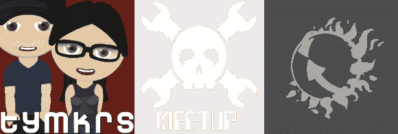

# 与 HeatSync 实验室和 Tymkrs 的黑客日聚会

> 原文：<https://hackaday.com/2014/05/09/hackaday-meetup-with-heatsync-labs-and-the-tymkrs/>

我们知道很多黑客将会在下周末参加创客大会。如果你发现自己在途中经过亚利桑那州的梅萨，或者你是当地的黑客爱好者，那么请在 5 月 15 日下午 5 点至 9 点之间来到 [HeatSync Labs](http://www.heatsynclabs.org/) 参加一个非正式聚会。你将会见到 HeatSync 实验室黑客空间的成员和明尼苏达州罗彻斯特[兔子洞](http://tymkrs.com/rabbithole/)黑客空间的创始人[Tymkrs](http://tymkrs.com/)(络腮胡和艾迪)。很抱歉通知晚了，我认为这将是一个很好的机会来组织一次即兴的黑客聚会，以便在他们史诗般的夏季公路旅行中穿过城镇时将 Tymkrs 包括在内。

如果人们有一个项目或他们正在做的项目的照片，我会很乐意听到所有的事情，我相信其他人也一样。我期待着拜访每一个能参加的人！

对于那些早到的人来说，应该有足够的比萨饼、苏打水和休闲食品。我要感谢 HeatSync 实验室的成员们，感谢他们在这么短的时间内让我在他们的 hackerspace 安排了一次 Hackaday 风格的聚会。会有一些食物和饮料，所以不要太晚，否则你可能会挨饿。

Meetup 地址:[亚利桑那州梅萨市中心西大街 140 号 HeatSync 实验室](http://goo.gl/maps/5oo83)