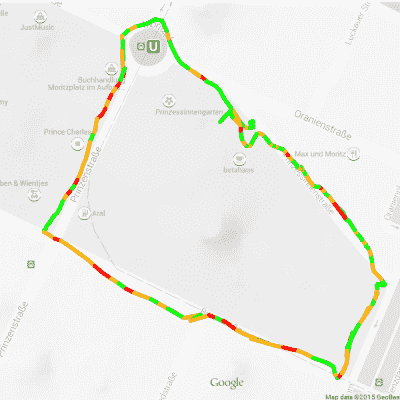

# Hackaday 奖参赛作品:Dekoboko 项目凸凹骑自行车绘制崎岖不平的道路

> 原文：<https://hackaday.com/2015/08/17/hackaday-prize-entry-project-dekoboko-%e5%87%b8%e5%87%b9-maps-bumpy-roads-on-a-bike/>

如果你住在新英格兰(像我一样)，你就会知道冬天道路会受到冲击。再加上随意的维护，你会得到一个自行车灾难的处方:颠簸，坑坑洼洼的道路会让你飞过车把。Dekoboko 项目凸凹旨在通过帮助你绘制地图和避开最崎岖的道路来帮助你，这可能是这一领域的天赐之物。

[Benjamin Shih]、[Daniel Rojas]和[Maxim Lapis]的 2015 年 Hackaday 奖参赛作品是一种夹在你的自行车上的设备，它可以绘制出你骑车时的颠簸程度。它通过加速度计测量自行车框架的振动来实现这一点。将此与 GPS 日志相结合，您将获得一张道路质量地图，帮助您规划平稳的行驶，或者帮助城市找出哪些道路最需要修复。

该项目目前处于第三个版本，围绕 Arduino、[Adafruit Ultimate GPS Logger](https://learn.adafruit.com/adafruit-ultimate-gps-logger-shield/overview)shield 和容纳加速度计的原型板 [Analog ADXL345](http://www.analog.com/en/products/mems/mems-accelerometers/adxl345.html) 构建。该团队还建立了他们网站的第一个版本，其中包含了在柏林的几次旅行的实时数据。不过，这确实表明了他们需要解决的一个问题:GPS 数据显示他们偏离了道路，这意味着数据略有偏差，或者他们正在 Prinzenstrasse 上的建筑物中骑车，包括一家家庭音乐俱乐部。我会假设是 GPS 不准确，而不是他们停下来狂欢，但他们需要想办法将这些数据绑定到特定的街道上，然后才能开始真正分析这些数据。谷歌地图确实提供了一种[方式来做到这一点](https://developers.google.com/maps/documentation/roads/snap)，但它并不总是准确的，尤其是在城市街道上。尽管如此，该项目已经取得了良好的进展，并可能有助于那些谁正在寻找一个平稳的乘坐城镇。

[https://www.youtube.com/embed/rqAj2ogiQoc?version=3&rel=1&showsearch=0&showinfo=1&iv_load_policy=1&fs=1&hl=en-US&autohide=2&wmode=transparent](https://www.youtube.com/embed/rqAj2ogiQoc?version=3&rel=1&showsearch=0&showinfo=1&iv_load_policy=1&fs=1&hl=en-US&autohide=2&wmode=transparent)

#### 2015 年[黑客日奖](http://hackaday.io/prize)由以下机构赞助:

