# 全球黑客日奖:新德里 Kicad +展示和讲述

> 原文：<https://hackaday.com/2015/07/28/hackaday-prize-worldwide-new-delhi-kicad-show-and-tell/>

虽然孟买和本加鲁鲁有一个活跃而庞大的黑客社区，但在黑客空间方面，印度首都新德里似乎已经遥遥领先——至少有四个。因此，当镇上最新的一家公司[创客庇护所](http://www.makersasylum.com/contact/)上个月开门营业时，我们决定组织一个黑客集会，将社区聚集在一起，并向他们介绍 Hackaday 奖。我们已经在[孟买](http://hackaday.com/2015/03/23/hackaday-prize-worldwide-makers-asylum/)和[孟加拉鲁鲁](http://hackaday.com/2015/05/06/hackaday-prize-worldwide-workbench-projects-bengaluru/)举办了 Hackaday Prize bring-a-hack 活动，我们想做一些更有意义的事情——为期一天的 [KiCad EDA 研讨会，晚上是 Show-n-Tell brag 秀](https://hackaday.io/event/6438-hackaday-prize-worldwide-new-delhi)。

Hackaday 的[马特·博格伦，又名@technolomaniac]已经用 Hackaday 做了几个"[从零到 WiFi 的 PCB 设计！](https://hackaday.io/event/5967-hackaday-prize-worldwide-san-francisco)“最近鹰 EDA 研习班。他设计了一个[简单的分线板](https://hackaday.io/project/5728-esp8266-01-breakout)，允许通过 USB-UART 电缆将 ESP-01 模块连接到 USB 端口，具有电平转换、上拉电阻和按钮开关，使编程变得容易。我们稍微推迟了开始，所以我快速浏览了一下[马特]准备的[精彩演示](https://s3-us-west-1.amazonaws.com/esp8266-breakout/Hackaday_Designing_PCBs_LA_Event.pptx)，快速浏览了一下“什么是 PCB？”部分并跳过其余部分。我们还讨论了当天研讨会的几个候选设计——一对 ATtiny 线跟踪机器人，一个简单的 Attiny SmartLED 控制器，但最终，当我提到“ESP-8266”时，每个人都变得兴奋起来！

  “What is a PCB?” [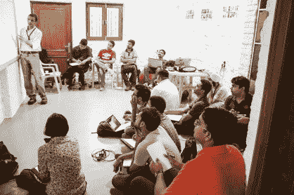](https://hackaday.com/2015/07/28/hackaday-prize-worldwide-new-delhi-kicad-show-and-tell/19638128038_283253e379_k-2/) KiCad workshop [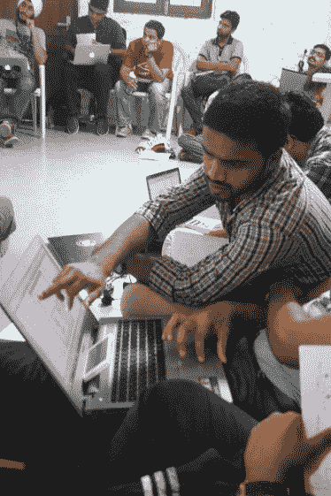](https://hackaday.com/2015/07/28/hackaday-prize-worldwide-new-delhi-kicad-show-and-tell/19777516468_1641220c32_k/) A helping hand

首先，我让每个人手动勾画出我们将要构建的示意图。对于那些新手来说，这样做是很好的实践，直到你更熟练地直接在 EDA 中工作。手边有一份参考草图很有帮助。所有的黑客都已经在他们的电脑上安装了 Kicad，所以我们很快开始创建原理图。到了午饭时间，我们已经完成了原理图的绘制，在网表阶段完成了。我担心午餐的影响，但幸运的是，每个人都迫不及待地开始工作，所以下午/晚上的其余时间都花在了设计 PCB 布局上，我们通过生成 Gerbers 完成了设计。[项目发布在这里](https://hackaday.io/project/6843-esp8266-01-breakout-board)，你也可以在这里找到 GitHub 资源库的链接。我们希望尽快制造出几块电路板。

 [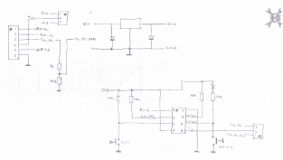](https://hackaday.com/2015/07/28/hackaday-prize-worldwide-new-delhi-kicad-show-and-tell/esp_sketch/) Sketch [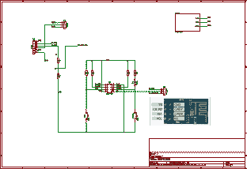](https://hackaday.com/2015/07/28/hackaday-prize-worldwide-new-delhi-kicad-show-and-tell/esp_sch/) Schematic [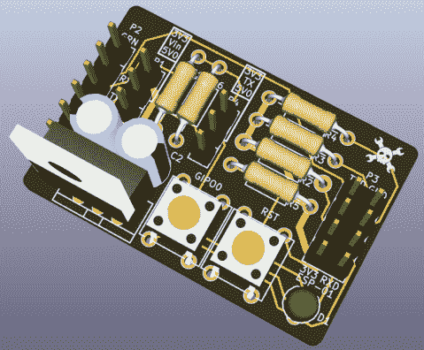](https://hackaday.com/2015/07/28/hackaday-prize-worldwide-new-delhi-kicad-show-and-tell/esp01/) PCB layout [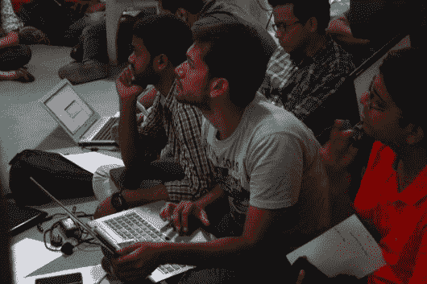](https://hackaday.com/2015/07/28/hackaday-prize-worldwide-new-delhi-kicad-show-and-tell/19965573595_3372e6cf7f_k/)  [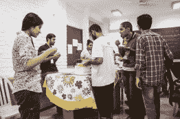](https://hackaday.com/2015/07/28/hackaday-prize-worldwide-new-delhi-kicad-show-and-tell/19826133095_a37ae39d3a_k/) Lunch [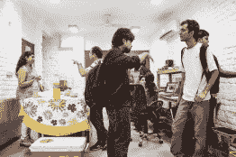](https://hackaday.com/2015/07/28/hackaday-prize-worldwide-new-delhi-kicad-show-and-tell/19799926216_180a9aad67_k/) Lunch

我们结束了车间，然后搬到楼上，进行一个晚上的展示和讲述。创客庇护所的创始人 Vaibhav Chabbra ，以一封欢迎信开始，并快速介绍了帮助运营创客空间的团队。随后，我对 2015 年 Hackaday 奖进行了总结，并展示了去年的获奖者。

展示开始时，[ [Sahil Sahajpal](https://hackaday.io/hacker/79577) ]展示了[Suraksha](https://hackaday.io/project/6704-suraksha)——一种用于自卫的安全手套。该手套包含一个由可充电电池供电的高电压、低电流发生器。它给攻击者一个安全但不舒服的震动，给穿戴者一些时间快速逃离。

Mahesh Venkitachalam 从孟加拉鲁鲁远道而来参加 KiCad 研讨会，并带来了他的两名手下。一个 Arduino 音频激光显示器，来自他即将出版的 Python 编程书籍——[Python Playground](https://www.nostarch.com/pythonplayground)。这是一个非常有趣的[黑客](https://github.com/electronut/pp/tree/master/arduino-laser)。计算机处理音频流，使用 Python 做一些 FFT。处理后的输出通过 USB 端口传输到 Arduino。Arduino 向电机驱动器发送数据，电机驱动器反过来控制两个小型 DC 电机的速度和方向。镜子以倾斜的角度粘在电机轴上，反射来自 LED 激光笔的光束。没有音频，投影一个圆。当音频流开始时，形成类似于次摆线的美丽图形。另一个黑客[Mahesh]展示的是一个基于 [555 的运动感应夜灯](http://electronut.in/night-lamp/)，具有高亮度 LED 的恒流驱动功能。没有 Arduino，没有编程，9V 电池供电，并以套件形式提供，使其成为易于组装的第一个套件。PIR 传感器触发单稳态 555，打开 LED 约 15 秒。演讲结束后，他向黑客分发了几块电路板。

 [![[Vaibhav Chabbra]](img/0a232289069dfbd8c0928939b3bd5a67.png "19638089840_afe9b03b6f_k")](https://hackaday.com/2015/07/28/hackaday-prize-worldwide-new-delhi-kicad-show-and-tell/19638089840_afe9b03b6f_k/) [Vaibhav Chabbra] [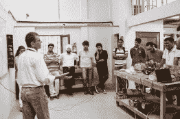](https://hackaday.com/2015/07/28/hackaday-prize-worldwide-new-delhi-kicad-show-and-tell/19818738882_5d0586430d_k/) Hackaday Prize [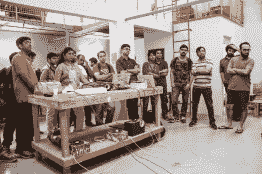](https://hackaday.com/2015/07/28/hackaday-prize-worldwide-new-delhi-kicad-show-and-tell/19818748602_653033fabd_k/)  [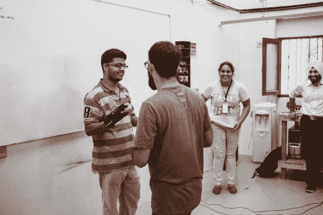](https://hackaday.com/2015/07/28/hackaday-prize-worldwide-new-delhi-kicad-show-and-tell/19818723552_bc8cc2deaa_k/) Safety Glove [![[Mahesh Venkitachalam]](img/400f89c2fce7d4f6b2317e009bbf4423.png "19830904201_281c3a0dcd_k")](https://hackaday.com/2015/07/28/hackaday-prize-worldwide-new-delhi-kicad-show-and-tell/19830904201_281c3a0dcd_k/) [Mahesh Venkitachalam] [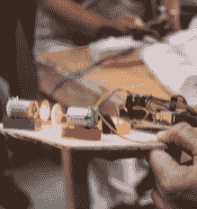](https://hackaday.com/2015/07/28/hackaday-prize-worldwide-new-delhi-kicad-show-and-tell/19638061990_1749554987_k/) Arduino Audio Laser display [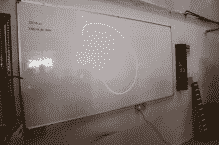](https://hackaday.com/2015/07/28/hackaday-prize-worldwide-new-delhi-kicad-show-and-tell/19799886216_ebf93ecb8a_k/) hypotrochoids [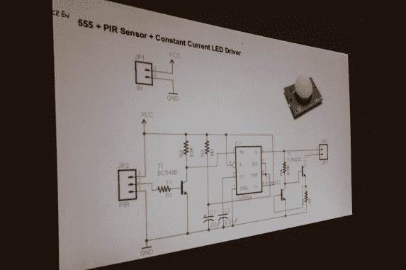](https://hackaday.com/2015/07/28/hackaday-prize-worldwide-new-delhi-kicad-show-and-tell/19638037298_21bbc97e7f_k/) 555 based motion sensing night lamp

贾斯梅特·辛格是德里创客空间 JMoon 的创始人。他给了我们巨大的帮助，帮助我们建立了创客庇护所，卷起袖子，帮助我们铺设电线，确保我们在上个月开门之前做好了准备。他顺便来炫耀他的[自动植物水系统](https://hackaday.io/project/5468-automatic-plant-watering-system)。它使用一个连接到 Arduino 的土壤电阻传感器，Arduino 控制水泵来保持植物的水分。[Jasmeet]增加了一个简单的桨轮式流量计，以确保向植物供应适量的水。

[ [Gursehaj Singh](https://hackaday.io/Gursehaj.Singh) ]和[Karmanya Aggarwal]是创客收容所的实习生，他们最近制作了一个全模拟、 [VU 电度表](https://github.com/MakersAsylumIndia/VuMeter)，使用 LM3914 和 AD620 运算放大器来显示音频电平。它有几英尺高，有许多发光二极管，是一个迷人的显示器。[Gursheraj]还谈到了他正在开发的盲人导航辅助设备，他希望在其中使用地图、触觉反馈、超声波传感器和摄像头。

[Utkarsh Kumar Gupta]，创客庇护所的另一名实习生展示了他令人惊叹的 DIY 投影仪。它使用 Bridgelux 的 180W COB LED，运行速度约为。150W。带有小型散热器和冷却风扇的液体冷却有助于保持 LED 冷却。一个 TFT LCD 彩色显示器，其背衬被移除，固定在 LED 前面。在 LED 和 LCD 之间是菲涅耳透镜，在 LED 前面是第二菲涅耳透镜。然后使用标准投影仪光学透镜单元来聚焦最终输出。通用图形输入卡提供 VGA、DVI、HDMI、分量、S-Video 和复合输入。几个强大的电源为所有的电子设备供电。一个机械杠杆改变前菲涅耳透镜的角度，它负责梯形校正。这是一座相当全面的建筑，他花了不到 300 美元就建成了。

  Automatic Plant watering system [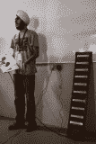](https://hackaday.com/2015/07/28/hackaday-prize-worldwide-new-delhi-kicad-show-and-tell/19818687632_e59de4448f_k/) VU Meter [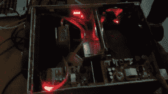](https://hackaday.com/2015/07/28/hackaday-prize-worldwide-new-delhi-kicad-show-and-tell/img_20150718_193432457/) DIY Projector, LED off  DIY Projector, LED on

接下来是[ [Jithin](https://hackaday.io/hacker/35701) ]，他展示了他的 [Python 驱动的科学仪器工具](http://hackaday.com/2015/06/05/hackaday-prize-entry-python-powered-scientific-instrumentation/)——一个高性能的测量系统，由一个微控制器驱动的盒子组成，包含几乎所有可以想象的台式电子工具，从恒流源、LCR 表、波形发生器、频率计数器到逻辑分析仪。他还展示了他的[多功能实验室工具](https://hackaday.io/project/6490-a-versatile-labtool)——一种与 Raspberry Pi 配对的低成本实验室工具，旨在为教学实验室配备一套名副其实的测试和测量仪器。这是他的另一个项目的精简版本，但仍然非常强大，并引入了无线硬件节点。这非常有趣，我想我可以花整个晚上和[Jithin]讨论这个项目。另外，他的父亲[阿吉特·库玛尔·库马尔教授]在建立来自新德里大学间加速器中心凤凰项目的 expEYES 项目中发挥了重要作用。

最后，我们请来自 [Mad Resistor](http://madresistor.com/) 的【Sandeep Kumar】、【Kuldeep Singh】和【Anupam Kaushik】谈论 Box1 电子学习实验室工具。他们的项目类似于[Jithin]和 expEYES 正在做的，但我们无法获得更多细节，因为它仍处于测试阶段。他们展示了一个加速度计模块，连接到基于 ST ARM 的主板，将数据发送到计算机上基于 Python 的工具包。

 [![[Jithin]](img/ea7b04bab647aae5d7d83b3508d0aae4.png "19830869251_10bacd6fd4_k")](https://hackaday.com/2015/07/28/hackaday-prize-worldwide-new-delhi-kicad-show-and-tell/19830869251_10bacd6fd4_k/) [Jithin] [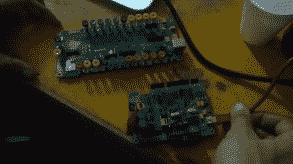](https://hackaday.com/2015/07/28/hackaday-prize-worldwide-new-delhi-kicad-show-and-tell/img_20150718_201820521/) Versatile Lab tool [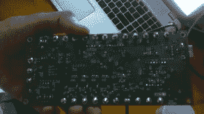](https://hackaday.com/2015/07/28/hackaday-prize-worldwide-new-delhi-kicad-show-and-tell/img_20150718_201843514/) Python Powered Scientific Instrumentation Tool [![[Mad Resistor]](img/b79fc8ea00a94d8b2ebd7c1fcbc3c987.png "19826028095_a74e98f61c_k")](https://hackaday.com/2015/07/28/hackaday-prize-worldwide-new-delhi-kicad-show-and-tell/19826028095_a74e98f61c_k/) [Mad Resistor]

我们原本预计在晚上 8 点结束，但在我们最终完成之前，已经过了晚上 9 点多了。