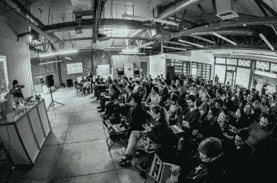

# 世界黑客日奖:旧金山

> 原文：<https://hackaday.com/2015/05/29/hackaday-prize-worldwide-san-francisco/>

夏天越来越热，Hackaday 奖也是如此。两周后，我们将在旧金山举行为期一天的研讨会，然后在最时髦的酒吧聚会。

*零到产品*研讨会将于 6 月 13 日在旧金山知名硬件创业加速器 Highway1 举行。本次研讨会由电子设计和 PCB 布局专家[马特·博格伦]发起并主持。

## 在票没了之前 RSVP！

Zero to Product workshop in Pasadena a few weeks ago

[回复研讨会的邀请](http://worldwide-sf.hackaday.io/)，你将很快了解什么是专业级 PCB 设计。你只需要基本的电子知识，不需要事先的布局经验。如果你想跟进，带上一台装有最新版本 Eagle 的电脑，但这不是必须的。它肯定会推动你为参加 [2015 年黑客日奖](http://hackaday.io/prize)而正在进行的任何 PCB 设计。如果你还没有[开始你的参赛作品](http://hackaday.io/had2015)，这是一个帮助集思广益的好群体！

不管你是否在研讨会上，我们计划在会后出去找点乐子。这次偶然的会面是在幸运之击，从晚上 7:30 开始。你想打保龄球还是喝酒，或者两者兼而有之，由你决定。[请回复](http://worldwide-sf.hackaday.io/#rsvp)；因为我们还没有把这个地方租出去，我们想知道有多少黑客会来。别忘了，这是 Hackaday 酒吧聚会的传统，当你认识新朋友时，带一点硬件炫耀一下。六月见！

* * *

#### 2015 年[黑客日奖](http://hackaday.io/prize)由以下机构赞助:

