# 世界黑客日奖:工作台项目

> 原文：<https://hackaday.com/2015/05/06/hackaday-prize-worldwide-workbench-projects-bengaluru/>

班加卢鲁(以前的班加罗尔)是一个充满了令人敬畏的黑客的城镇。因此，当 [Workbench 项目](https://www.workbenchprojects.com)，一个当地的创客空间，问我是否愿意下来谈谈 Hackaday 奖的时候，我立即开始行动。我们决定安排一个[“拿来一个黑客”活动](https://www.facebook.com/events/391564464364263/)，邀请当地的制造商带着他们的黑客出现并发表演讲，或者顺便来讨论重要的想法。为了接触到更多的受众，我们还与[物联网 BLR](http://iotblr.org/) 合作，这是一个位于孟加拉鲁鲁的相当大的物联网爱好者团体。 [10，000 个创业公司(NASSCOM for Startups)](https://www.facebook.com/NasscomForStartUps) 帮助确保所有的黑客都能得到三明治和饼干，而[纸船](https://www.facebook.com/paperboatdrinks)则提供了一个装满饮料的冷藏箱。一场反常的冰雹意味着我们不得不推迟一点出发。但这变成了一种祝福，因为它允许那些已经在该空间的人检查已经在演示桌上设置的黑客，并通常相互联系。

[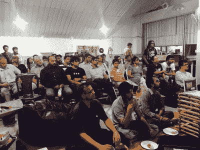](https://hackaday.com/wp-content/uploads/2015/05/wp_blr_04.jpg)

almost 100 Hackers turned up

与[Pavan]一起建立工作台项目的[Anupama]首先告诉我们这一切是如何在一年前开始的。她和[帕万]脑子里有想法，但没有办法将它们原型化。“你要么继续抄袭创客空间的缺乏，要么直接跳进去自己开一个”。

然后我们让[Pavan]告诉我们他们建立的各种各样的[工作室](https://www.workbenchprojects.com/about/whoweare)。他还兴奋地宣布他们加入了世界范围的麻省理工学院私人实验室网络。他们的空间位于前往[哈拉苏鲁地铁站](http://en.wikipedia.org/wiki/Halasuru_metro_station)的自动扶梯的正下方。这一空间的使用本身就很精彩，否则它就会被浪费和清空。

我走上前去，谈论了 Hackaday 奖，以及我们今年对制造商发出的“打造有意义的东西”的呼吁。我展示了去年的获奖者，今年的奖项，并给出了其他细节，要求聚集的黑客们加入并向 Hackaday 奖提交他们的黑客作品。接下来是[Nihal]，他创建了 IoT-BLR，并向我们介绍了他们的项目、活动和计划。[物联网 BLR](http://iotblr.org/) 是全球第三大物联网 Meetup 社区。

 [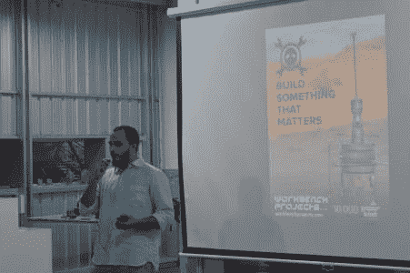](https://hackaday.com/2015/05/06/hackaday-prize-worldwide-workbench-projects-bengaluru/wp_blr_19/) Pavan talking about the facilities at Workbench Projects [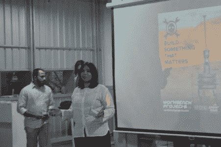](https://hackaday.com/2015/05/06/hackaday-prize-worldwide-workbench-projects-bengaluru/wp_blr_18/) Anupama talking about how Workbench Projects started [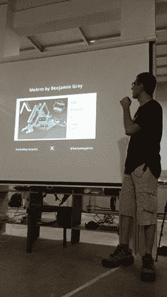](https://hackaday.com/2015/05/06/hackaday-prize-worldwide-workbench-projects-bengaluru/wp_blr_03/) Anool talking about the Hackaday Prize

完成之后，我们开放了会场，让聚集在一起的黑客们站出来谈论他们的黑客技术。首先是[Anmol Agrawal]展示了他的[地震预警系统](https://hackaday.io/project/5587-earthquake-early-warning-and-monitoring-system)，它是用 [Littlebits](http://littlebits.cc/) 、 [PubNub](https://www.pubnub.com/) 和 Ruby 开发的原型。

我很高兴在短时间内，我在 Linnaro 工作的朋友[Mohammed Khasim]同意过来谈论并展示谷歌正在开发的模块化手机，这是 Ara 项目的一部分。

 [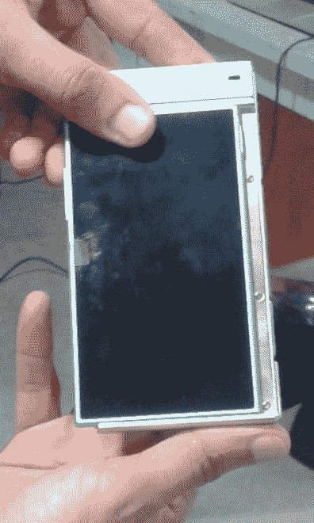](https://hackaday.com/2015/05/06/hackaday-prize-worldwide-workbench-projects-bengaluru/wp_blr_34/) Project Ara – front  Project Ara – back

由[Kruti]、[Chitra]和[Archana]组成的女子团队展示了他们为盲人设计的智能拐杖。五个超声波 ping 传感器，一个光传感器和一个摄像头都连接到一个由电池组供电的树莓 Pi 上。拐杖与配对的智能手机通信，应用程序提供音频提示。还有一个用于触觉反馈的寻呼机电机。

[Rahul]和他的团队带着看起来像钢铁侠电弧反应堆的东西出现在 t 恤上。它原来是一个 HID 设备，可以用来将按键发送回配对的计算机。他们的下一次迭代不那么浮华和不引人注目。他们现在正致力于通过允许学生在紧急情况下发送警报来为学生提供安全保障。

[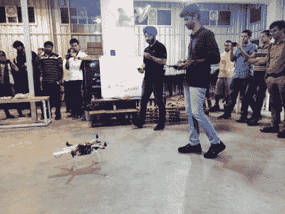](https://hackaday.com/wp-content/uploads/2015/05/wp_blr_01.jpg)

[ [Chetan](https://twitter.com/chetanniyan) 和他来自 [EdgeVerve](http://www.edgeverve.com/) 的团队展示了他们在无人机上放置各种传感器的工作——二氧化碳、温度、湿度、多光谱相机——使它们能够用于一些现实世界的应用。他们还使用廉价的超声波传感器和在紧急情况下部署的弹道降落伞集成了防撞功能。

物联网-BLR 联网汽车项目团队谈到了他们的项目，即利用车辆上的车载诊断，并使用各种传感器数据来控制污染。

[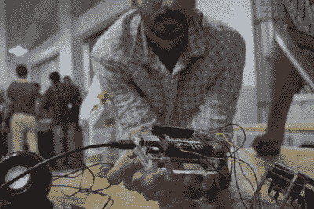](https://hackaday.com/wp-content/uploads/2015/05/wp_blr_29.jpg)

库马尔·阿布舍克及时下来给我们展示他的[猎犬逻辑](https://hackaday.io/project/4395-beaglelogic)。我早些时候在[博客](http://hackaday.com/2015/02/19/turn-your-beagleboneblack-in-to-a-14-channel-100msps-logic-analyzer/)上写过这个项目，能够看到它的实际运作真好。

还有更多的项目在展出。[Osho Bajpai]展示了他的“智能驾驶警报系统”,该系统可以检测驾驶员是否睡着并叫醒他。[Sanju Mathew]展示了他的义肢，而[sup rete Joshi]展示了他的“智能机械臂”，它使用智能手套复制了人类手臂的运动。展出的还有一个遥控滑板，由电子稳定控制系统控制的 BLDC 电机驱动。看到一群小学生推着他们仍在研发中的直升机式自行车也很有趣。这些孩子在这个过程中学到了很多东西，比如人体工程学和焊接。[阿卜杜勒]展示了他正在研究的几个装置，以帮助利用沿海地区的潮汐能。来自 WiSense 的团队展示了一些联网的环境传感器。一种是测量土壤湿度和温度，并通过 GSM 短信传输数据。这是为农民准备的，提醒他们在合适的时间给农场浇水。另一个传感器用作储罐液位检测器，控制流速以防止溢流。

 [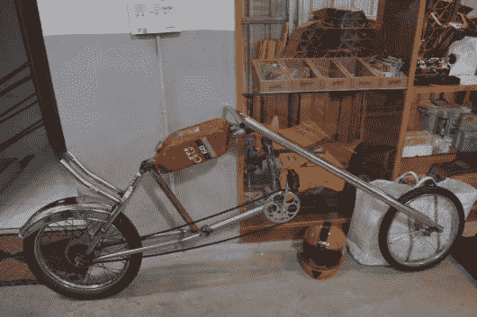](https://hackaday.com/2015/05/06/hackaday-prize-worldwide-workbench-projects-bengaluru/wp_blr_27/) Chopper inspired Bicycle, built by school kids  Remote controlled Skate Board [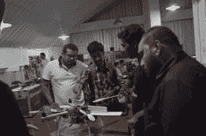](https://hackaday.com/2015/05/06/hackaday-prize-worldwide-workbench-projects-bengaluru/wp_blr_17/) Drone gets some attention [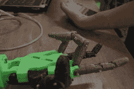](https://hackaday.com/2015/05/06/hackaday-prize-worldwide-workbench-projects-bengaluru/wp_blr_14/) Supreet Joshi’s Smart Robotic Arm [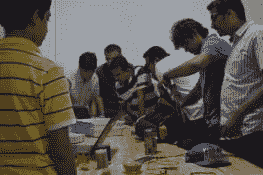](https://hackaday.com/2015/05/06/hackaday-prize-worldwide-workbench-projects-bengaluru/wp_blr_13/) 11 year old Nihar Thakker’s solar powered fan Cap [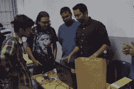](https://hackaday.com/2015/05/06/hackaday-prize-worldwide-workbench-projects-bengaluru/wp_blr_10/) Smart Driving alert system

这时已经是深夜了，所以人们花了接下来的一个小时查找各种项目，聊天，并使用我设置的 OpenSelfie photobooth 自拍。Workbench Projects 的[Rishi Bhatnagar]是整个活动的发起人，他成功地将当晚的活动进行了存档，休息后你可以观看(长)视频。

 [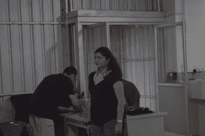](https://hackaday.com/2015/05/06/hackaday-prize-worldwide-workbench-projects-bengaluru/wp_blr_09/) My wife Samata, with her LED necklace  We ran out of chairs – standing room in a packed house [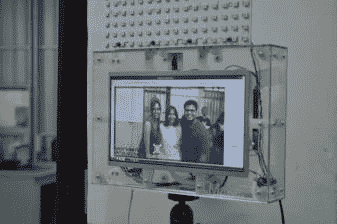](https://hackaday.com/2015/05/06/hackaday-prize-worldwide-workbench-projects-bengaluru/wp_blr_11/) the OpenSelfie PhotoBooth  Intelligent cane for blind  Drone demo, for collision avoidance

这是这次活动的另一个相册。

下面的视频很长，如果你想跳过，链接在下面。

[https://www.youtube.com/embed/tCAfJ0IRJa4?version=3&rel=1&showsearch=0&showinfo=1&iv_load_policy=1&fs=1&hl=en-US&autohide=2&wmode=transparent](https://www.youtube.com/embed/tCAfJ0IRJa4?version=3&rel=1&showsearch=0&showinfo=1&iv_load_policy=1&fs=1&hl=en-US&autohide=2&wmode=transparent)

*   [阿努帕玛的介绍](https://www.youtube.com/watch?v=tCAfJ0IRJa4&t=00)
*   [Pavan 谈工作台项目](https://www.youtube.com/watch?v=tCAfJ0IRJa4&t=240)
*   [Anool 谈黑客大奖](https://www.youtube.com/watch?v=tCAfJ0IRJa4&t=540)
*   [尼哈尔谈物联网-BLR](https://www.youtube.com/watch?v=tCAfJ0IRJa4&t=3060)
*   [地震预警系统](https://www.youtube.com/watch?v=tCAfJ0IRJa4&t=3540)
*   [项目 Ara](https://www.youtube.com/watch?v=tCAfJ0IRJa4&t=4080)
*   [智能盲人手杖](https://www.youtube.com/watch?v=tCAfJ0IRJa4&t=4800)
*   [戴上你的音乐](https://www.youtube.com/watch?v=tCAfJ0IRJa4&t=4980)
*   [智慧城市的智能无人机](https://www.youtube.com/watch?v=tCAfJ0IRJa4&t=5400)
*   [利用车辆 OBD 控制污染](https://www.youtube.com/watch?v=tCAfJ0IRJa4&t=5760)
*   [猎兔犬逻辑](https://www.youtube.com/watch?v=tCAfJ0IRJa4&t=6180)