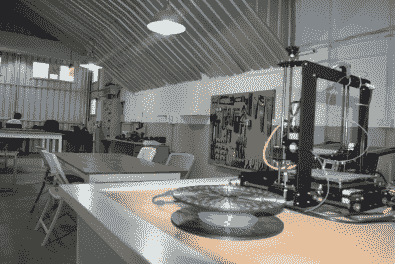

# 全球黑客日奖:在班加罗尔举行的工作台项目会议

> 原文：<https://hackaday.com/2015/04/13/hackaday-prize-worldwide-workbench-projects-meetup-in-bangalore/>

印度班加罗尔:根据你问的对象不同，你会得到不同的回答。老前辈们记得它是养老/退休之城(不过现在已经不是了)。对其他人来说，这是印度的硅谷。有人称它为印度的创业之都。不过，对我来说，它勾起了美好的回忆。早在 1986 年，我从孟买大学毕业后，在这个城市找到了第一份工作，月薪 20 美元。

从那时起，很多事情已经过去了，下个月我将回到另一个名为[工作台项目](http://workbenchprojects.com/)的令人敬畏的创客空间，谈论[黑客日奖](http://hackaday.io/prize)以及我们如何让黑客来这里解决我们的一些重大问题。我们在各个领域都面临着巨大的问题——污染、水资源、能源、气候、农业、交通、教育——清单很长。

5 月 2 日周六，在 Workbench Projects hackerspace，我们将聚集在“Bring-A-Hack @ Workbench Projects ”,谈论我们对制作和黑客的热情。我们将讨论 2015 年黑客日奖，该奖项为能够为各种各样的人所面临的问题构建解决方案的黑客提供 50 万美元的奖金。这到底意味着什么？这是今晚的话题之一。当然，你会有足够的时间来展示自己的技术，就困难的项目寻求建议，并与所有与会者进行社交。详情请访问[活动页面](https://www.workbenchprojects.com/workshops/event_details/29)。

Workbench Projects 是一个令人敬畏的黑客空间，由 Pavan 和 Anupama 的[团队](https://www.workbenchprojects.com/about/teams)运营，由[杰出的顾问团队](https://www.workbenchprojects.com/about/advisors)指导，并由一些优秀的[合伙人和合作者](https://www.workbenchprojects.com/about/partnersandcollaborators)支持。

   