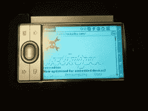
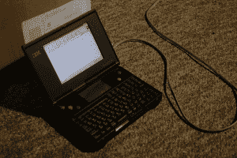
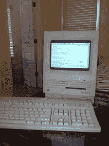
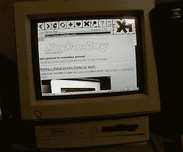
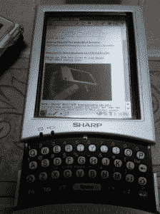

# Hackaday 复古版和复古综述

> 原文：<https://hackaday.com/2014/01/25/hackaday-retro-edition-and-retro-roundup/>

大约一年半前，我们推出了 [Hackaday retro edition](http://retro.hackaday.com/) ，它是主版本的一个小分支，用纯 HTML 编写，没有 Javascript 或任何其他 Web 2.0 cruft。它的设计使得你可以在任何一台*电脑上加载这个版本，从苹果牛顿到 Commodore 64。人们[已经做到了](http://retro.hackaday.com/Success/index.html)。*

经过长时间的忽视，我们重新推出了复古版，增加了一个新功能:大约每一个小时，五个随机的 Hackaday 页面，一直追溯到[第一个帖子](http://hackaday.com/2004/09/05/radioshack-phone-dialer-red-box/)将出现在复古网站上。是的，这是我们最初为复古网站计划的一个功能，但现在 Hackaday 有了出色的开发人员在幕后工作。我的意思是，他们可以建立一个 cron 工作！太神奇了！

一如既往，我们非常欢迎你在我们的复古网站上加载任何复古硬件，拍张照片，然后[发送到](http://hackaday.com/contact-hack-a-day/)。很有可能，我们会把它贴在这些半频繁的复古综述文章中。

如果没有一些人在旧硬件上加载复古版本的例子，任何复古综述文章都不会完整。休息之后你可以看看一些。

* * *

 【格雷格】有一个旧的 Palm LifeDrive 放在抽屉里，他决定摆弄它。

通常，“较新”的 Palm 设备没有 SDHC 卡的驱动程序，这意味着它们的存储空间被限制在 2GB 左右。 [Palm Powerups](http://www.palmpowerups.com/) 的创造者【Dimitry Grinberg】为 Palm 编写了一个 SDHC 驱动程序，允许任何人在这些 10 年前的设备上使用巨大的 16 和 32GB 卡。

[Greg]安装了这个 Palm Powerup，将设备连接到他的手机，并加载了复古版。

* * *

这个对于牛逼的硬件来说[怎么样？这是一台 IBM PC110 掌上电脑，实际上是一台掌上电脑；它只有 6 英寸 x 4.5 英寸 x 1.3 英寸，配有 4.7 英寸 VGA 屏幕，260MB 驱动器，最高 20MB 内存和 33MHz 486。90 年代中期发行，是日本独有的。这就像母鸡的牙齿一样罕见，我们不知道这些糖果色的按钮实际上是做什么的。](http://www.thinkwiki.org/wiki/PC110)

[John B.]碰巧有一个这样的美人，并决定使用内部 2400 波特调制解调器来加载复古网站。

* * *

我们喜欢经典的一体机，显然【斯科特】也是如此。他把他的旧 Mac SE 从父母家带回家，在翻了一个装满旧连接器的袋子后，找到了一根 DIN-8 到 DB-9 电缆和一个 USB 串行适配器。这就是获得与 is MacBook 的串行连接所需的全部内容。

由于 se 的 800k 磁盘驱动器，[Scott]无法获得 TCP 堆栈和 System 7 浏览器。他决定用 screen 来模拟终端会话，而不是在 SE 上运行软件。在波特设置和窗口大小上做了一点手脚后，他能够使用 Lynx 加载复古网站。

* * *

 这里有一个非常非常古老的。这是[凯尔]的康柏 Presario 425，大约在 1993 年生产。486 在 25 兆赫，虽然它已经被超频到 33 兆赫。

[Kyle]在不使用终端仿真或桥接的情况下将这台计算机接入互联网方面做了大量工作。里面有一个 10MBps 的以太网卡，还有一个声霸 16。尽管有古老的硬件，我们可以看到这是一个对复古 DOS 游戏有点用的机器，使用古老的软件，或者，当然，加载复古版。

* * *

[Perry]告诉我们，这不是一个很大的复古提交，但我们不得不同意。这是一款由夏普生产的基于 ARM 的老式 Linux PDA，206 MHz，32 MB 内存。

* * *

目前就这些。同样，如果你设法从地下室挖出一些复古硬件，并加载复古版， *[将它发送到](http://hackaday.com/contact-hack-a-day/)。*

如果你想知道如何让你的旧 boxxen 上网，复古版也有一些针对 Apple II、Classic Mac 和 Commodore 64 的复古计算教程。我们很乐意为一些更奇特的平台众包更多的教程，所以如果你有印章写一个，我们会链接到它。