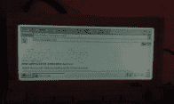
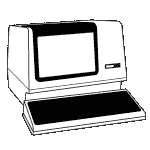

# 黑客日复古版:笔式计算

> 原文：<https://hackaday.com/2015/01/17/hackaday-retro-edition-pen-computing/>

虽然我们早已过了“笔式计算”的全盛时期，而且似乎随着配备 Wacom 触控笔和数字化仪的笔记本电脑和平板电脑的回归，这并不意味着过去的笔式电脑没有用。虽然它们主要用于工业应用，但是它们是有用的，并且是触摸屏显示器的一些最初的实际应用。

[Jason]得到了其中一台加固型手持电脑，特别是一台 [Itronix T5200](http://pencomputing.com/showcase/itronix_t5200.html) 。这款三磅重的迷你笔记本运行 Windows CE 掌上电脑 3.01 版。规格包括 74MHz RISC 处理器、16 MB 内存、16MB 闪存和分辨率为 640×240 的 7.3 英寸单色触摸屏。它既奇怪又古老:当合上时，它的厚度超过两英寸。你很难找到这么厚的现代笔记本电脑。[Jason]的硬件是预生产版本。

不像许多复古提交的东西设法在旧硬件上调出 [Hackaday 复古版](http://retro.hackaday.com/)，这台机器实际上有一个浏览器。它很旧，很笨重，但是很好用。有三种方法可以让这台旧电脑上网 IrDA，一个 RJ11 调制解调器端口，或者 RS232。[杰森]没有告诉我们他用哪个端口加载复古版，但他确实发了几张照片。你可以看看下面这些。

        

* * *

hack aday 复古版是我们庆祝旧电脑做一些现代的事情，在大多数情况下，加载旧的，没有 CSS 或 Javascript 版本的我们的网站。

如果你有一台想要展示的旧电脑，只需加载复古网站，抓拍一些照片，将它们冲洗出来，[并发送到](http://hackaday.com/submit-a-tip/)。