# 黑客空间:最终传输《我的世界》解谜

> 原文：<https://hackaday.com/2014/05/02/hackaday-space-final-transmission-minecraft-puzzles-explained/>

这是我们在整个四月运行的 ARG 总结的最后一部分。以防你上周把头埋在洞里，这是一个长达一个月的系列谜题，最终宣布了非常棒的黑客日奖。在这一周里，我们已经讲述了[传输 1](http://hackaday.com/2014/04/29/hackaday-space-transmission-1/ "Hackaday Space: Transmission 1") 、 [2](http://hackaday.com/2014/04/30/hackaday-space-transmission-2-puzzles-explained/) 和 [3](http://hackaday.com/2014/05/01/hackaday-space-transmission-3-puzzles-explained/) ，详细介绍了我们如何将拼图拼在一起以及出错的地方。在最后阶段，我们想要一些有点不同的东西。在整个 ARG 过程中，我们一直受到《Ready Player One 这本书的启发，所以在这个阶段，我们想要一个人们可以竞争的高分表。

因为我们已经在传输 3 中成功地走在了前面，所以我们只有一周多的时间来计划这一轮。我们在办公室里提出了一些可以用高分表格制作视频游戏的想法。这些都没有真正坚持下来，我们很快意识到我们没有资源来完成大多数游戏的图形设计工作。有人建议我们尝试制作一部以太空港为主题的 MUD，最后是对汤姆少校的营救。起初这似乎是一个伟大的想法，我开始使用 [RanvierMUD](http://www.ranviermud.com/) 框架进行工作。然而，很快就清楚了，为一个完整的 MUD 写所有的文本实际上是一个巨大的努力，坦白地说，我不是一个伟大的作家。

了解秘密，并观看下面的《我的世界》世界视频之旅。

#### 《我的世界》

因此，在下一次传输的 5 天前，我们仍然不知道我们要发布什么。谢天谢地，史蒂夫的孩子对《我的世界》很着迷，他立刻建议我们建立一个《我的世界》世界。现在有几个黑客日作家(包括我自己)喜欢《我的世界》，对我来说它是终极的黑客友好游戏。红石、建筑和创意都与黑客思维产生了强烈的共鸣，因此这似乎是一个完美的契合。有人担心我们的读者不一定都有副本，但我们认为大多数人都有副本是一个很好的选择。

我们很快充实了我们应该构建的一些想法，并开始考虑如何在游戏中加入拼图元素和记分牌。我们使用看起来相当酷的 [Galacticraft mod](http://micdoodle8.com/mods/galacticraft) 进行了测试，但是这需要客户端的修改，安装起来不太简单，所以我们不得不放弃它。我们也想过做一些流星追逐，但这似乎有点做作。最后，我们决定将主题从 ARG 扩展到游戏中。

[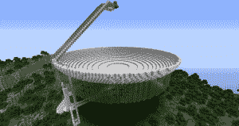](http://hackaday.com/wp-content/uploads/2014/04/greenbank.png) [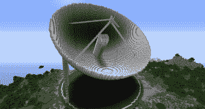](http://hackaday.com/wp-content/uploads/2014/04/effelsberg.png) [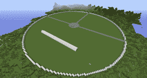](http://hackaday.com/wp-content/uploads/2014/04/ratan.png) [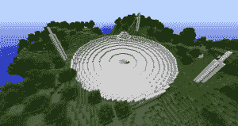](http://hackaday.com/wp-content/uploads/2014/04/arecibo.png) [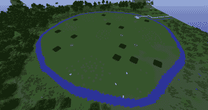](http://hackaday.com/wp-content/uploads/2014/04/lofar.png) 

我们决定建造我们在传输 3 中提到的 5 个望远镜的模型，以及一个火箭和太空港，从那里你可以启动一个“救援”任务去寻找汤姆少校，他将被安置在某个空间站内的[端](http://minecraft.gamepedia.com/The_End)。我们找到了由 Lets Lente 创建的令人敬畏的[地球 2.0](http://letslente.weebly.com/the-earth-20.html#/) 地图的副本，并决定我们将把我们能找到的所有真实世界的空间事物放入地图中。谢天谢地，布莱恩和迈克为《我的世界》疯狂，所以他们接手建造了一些真正的大型建筑。[Brian]在 4 个大型望远镜上做了出色的工作。[Tom]，我们在 SupplyFrame 的一个同事，和他的女儿建造了 LOFAR 阵列(他们还组装了一个 SupplyFrame 办公室的复制品，真的非常精确！).

[迈克]建造了一个壮观的火箭和机架，然后组装了容纳汤姆少校的空间站。在这期间，我配置了服务器，想出了如何保护区域，并在主繁殖点建造了一个传送点。传送点可以用来从现实世界拨入经度和纬度坐标，神奇地将你传送到游戏中的地点。这就把一切都很好地联系到了早期传输的线索中。

#### 难题

[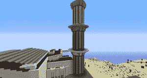](http://hackaday.com/wp-content/uploads/2014/04/spaceport1.png) [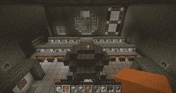](http://hackaday.com/wp-content/uploads/2014/04/spaceport2.png) [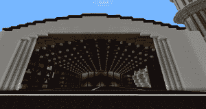](http://hackaday.com/wp-content/uploads/2014/04/spaceport3.png) [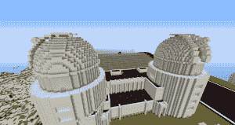](http://hackaday.com/wp-content/uploads/2014/04/spaceport4.png) [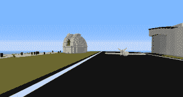](http://hackaday.com/wp-content/uploads/2014/04/spaceport5.png) [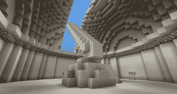](http://hackaday.com/wp-content/uploads/2014/04/spaceport6.png)

所以，这就解决了这个世界的问题(他说……就像建造所有这些巨大的建筑只需要五分钟)。接下来的问题是，我们如何在其中加入拼图元素？幸运的是，另一位 SupplyFrame 的同事[Sarah]已经掌握了这一点。她负责建造容纳[迈克]火箭的太空港的其余部分，并作为寻找汤姆少校的出发点。在这个太空港里，她藏了一系列的谜题，这些谜题可以让你接近火箭。它从一个衣架开始，有大量的压力板，你可以站在上面。每个压力板都标有电阻范围的数字。当你踩在压力板上时，它会把你传送到下一个房间，或者一个“错误的”房间，或者出口。为了穿过房间，你必须知道在每个房间里踩哪一个垫子。然后我们在《我的世界》世界的每一个地点隐藏了这些线索，在每一个望远镜地点以电阻颜色编码块的形式。在每个房间里，你会发现只有一个垫子对应于世界上任何一个积木的代码，所以当你知道怎么做时，很容易就能弄清楚。

[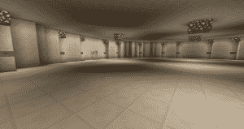](http://hackaday.com/wp-content/uploads/2014/04/puzzleroom.png) [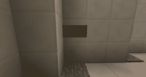](http://hackaday.com/wp-content/uploads/2014/04/puzzleroom2.png) [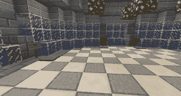](http://hackaday.com/wp-content/uploads/2014/04/puzzleroom3.png)

这非常有效，这意味着你必须查看传输 3 和 1 中望远镜的坐标，使用产卵处的主传送器访问它们，读取电阻颜色代码，然后前往发射地点(从传输 3)并找出哪个代码映射到哪个房间。这些谜题设计得很好，也很有效，尽管这是在《我的世界》，但似乎有些人只是为了接近火箭而在世界上搞了些小花招。

一旦你进入火箭，你就可以掉进一个巨大的洞，穿过一个入口，神奇地最终到达空间站，在那里汤姆少校四处漫游，滔滔不绝地发表精辟的评论。在空间站有许多你可以找到和看到的东西，但我会把它们留给更感兴趣的人去探索。我们将离开服务器，所以如果你想了解这个世界，请查看帖子末尾的详细信息。

#### 黑进记分牌

[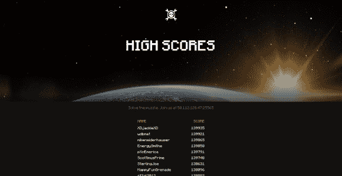](http://space.hackaday.io)

因此，为了完成我们的目标，我们希望有一个公共记分牌，每个人都可以通过它来跟踪他们在世界上的进展，这样我们就可以在最后给获胜者颁奖。这似乎很难做到，首先，《我的世界》有一个记分牌系统，但它并没有真正的“游戏”,所以没有自然的分数可以获得，所以你必须设置自己的。最后，我们决定奖励在世界范围内找到的地点。当我们发射的时候，我们已经有了 10 个区域，5 个望远镜和 5 个额外的地方，你可以通过运气或坚持找到它们。每个地点都有一个隐藏的点，当玩家进入该区域时，它会奖励给每个玩家，每次发现该区域时，点数都会减少，所以这给了我们一个不错的竞争。可以在 [http://space.hackaday.io](http://space.hackaday.io) 查看记分牌。

然后，我们编写了一小段代码，每隔 5 分钟通过 FTP 从《我的世界》服务器下载 scoreboard.dat 文件，然后使用 [JNBT 库](http://jnbt.sourceforge.net/)解析该文件。然后，这将数据显示在一个 API 上，我们的记分牌页面在渲染时会下拉这个 API。有点啰嗦，但是我们试着使用了 [JSON API](http://mcjsonapi.com/) 插件，这实际上并没有提供对《我的世界》境内记分牌输出的访问，所以这是最快的工作方式。

#### 最终传输

我们宣布《我的世界》服务器有一点明显的困惑。我们在 Hackaday 上发布了以下图片:

[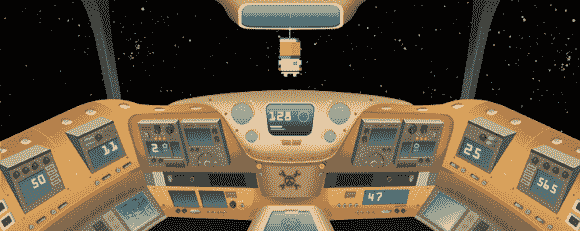](http://hackaday.com/wp-content/uploads/2014/04/had_space02.png)

图像中拨号盘上的编码数字构成了服务器 50.112.128.47:25565 的 IP 地址。一旦这个线索被解码，人们开始在服务器上跳跃。我想高峰时我们有 20 个左右的并发用户，但总的来说有几百人访问服务器。

我们对运行《我的世界》服务器的主要担心是可能会有痛苦。我们在 Hackaday 上有我们的宠物巨魔，但它们跟《我的世界》·格里菲斯比起来根本不算什么！谢天谢地，我们在任何重大事故发生前 5 天就设法去了，每个人都表现得很好，并探索了这个世界。这个难题最终被解决了，尽管可能会有小故障。最终很明显，人们会开始没有事情可做，所以我们决定进行一次创造性的练习。我们在主种子后面设置了一个大的创意区，人们可以在那里建造他们想要的东西，这成为了 PixelArt 竞赛，我们昨天[宣布了获胜者](http://hackaday.com/2014/05/01/hackaday-space-pixel-art-contest/ "Hackaday Space: Pixel Art Contest")(我们敬爱的【Caleb Kraft】是评委)。我们已经用像素艺术作品的视频更新了那个帖子。

这场比赛进行得非常顺利，我们有大量的参赛作品，它们几乎都令人惊叹。然而，最终格里菲斯夫妇还是来了，他们决定清洗创意区，在里面装满船只，尽可能多地毁坏艺术品。这是一个真正的耻辱，一些独特的作品丢失了。谢天谢地，我们设法挽救或重建了大部分。我们的系统管理员也学到了宝贵的一课:未经测试的备份流程不是备份！

#### 一切都结束了，是时候建造东西了

那是非常疯狂的一个月，现在已经接近尾声了。明天我们将宣布 ARG 的获胜者并给他们颁奖。我们还将暂时保持《我的世界》服务器的运行，或者直到它不再被使用，所以请随意在那里闲逛并构建一些疯狂的东西。偶尔会有临时员工出现。

如果您想使用服务器，请访问:

> minecraft.hackaday.com:25565

我们在这里送出一些可爱的小奖品，但它们不是太空旅行！为此，你需要构建一些真实的东西，在虚拟世界中花了这么多时间玩这些谜题之后，这样做是正确的。去黑吧！

[https://www.youtube.com/embed/PXPgtisOcv4?version=3&rel=1&showsearch=0&showinfo=1&iv_load_policy=1&fs=1&hl=en-US&autohide=2&wmode=transparent](https://www.youtube.com/embed/PXPgtisOcv4?version=3&rel=1&showsearch=0&showinfo=1&iv_load_policy=1&fs=1&hl=en-US&autohide=2&wmode=transparent)

[https://www.youtube.com/embed/IoMJsIrsi7g?version=3&rel=1&showsearch=0&showinfo=1&iv_load_policy=1&fs=1&hl=en-US&autohide=2&wmode=transparent](https://www.youtube.com/embed/IoMJsIrsi7g?version=3&rel=1&showsearch=0&showinfo=1&iv_load_policy=1&fs=1&hl=en-US&autohide=2&wmode=transparent)

#### [计] 下载

这里是链接到[充满所有好东西的黑客日《我的世界》世界文件](http://hackaday.s3.amazonaws.com/HackadaySpaceMinecraft.tar.gz)。归档文件大约有 3GB。