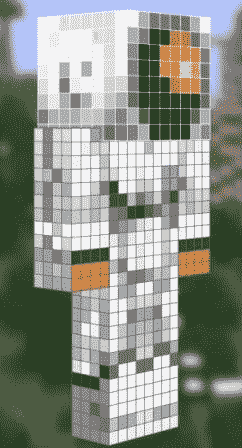

# 黑客空间:传输 3 解谜

> 原文：<https://hackaday.com/2014/05/01/hackaday-space-transmission-3-puzzles-explained/>

昨天，我们对 Transmission 2 进行了一次测试，这是我们在四月份发布的一系列文章的一部分。今天，我将揭示传输 3 中的所有细节，我们如何把它放在一起，答案是什么。

在经典的黑客时尚中，我们没有计划这些，所以到这个时候，我们所有的最初想法都已经用完了，我们现在已经没有创造力了，所以让 Transmission 3 上市真是一个艰难的过程。然而，我们设法做到了，并通过[发布一系列太空望远镜的图像](http://hackaday.com/2014/04/15/119822/)打开了传输 3:

汤姆少校还[在他的个人资料上发布了一个新的页面传输#3](http://hackaday.io/page/319) ，图片如下，文字为“确认发射地点”:

由于最后一个谜题在几个小时内就解决了，而第一个只用了 20 分钟，我们决定增加这个谜题的难度。我们希望这需要几天的时间，我认为如果没有一些事情完全出错的话，这应该是对的…

#### 隐式数据

望远镜图像的文件大小比它们应有的大小要大得多。你们中注意到这一点的人很快发现，在每个文件的末尾都有一个数据块。这是一个可爱的小技巧，它利用了这样一个事实，即 [JPEG 文件格式](http://en.wikipedia.org/wiki/JPEG#Syntax_and_structure)在文件末尾有一个信息结束标记，即 0xFF 0xD9。您只需在这个字节后添加您想要的任何信息，jpg 文件就神奇地仍然有效。你可以用 Windows 上的复制命令“复制/B file.jpg+文件 2 .无论什么>隐藏. jpg”或者用 linux 上的 cat“cat file.jpg 文件 2 .无论什么> >文件. jpg”来完成。

我们用同样的方法在 Transmission 3 火箭图像的末尾添加了一个《我的世界》皮肤，这只是对下周谜题的一个复活节彩蛋提示。

因此，每个人都在望远镜图像的末尾找到了数据块，给了它们 5 个二进制文件，但没有线索知道它们是什么。过了一会儿，IRC 频道上的几个人注意到数据块包含单词“Salt”。很明显，这是一个 OpenSSL 编码的文件，因为文件的前 8 个字节以单词‘Salted _ _’开头，表明文件是用 Salted 密码加密的[。对合适的解密方法的追求开始升温。](http://en.wikipedia.org/wiki/Salt_(cryptography))

人们变得非常聪明，尝试各种各样的工具。有人甚至编写了一个脚本，试图使用 OpenSSL 中的所有可用选项来暴力破解加密方法。许多密码都被尝试过，每个人都为此努力了几个小时。这些文件是使用 aes-256-cbc 加密方法用 OpenSSL 编码的，其密码在传输 1 的隐藏数据中给出，“我正在以一种最奇特的方式漂浮”，或者我们是这样认为的。原来，当我在 Windows 的命令行上对这些文件进行编码时，撇号被吞没了，导致密码实际上是“我以一种最奇特的方式漂浮着”。谢天谢地，终于有人尝试在 Windows 上解码，他们破解了它，IRC 中的每个人都从中发现了它，很快所有 5 个文件都被解码，并发现是 MP3 文件:

#### 生成音频谜题

当 MP3 被找到时，每个人注意到的第一件事就是我们藏在视频噪音里的小复活节彩蛋。我们受到了[Aphex Twin]在 90 年代末发布的 Windowlicker 中编码的隐藏图像的启发。当然，由于我们发布了音频文件，我们只需将 Hackaday 徽标编码到音频中:

从这些光谱图中，你可以非常清楚地看到乔利扳手，你也可以看到每个文件是如何被带通滤波到一组特定的频率。

这些图像是使用工具[凝固](http://www.abc.se/~re/Coagula/Coagula.html)创建的。使用此工具及其基本设置，您可以导入图像并将其转换为音频文件。有一些设置可以使用，但我们发现使用“无噪声渲染图像”选项在各种音频播放器中播放时效果最佳。使用另一个选项很难查看图像。一旦我们有了 wav 文件，我们简单地将它们作为 audacity 中的另一层音频添加进去，这与来自[Brian]的一个噪声轨道和一个音频轨道合并在一起。在应用了所有的效果之后，我们添加了高通滤波器和低通滤波器，将音频放在每个望远镜接收范围的几倍的范围内。我相信我们把每个望远镜的频率范围除以 250，000，最终得到人类听觉范围内的东西。

我们还添加了一个额外的复活节彩蛋，我们计算了无线电信号从轨道上的主要位置传送到图像中的每个望远镜需要多长时间。3 个示波器永远不会收到音频，但其中 2 个会收到。因此，我们在 MP3 的 ID3 注释字段中添加了以下信息:

> 在 T-10 点接收到的传输信号。38960.88868888666

这表示每个示波器接收到信号的时间。我们希望有了这些信息，一些有事业心的人会想出如何根据汤姆少校的轨道倾角、高度和每个望远镜的经度/纬度对他进行三角测量。理论上这仍然是可能的，但是我们自己也不确定答案！如果有人有一个很好的解释，如何做这种数学计算，以找出汤姆少校在传输 3 时的位置，那么我们很乐意在评论中听到它。

#### 究竟是什么？

一旦每个人都找到了音频文件，他们就开始试图从噪音中提取音频，以破译正在说的话。在每首歌中，说了两个词。在一些文件中，这很容易做到，像“地球”和“地面”这样的词很容易区分。然而，看起来虽然我们很容易理解说了什么，但对于不知道单词应该是什么的人来说却非常非常困难。通常，我们没有时间在不熟悉这些文件的人身上测试这些文件，所以我们最终把这些文件做得太嘈杂，让人无法理解。这并不是说你们都没有真正努力，有一些非常勇敢的尝试来清理音频和消除图像噪音，有些比其他人更成功。最后，我相信除了三个词之外，所有的词都没有被识别。

因为很明显没有人会更进一步，我们决定我们必须帮助每个人，所以我们向 4 月 1 日注册的大约 1000 人发出了一封电子邮件。这封电子邮件包含以下内容:

> 在 2014 年 4 月 15 日 00:01 收到来自少校汤姆的信号，传输档案可在此处获得:[http://hackaday.com/2014/04/15/119822/](http://hackaday.com/2014/04/15/119822/)
> 在传输中检测到一个盗版信号，并已被移除。现在可以在以下位置获得干净的变速箱数据:
> 
> [http://hackaday.s3.amazonaws.com/space/1.mp3](http://hackaday.s3.amazonaws.com/space/1.mp3)
> http://hackaday.s3.amazonaws.com/space/2.mp3http://hackaday.s3.amazonaws.com/space/3.mp3http://hackaday.s3.amazonaws.com/space/4.mp3T12)http://hackaday.s3.amazonaws.com/space/5.mp3
> 
> 请确认发射地点坐标。

这些链接导致每个文件的更干净的版本。这些一发出去，我们立刻让人们用他们现在能清楚听到的话来回应。

> “大地法拉”
> “焦耳电路”
> “放大器增益”
> “电子电容器”
> “电介质二极管”

#### 代码字

于是问题变成了它们是什么意思？人们提出了许多想法。到目前为止，我最喜欢的想法是将这些单词隐藏在整个 Hackaday 帖子中，根据每个帖子中单词的位置或其他变化来创建一个秘密消息。我真的希望我想出了这一点，但可悲的是，它要简单得多。

每个单词的第一个字母映射到一个 0 索引数字，其中 A=0，B=1，C=2 等等。这给了我们以下的数字，45 92 06 42 33。从这里开始，每个人都花了一段时间来猜测这些数字可能意味着什么，最终有人想到这些数字是经度和纬度，45.920N 64.233E。这并没有指向任何特别感兴趣的位置，但非常接近哈萨克斯坦的拜科努尔航天发射场。由于目标有点偏离，IRC 上的人很快就放弃了这个选项，转而做其他事情。后来，有人更坚持尝试了 5 对数字的每一种可能的组合，并把它们都标在谷歌地图上。从那里可以清楚地看到，最后两个数字被颠倒了，正确的答案实际上是拜科努尔航天发射场的 Site 1 发射台([加加林的起点](http://en.wikipedia.org/wiki/Gagarin%27s_Start))。

我们真的很抱歉，第一次走上这条赛道的人错过了解决方案，这在一定程度上是我们的错，因为我们决定让找到正确的坐标变得更难。目的是让数字以随机的顺序排列，但是如果你把它们重新排列成望远镜坐标纬度的顺序，它们就会指向正确的位置。当然，我手动随机化了坐标，最后前 3 个的顺序是正确的，这让整个事情有点误导。然而，蛮力战胜了一切，最终找到了解决办法。

在正确的坐标被确认并发布到传输 3 页面后，我们让地面控制发出另一条信息来结束这一轮:

> 汤姆少校，这是地面控制中心。发射地点已确定。
> 
> 在 T-525600 等待救援任务。穿上衣服。

这一次我们回到了我们在传输 1 中使用的 T 秒符号，更多的困惑，但现在每个人都有了每周期待另一个谜题的想法，所以这没多大关系！下一个节目将在 Hackaday 奖宣布前一周播出，所以我们决定它应该是一个大的、包容性的节目，但明天会有更多的报道。

#### 未完待续…