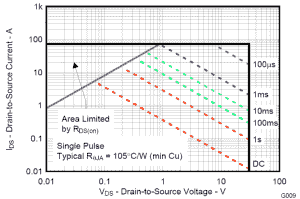

# 黑客日视频:组件(和直升机)的安全区域操作

> 原文：<https://hackaday.com/2014/03/21/hackaday-video-safe-area-operation-for-components-and-helicopters/>

我们回来了，这次讨论的是安全工作区，也称为安全工作区(SAO ),是可能会破坏设计的各种因素的缩写。我们也谈论直升飞机。

你可能会问，为什么要花这么多时间来讨论 SAO，直升机有什么用？根据设计的不同，可能会涉及到相当多的繁琐的数学运算，有时这是无法避免的。或者，如果你能感觉到什么时候数学是关键的，什么时候不是关键的(基于设计选择)，那么在遵守交通规则的同时，你的下一个项目应该更容易启动和运行。

Safe Area Operation Diagram

元件，尤其是那些产生热量的元件，如上面所示的功率 MOSFET，都有一套相当明确的工作规范。这些规格构成了 SAO 在这种情况下，您可以确保一致的操作，同时保持器件的可靠性。因此，虽然有时间讨论细节，但也有概念阶段，在这个阶段，人们可能会提出问题的想法，并在使用一些占位符类型值时检查是否合适。

所以不为家里温和的观众所知，我们有一个计划；不，我们对统治世界不感兴趣，我们用 Z80 尝试过，但失败了。我们感兴趣的是帮助那些崭露头角的设计师，甚至包括一些我们这种精疲力竭的类型，去获得解决一些常见问题的不同方法的直观感受。

Safe Area Operation discussed.

一个可能涉及 SAO 的示例设计可能有几个方面:我们应该使用开关操作而不是线性操作吗？我们需要小心选择正确的部分吗？或者几个部分中的任何一个都有用吗？会不会变热？

如果你不知道我们在谈论什么，顶部的视频包括一个很好的例子，大约在 3 点 40 分，展示了一辆几十年前的机动坦克的变阻器。粗糙的电机控制器在错误的位置放置了太长时间，产生了太多的热量，以至于在塑料外壳上熔化了一个洞。虽然这是一个简单的例子，但我们可以将其视为在保持冷却的同时权衡电阻、电流和电压的例子。

Deadman’s Curve and SAO

这让我们回到了原点；为什么要让古老的直升机参与进来，这仅仅是一个廉价的噱头来引起人们的兴趣吗？答案是肯定的，这是一个噱头——但直升机确实有一个 SAO，或 Deadman 曲线，它是在高度和前进速度之间绘制的。死亡曲线只是意味着有一个巨大的区域，飞行器可以正常运行而不用担心数学，然后有一个区域就是数学。

Safe Area Operation vs Time

在坦克和直升机之后还和我们在一起吗？太好了，是时候进行真正的数学运算了。在 5:30 的时候，你会学到如何阅读和理解 SAO 图的基本知识，如右图所示。

我们也可以用时间换取热量，因此短脉冲可以处理更高的电流，如虚线所示。这在 LED 等其他设备中可能很有用，在这些设备中，人眼在短脉冲期间记录峰值输出，然而，由于一种称为[视觉暂留](http://en.wikipedia.org/wiki/Persistence_of_vision)的现象，不会记录 LED 花费一部分时间关闭和冷却的事实。

视频快结束时，我们将讨论为什么 MOSFET 的“导通电阻”(通常表示为 RDS(on))会对该器件的功耗产生巨大影响。这是因为对于不稳定的负载，功耗随着电流乘以负载电阻的平方而增加(P = I ² R)。导通电阻非常小的变化都会对功耗产生非常大的影响。为了理解温度的产生和影响，请查看上一个关于热的[黑客视频](http://hackaday.com/2014/03/03/hot-or-not-find-out-how-to-calculate-component-heat-and-why-you-should/ "Hackaday: How to Calculate Heat")。

归根结底，所有这些都意味着，如果你站在 SAO 等式的错误一边，你的设计可能会过热或受到其他压力，并遭受各种应该避免的问题。SAO 不是用来证明某件事是不可能的，更多的时候它是一种工具，用来发现什么*是可能的*以及什么是权衡取舍。有时答案是，如果 SAO 确定“你不能从这里到达那里”，或者用 [WOPR](http://en.wikipedia.org/wiki/WarGames "WOPR on the movie Wargames.") 的话说，“唯一成功的举措就是不玩”，那么设计师需要重新开始或者寻找解决问题的其他方法。通常这意味着被调换或者回家。好消息是，如今有一些真正的超棒开关输出可用。

[https://www.youtube.com/embed/udPvhbDd-CQ?version=3&rel=1&showsearch=0&showinfo=1&iv_load_policy=1&fs=1&hl=en-US&autohide=2&wmode=transparent](https://www.youtube.com/embed/udPvhbDd-CQ?version=3&rel=1&showsearch=0&showinfo=1&iv_load_policy=1&fs=1&hl=en-US&autohide=2&wmode=transparent)