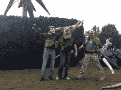
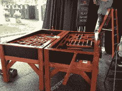
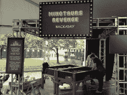
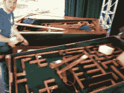
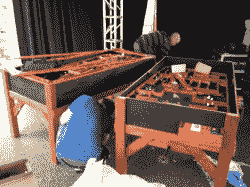

# Hackaday 的决斗大理石迷宫已经死了

> 原文：<https://hackaday.com/2012/10/09/hackadays-duelling-marble-mazes-are-dead/>

[https://www.youtube.com/embed/zglVU1gY9TU?version=3&rel=1&showsearch=0&showinfo=1&iv_load_policy=1&fs=1&hl=en-US&autohide=2&wmode=transparent](https://www.youtube.com/embed/zglVU1gY9TU?version=3&rel=1&showsearch=0&showinfo=1&iv_load_policy=1&fs=1&hl=en-US&autohide=2&wmode=transparent)

整个红牛创作大赛终于结束了。我们回到了家，从在马克尔的周末中完全恢复了过来。我要感谢红牛车队的工作人员让这个周末变得非常有趣，感谢来自 [Squidfoo](https://www.facebook.com/squidfoo) 的工作人员是一个了不起的团队。

现在，所有的“谢谢”语句都结束了，让我们谈谈发生了什么。孩子们毁了我们的游戏。我们立刻注意到我们的结构经不起虐待。它是在如此短的时间内设计、建造和测试的，以至于我们真的不知道它将如何承受大众的重量。事实证明，我们应该走得更远，更崎岖。它几乎立刻就被摧毁了。

在发现它在运输过程中被砸碎后(我们没有正确装箱是我们的错)，我们做好了一切准备迎接大门的开启。在第一波过后，我们看到我们的电缆系统很快就不一致了。更糟糕的是，孩子们会在父母的注视下一言不发地爬上去。

到午饭时，[安德鲁]，我们的木匠已经花了几个小时进行快速修理。一个年轻的少年踩了一个控制杆，最终导致一张桌子完全失灵。到第一天下午 2 点，两张桌子都完全坏了。

虽然桌子坏了有点令人失望，但这让我们可以四处逛逛，玩得很开心。[Scott Sauer]和[Ryan Fitzpatrick]在某个时候决定制作一套牛头怪服装，结果大受欢迎。你可以看到上面服装的一些亮点。

