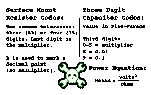
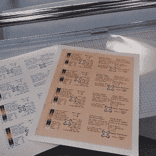
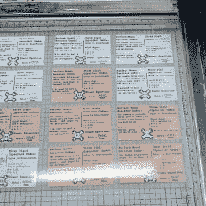
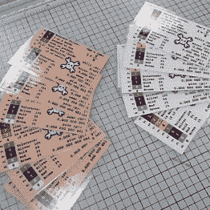

# 哈卡戴电阻代码参考卡

> 原文：<https://hackaday.com/2013/08/28/hackadays-resistor-code-reference-card/>

看看我刚刚做的电阻颜色代码参考卡。我受到了 Octopart 本周众筹的 PCB 版本的启发。那些没有我通常会查找的信息，所以我决定自己做一些，放在那里作为灵感或者让你们自己打印出来。

这背后的故事是，我们得到了一些关于八部卡的提示。不要误解我的意思，有一个 PCB refcard 很酷。但是正面的信息只是色码本身(三次)。背面是一组表贴封装。我不觉得这些足迹有用，除非它是一种测试我自己设计的自定义轮廓的方法。如果我要订购这样的东西，我会更倾向于达夫·琼斯设计的尺子，T2 最近做了一个小批量的开放订单。我差点就扣下了扳机。也许下次吧。

 为什么要让信息本身扫兴呢？我开始思考我经常查阅的东西。手头有电阻色码图总是好的，所以我把它包括在内。宽容是我没有记住的一件事(当然，黄金 5%带除外)。我也喜欢查找一些国际单位制单位，以确保我做的数学是正确的。对我来说最常见的四个包括在前面欧姆定律方程的下面。

背面是一张用于读取表面贴装电阻代码的备忘单。[Mathieu]已经提到，带有“R”的代码有时可以包含一个乘数。哎呀！旁边是一个三位数的电容代码提醒，我几乎总是最终查找。权力方程式是我一直都知道的，但是，嘿，它有空间。

## 做一个你自己的

我用了不到一个小时就把这东西搞定了。查看 XCF 文件，以及上面显示的 PNG 导出文件(这些文件实际上有透明背景)，还有我为这个项目打印的 PDF 联系表。他们在我们的 Github repo 上[。我决定尝试两种不同的背景色。我是上面显示的浓汤的粉丝，但也跑了一半的白色。](https://github.com/Hack-a-Day/Resistor-RefCard)

  Color prints and laminating sheet  Color prints cut and aligned for lamination  Laminated cards after being cut apart

我去了当地的联邦快递金科斯打印店。我可以提前上传 PDF 文件。他们给我印了两份双面拷贝(每种颜色一份)。我觉得这个 2.91 美元的价格很便宜，因为这意味着我可以在家里用一台超级便宜的黑白激光打印机。当我拿起它们的时候，我还用它们的切纸刀把卡片和纸张分开。在用切纸机的网格表对齐卡片后，我用一张 8.5×11 的层压板一次性层压了 12 张卡片。用同一把切纸刀将完成的卡片切成单张。层压是 2.10 美元，使整个项目达到 5.01 美元——每张卡片 42 美分，这与 Octopart 版本要求的 9 美元相比是一个很大的突破。

当然，如果你想把它印在 PCB 上，为什么不用喷胶把它粘在一些覆铜板上，然后用透明的丙烯酸喷剂把它涂在上面。也许这对我来说听起来很容易，因为实际上我手头上有所有这些东西。

如果你自己制作参考卡，我们想看看。把它们贴在下面(你制作的真实卡片…没有模型！).我建议把你的照片发到 [imgur](http://imgur.com) 上，并在评论中使用 [HTML img 标签](http://www.w3schools.com/tags/tag_img.asp)。这应该很好玩！