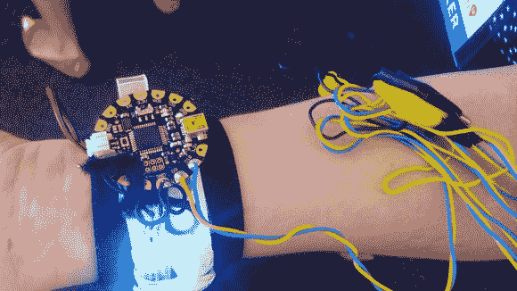

# 被黑的电子烟蒸发器可以在太空中散发气味！

> 原文：<https://hackaday.com/2014/07/23/hacked-e-cigarette-vaporizer-can-send-smellsin-space/>

这个 3D 打印的香味分配器是由来自三个州的八个人在 2014 年纽约 NASA 太空应用挑战赛期间组装的。该队在比赛中获得了 T2 第一名。

该项目名为 Senti8，使用了 FLORA Arduino 微控制器和从 Adafruit 购买的 Neopixel LED 灯条。然后，一个智能手机移动应用程序远程连接到该设备，允许用户选择他们想要发送给朋友的气味，朋友也戴着其中一个腕带。

他们通过简单地询问一位名叫道格·惠洛克的美国宇航员，在茫茫太空中旅行时，他最想念什么，从而产生了这个想法。令他们惊讶的是，他说他最怀念的是他的嗅觉。

最初，该项目被设想为太空旅游的可穿戴技术。但随着时间的推移，该项目演变成一种腕带，可以让人们记住去过的地方或星球。甚至那些地方特有的记忆也可以通过气味进行实验。

2014 年 7 月 17 日，团队成员之一[Brooks]被发现穿着 Senti8 出现在加利福尼亚州帕萨迪纳市举行的可穿戴技术 LA 会议上。当她与当地 Crashspace 成员聊天时，外面排列的 LED 灯可以在整个大礼堂中看到，他们准备向公众展示他们的[设计导向的黑客](http://blog.crashspace.org/2014/07/crashspace-at-the-extreme-wearables-designathon/)。

她在采访中演示了腕带，视频如下:

[https://www.youtube.com/embed/ySvl7jQtXnM?version=3&rel=1&showsearch=0&showinfo=1&iv_load_policy=1&fs=1&hl=en-US&autohide=2&wmode=transparent](https://www.youtube.com/embed/ySvl7jQtXnM?version=3&rel=1&showsearch=0&showinfo=1&iv_load_policy=1&fs=1&hl=en-US&autohide=2&wmode=transparent)

Senti8 介绍视频也可以在这里看到:

[https://www.youtube.com/embed/CTgAMKQsZkw?version=3&rel=1&showsearch=0&showinfo=1&iv_load_policy=1&fs=1&hl=en-US&autohide=2&wmode=transparent](https://www.youtube.com/embed/CTgAMKQsZkw?version=3&rel=1&showsearch=0&showinfo=1&iv_load_policy=1&fs=1&hl=en-US&autohide=2&wmode=transparent)