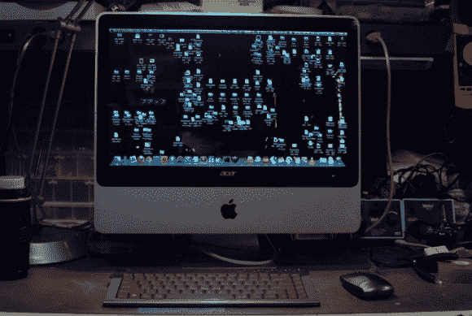

# 被黑在一起的 Mac 不是黑客

> 原文：<https://hackaday.com/2013/04/16/hacked-together-mac-isnt-a-hackintosh/>

看看这台 20 英寸的 iMac。注意到什么特别的吗？仔细看苹果标志上方的品牌。唯一能让你看出这个 iMac 是一个拼凑而成的单元的是替换屏幕上的宏碁标志。

正如我们经常被抓到的那样，[Flippy]正在浏览易贝的交易。这是一项危险的活动，因为你最终会陷入 35 美元一台的铝制 iMac。这导致了购买一个非常薄的 led 液晶显示器作为显示器。它完全适合 iMac 的玻璃边框后面，在右上角有一个小小的芯片，不会打扰[Flippy]。它足够薄，这实际上为他留出了空间，可以添加 MacBook Pro 的内部部件，他一直放在他的未用部件堆中。考虑到所有的主要组件，剩下的实际上只是物流，如路由所有的电缆连接器和添加 USB 端口的开口。他最终得到的是一台价格低廉的高端电脑。