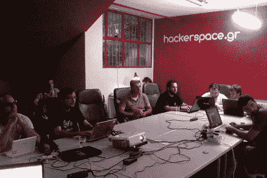

# Hackerspace 简介:希腊雅典的 Hackerspace.gr

> 原文：<https://hackaday.com/2012/04/26/hackerspace-intro-hackerspace-gr-in-athens-greece/>

这是一个合适的视频，作为我们的第一个黑客空间介绍。在我们昨天呼吁黑客空间之旅后，[Nikos]发邮件告诉我们，他们的黑客空间已经准备好了一个视频。虽然这更像是一个普通的视频，解释了 hackerspaces 背后的想法，但我们确实可以看到那里正在发生的一些事情。你可以在休息后观看视频(有英文字幕)，或者直接去他们的网站看看在希腊雅典的 Hackerspace.gr 发生了什么。

虽然这个视频制作得很好，但你的不一定。我们不在乎你是否和其他两个成员在地下室拍摄，展示几个项目，我们想看！如果你在为我们制作视频，请记住我们已经知道什么是黑客空间，所以让我们看看你在做什么！

[https://www.youtube.com/embed/q549zJE8d84?version=3&rel=1&showsearch=0&showinfo=1&iv_load_policy=1&fs=1&hl=en-US&autohide=2&wmode=transparent](https://www.youtube.com/embed/q549zJE8d84?version=3&rel=1&showsearch=0&showinfo=1&iv_load_policy=1&fs=1&hl=en-US&autohide=2&wmode=transparent)