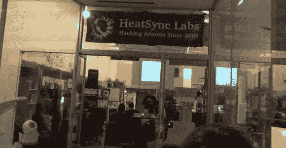

# 黑客空间简介:HeatSync 实验室

> 原文：<https://hackaday.com/2013/03/11/hackerspace-intro-heatsync-labs/>

托德·哈里森(Todd Harrison)写的不是一个项目，而是他当地黑客空间的视频之旅:亚利桑那州梅萨的热同步实验室。他[在周末随身带了一台相机](http://www.toddfun.com/2013/03/10/heatsync-labs-hacker-space-in-mesa-az/)去记录你参观太空时可以期待的东西。休息之后你会发现旅程被嵌入了。

它从我们喜欢看的东西开始。这个空间被用来做一个演讲，看起来会有很多人参加。该建筑是一系列店面中的一个单元，当你一进门，它就提供了一个大的开放空间。就在这个聚集区的过去，有几排电子工作台，包括工作台用品和示波器等硬件，以及焊接和返工区。在后面的角落里，他们有一个很大的激光切割机，[托德]花了一些时间和其中一名成员一起查看他们用它制作的所有有趣的东西。后面的房间将木工、机床和焊接等杂乱的项目与其他项目分开。

这个地方非常干净，我们会组织好的。如果你在这个地区，一定要停下来亲自看看。

这是我们第二次看到 HeatSync 实验室。第一次巡演由我们自己的[Caleb Kraft]主持

[https://www.youtube.com/embed/OQb2Ia0rCyY?version=3&rel=1&showsearch=0&showinfo=1&iv_load_policy=1&fs=1&hl=en-US&autohide=2&wmode=transparent](https://www.youtube.com/embed/OQb2Ia0rCyY?version=3&rel=1&showsearch=0&showinfo=1&iv_load_policy=1&fs=1&hl=en-US&autohide=2&wmode=transparent)