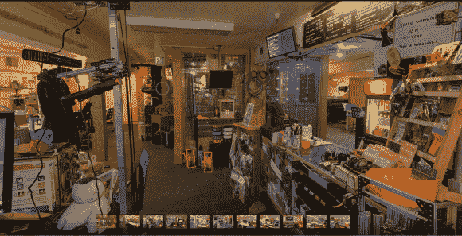

# 黑客空间简介:Metrix Create:华盛顿州西雅图的空间

> 原文：<https://hackaday.com/2013/02/12/hackerspace-intro-metrix-createspace-in-seattle-washington/>

代替视频，Metrix 的成员在华盛顿西雅图发布了[一个自助虚拟旅行](http://www.bohonus.com/hosted/metrix/)。有一个链接指向该地区专门从事这类事情的专业摄影师。我们假设他是会员，很想知道他是否黑进了自己的系统来捕捉球形全景。

上面的图像看起来朝向前门。右边是一个咖啡馆类型的柜台，它甚至提供了一个菜单板，上面列出了会员价格和时间租赁，比如在焊接室的一个小时。这次旅行包括从 11 个有利位置拍摄的照片，突出了空间的每个部分。这包括你可能期望的一切(3d 打印、激光切割、电子原型制作)，但也有一些你没有。有一个儿童安全游戏区(我们听说堪萨斯城黑客空间也有一个)，还有一个巨大的取放机。