# 黑客空间介绍:制造商在阿拉巴马州亨茨维尔本地 256

> 原文：<https://hackaday.com/2012/05/29/hackerspace-introduction-makers-local-256-in-huntsville-alabama/>

当我宣布今年夏天将在阿拉巴马州和乔治亚州旅行时，来自 Makers Local 256 的[Tim]很快给我发了一封电子邮件，问我是否愿意顺道拜访。既然我打算带我的孩子去亨茨维尔的航天中心，我想这将是参观另一个黑客空间的绝佳机会。

[https://www.youtube.com/embed/AHp-1C8Ep9U?version=3&rel=1&showsearch=0&showinfo=1&iv_load_policy=1&fs=1&hl=en-US&autohide=2&wmode=transparent](https://www.youtube.com/embed/AHp-1C8Ep9U?version=3&rel=1&showsearch=0&showinfo=1&iv_load_policy=1&fs=1&hl=en-US&autohide=2&wmode=transparent)

Makers Local 256 是受旧金山科技商店的启发而创立的。他们第一次见面是在 2006 年，从那以后他们成长了很多。他们开始时占地约 900 平方英尺，现在拥有超过 2500 平方英尺的设施。正如你在视频中看到的，他们非常活跃，到处都有项目。对我来说，只是四处走走看看，然后离开是相当困难的。我真的很想深入了解一些正在进行的项目。

当我们四处走动时，我们发现[Jennifer]正在一间办公室里建造一个看起来相当令人印象深刻的 LED 立方体。我请她解释了下面视频中的项目。看起来会很酷。

[https://www.youtube.com/embed/5l0JYZoCQCo?version=3&rel=1&showsearch=0&showinfo=1&iv_load_policy=1&fs=1&hl=en-US&autohide=2&wmode=transparent](https://www.youtube.com/embed/5l0JYZoCQCo?version=3&rel=1&showsearch=0&showinfo=1&iv_load_policy=1&fs=1&hl=en-US&autohide=2&wmode=transparent)

就像我之前说的，那里有很多东西可以看和玩。有一个真人大小的 Dalek，巨型模型火箭，一个雅各布的梯子，几个摩托车焊接在一起，掏空弹球机。各种乐趣。我们甚至用 100%胶带美国队长盾玩飞盘。

[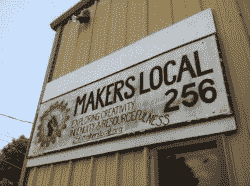](https://hackaday.com/wp-content/uploads/2012/05/img_2356-e1338330887651.jpg)[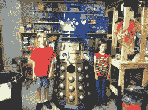](https://hackaday.com/wp-content/uploads/2012/05/img_2353.jpg)[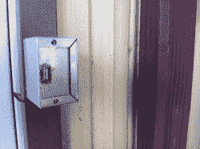](https://hackaday.com/wp-content/uploads/2012/05/img_2357.jpg)[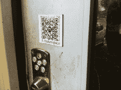](https://hackaday.com/wp-content/uploads/2012/05/img_2358.jpg)[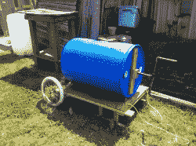](https://hackaday.com/wp-content/uploads/2012/05/img_2359.jpg)[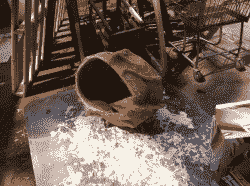](https://hackaday.com/wp-content/uploads/2012/05/img_2361.jpg)[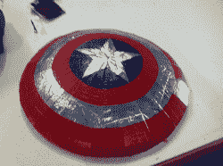](https://hackaday.com/wp-content/uploads/2012/05/img_2362.jpg)[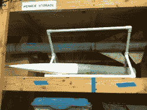](https://hackaday.com/wp-content/uploads/2012/05/img_2364.jpg)[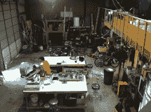](https://hackaday.com/wp-content/uploads/2012/05/img_2365.jpg)[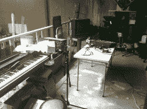](https://hackaday.com/wp-content/uploads/2012/05/img_2366.jpg)[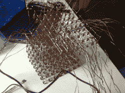](https://hackaday.com/wp-content/uploads/2012/05/img_2368.jpg)[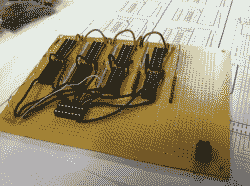](https://hackaday.com/wp-content/uploads/2012/05/img_2372.jpg)[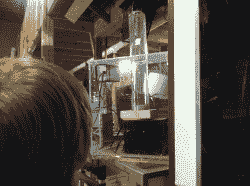](https://hackaday.com/wp-content/uploads/2012/05/img_2376.jpg)