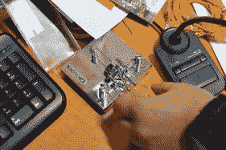
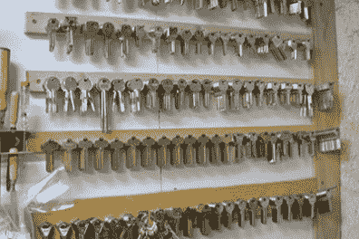

# 黑客空间之旅:MuCCC

> 原文：<https://hackaday.com/2014/11/18/hackerspace-tours-muccc/>

如果不去一趟真正的欧洲黑客空间，我们的德国之旅就不算完整，慕尼黑混沌电脑俱乐部也非常乐于助人，允许我们侵入他们的空间。

甚至在走进门之前，迎接你的是你所见过的最酷的展示之一。他们建筑的前半部分是一个巨大的 flipdot 显示器。它令人惊讶，虽然在我们的访问中没有点被翻转，但我们可以想象噪音会震耳欲聋。简直牛逼。

走进门，迎接你的是普通会议区、会议室、沙发和阴阳魔界弹球机。当我们到达时，机器并不完全工作，但在五分钟内，[Sprite_TM]就在后玻璃后面，并在一个小时内修好了一切。

后面的房间和地下室有常见的各种工具——3D 打印机、数控机床、车床和电子工作台。如果你需要配钥匙，去地下室。你还会在地下室找到一台自动取款机。这个故事是这样的，慕尼黑的新闻站想做一个关于在 ATM 机上用 USB 接入 Windows 系统是多么容易的故事。电视台做不到——但他们伪造了——把自动取款机放在了易贝身上。没花多少钱，自动取款机就找到了通往地下室的路。

不过，MuCCC 不仅仅是一个有工具的空间:在欧洲黑客空间的传统中，经常会有适合学术会议的演示和演讲。上周二，[nicolas] [展示了一些保护密钥免受物理完整性攻击的技术](https://gnunet.org/benes2014panic)，例如，邪恶的女仆攻击或 SWAT 小组入侵您的路由器柜。它是一个守护进程，通过 GPIO 引脚监听加载了传感器的 AVR。如果设备中存在物理入侵——大气压力或光线——存储在存储器中的密钥可以被擦除。

你可以从下面的空间查看图片集。

  The stores of Club Mate. There was also a vending machine.  Components  Flip dot display in a junk box.      Iambic keyer    This test equipment was donated, but it’s still amazingly good  No, that’s not a Darwin. It’s close, though, and the only printer of this design I’ve seen at a hackersapce            Keys  There’s an ATM in the basement. Apparently, a news station in Munich bought an ATM to demonstrate how easy it is to crack. The news station couldn’t crack it. It was then sold on eBay and wound up at the space. Yes, you can now play Solitaire on it.          Good     [![[Sprite_TM] came into the space and found a broken Twilight Zone game. 30 minutes later, it was fixed.](img/09d6ee6e543b4a84bb8dea58294038a5.png "Sprite")](https://hackaday.com/2014/11/18/hackerspace-tours-muccc/sprite-3/) [Sprite_TM] came into the space and found a broken Twilight Zone game. 30 minutes later, it was fixed.  ARRL handbook in Germany. Okay.  Twilight Zone    Outside of the space.