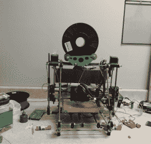

# 黑客空间之旅:奥马哈创客集团

> 原文：<https://hackaday.com/2014/09/24/hackerspace-tours-omaha-maker-group/>

内布拉斯加州奥马哈的奥马哈创客团体成员亲切地称他们的空间为创客室。这让人回想起他们在一个 900 平方英尺的空间里的简陋开端，那里以前是一家面包店。那里只有一个简陋的电源插座，他们不得不去最近的厕所，通常是乘坐他们制造的汽车。正是在这个小小的空间里，他们建造了工作台，建立了友谊，从而创造了他们今天的聚会场所。

在过去的两年里，[OMG]一直住在他们目前更靠近中心的地方。正是在那里，我在创客节前的晚上与(埃里克)和(本)见了几个小时，他们对此负有很大责任。[Eric]花了一天时间在奥马哈儿童博物馆布置，他和[Ben]很友好地给了我一个详细的参观。

新空间是一系列房间，从休息室和会议室开始。在这里，你可以找到啤酒和小吃，满是装裱好的文章的吹牛墙，以及一个可遥控的网络摄像头。几个创始成员已经遍布世界各地，但能够通过这些联系参与进来。这个房间最好的部分要么是 PVC 框架的拉斯皮·MAME 橱柜，要么是浴室门上不歧视机器人的标志。

接下来是一个有点小的房间，里面有他们的 3D 打印机，一个由其中一个成员制作的带有线轴支架的改良孟德尔打印机。旁边有一大堆胶棒帮助指纹粘在床上。那对我来说是一个新的。[本]说他们工作得太好了。旁边是他们的 K40 C0 [2] 激光切割机，他们修改为只有在关闭时才运行(！).他们还增加了发光二极管和排气扇。切割机大概三天就内部众筹了。根据[Eric]的说法，这种方法对他们很有效；没有人会花钱买他们不会用的设备。他们目前正在使用捐赠的框架建造第二个更大的框架。

许多魔法都发生在隔壁房间。它是最大的，容纳了大部分的一般制作空间，包括一个电子工作台和一个带手工工具的独立工作台。中间是一些模块化的轮式工作台，这是他们作为一个群体在旧空间里做的第一件东西。你还会发现一个缝纫区，一个热线泡沫切割机，一个绘图仪，以及他们通过[发明 50 州竞赛](http://blog.inventables.com/2014/05/we-are-donating-3d-carving-machine-to.html)赢得的 Shapeoko。

他们有一个成员碰巧是机械师。他提供了各种有趣的东西，比如金属车床、木头车床和竖锯，这些都在第四个也是最后一个房间里。在这里可以找到所有重型机械和大量原材料，还有磨机、焊接设备、钻床、带锯等类似的东西。

我最喜欢这个空间的一点是它的整体结构。[Eric]告诉我，他们定期安排清理日以消除混乱。这是特别有帮助的，当他们有像跑步机这样的东西捐赠给他们的时候，这对一对夫妇的马达是好的，并且基本上只是在那之后的方式。所有的手动工具，如套筒扳手、钳子和锤子都有颜色编码，以区分那些任何人都可以自由使用的工具和那些个人使用的工具。几个架子上的蓝色储物袋充当了私人储藏的储物柜。

很高兴看到一个团体像[奥马哈创客团体]这样运作。除了组织奥马哈的第一届创客节，他们还经常在内布拉斯加州机器人博览会的一个巨大的展位上工作。他们还至少每年举办一次投石机和鸡蛋掉落工程之类的比赛。2014 年早些时候，他们举办了一场[杉木拉力赛](http://omahamakergroup.org/2014/01/22/2014-firlumber-rally-photos/)，并在“空间”内建造了他们自己的木质赛车。

他们试图以合理的费率保持会员资格。对于每月 15 美元的学生费用，你可以使用公共工具和机器。每月 35 美元可以给你一把钥匙。不管怎样，冰箱里的啤酒总是受欢迎的。他们每周至少有两次营业时间，每月会面讨论业务。如果你对硬件不感兴趣，他们还有一个叫做 [OMGCode](http://code.omahamakergroup.org/) 的编程小组。

[https://videopress.com/embed/bmv5hhpU?hd=1&cover=1&loop=0&autoPlay=0&permalink=1&muted=0&controls=1&playsinline=0&useAverageColor=0](https://videopress.com/embed/bmv5hhpU?hd=1&cover=1&loop=0&autoPlay=0&permalink=1&muted=0&controls=1&playsinline=0&useAverageColor=0)