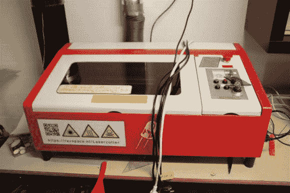
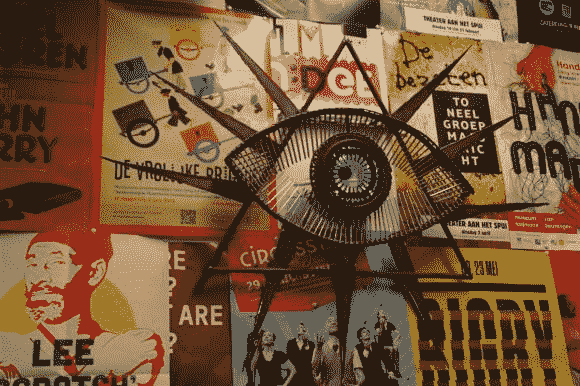

# 欧洲的黑客空间:海牙的 RevSpace

> 原文：<https://hackaday.com/2013/10/26/hackerspacing-in-europe-revspace-in-den-haag/>

欢迎来到 [RevSpace！](https://revspace.nl/Main_Page)

这是荷兰最大的黑客空间——直到 Hack42 在阿纳姆获得了一个军事基地……稍后会有更多的报道。RevSpace 是一个 24/7 的黑客空间，位于一个大型工业建筑的地下室，变成了车间/工作室。他们有很多空间，但随着他们的继续增长，甚至可以使用更多空间！上面的照片来自周二晚上的烧烤——这是一项每周一次的活动，已经持续了将近两年了！这是一个社交之夜，它吸引了许多人来分享美食、良伴和美好时光。

特别感谢[马克]来火车站接我们！他就是照片最下面**右边**的那个人，也是 RevSpace 的董事会成员之一！

进入地下室后，一个大型三相电源开关控制着俱乐部的状态——会员们在场时打开开关，这就更新了网站，告诉人们这个空间实际上是开放的。

这个系统和其他几个系统由安装在大警铃上方的小型计算机控制。

每个付费会员都有自己的钥匙——不过空间决定为他们制作自己的程序员！

必须的俱乐部队友照片。

我们提到过这个空间有一个很棒的焊接和制造棚吗？

该空间拥有的少数自动售货机之一。显然，你可以花几百欧元买到这些自动售货机，主要是因为有人丢了钥匙！不过，对于黑客空间来说，这不成问题，只要撬锁就行了！他们购买的两台机器最后仍然有将近 100 欧元在里面！

被黑的中国激光雕刻机，以提高性能…

用于电子项目的小型 PCB 工厂。

这是烟囱——不幸的是，它被泥土填满，前面有一堵砖墙……他们租了一把手提钻，现在有了通风橱和通风系统！

一些 3D 打印机和长长的工作台。

紫外线灯无处不在！这个黑客空间配备了你需要的几乎所有工具！

像这样方便的标签告诉你这是谁的项目(或工具)，是否允许你使用它，等等。

头骨可以看到所有的东西——3D 的！

组件存储覆盖了大部分墙壁——到处都是架子！

这是一个完全可滚动的，可滚动的，网络可编程的 LED 标志！

他们甚至有立体显微镜！

一个房间，但是空间很大！

他们遇到了虫子吃他们的植物的问题——这有点难以看到，但现在有小的捕蝇草来保护他们！

其中一个黑暗的储藏室里堆满了各种各样的硬件、工具和其他随机零件。

宜家 LACK 拉克桌的更多创意用途！

小书馆…

可能会扩展到地下室的其他地方！

等离子切割硬盘。为什么？为什么不呢！

没有至少一台街机的黑客空间是什么？

这是他们支付实际租金的正式办公室。他们与拥有该建筑的公司关系良好，并且他们为其他常驻公司(IT 等)提供许多服务，所以从财务角度来说，这是一个非常好的情况！

他们在大楼里发现了路灯的设计图，看着挺迷人的！

这里有一个细节特写——看到这样的东西真的会让你对 CAD 发明之前的制图产生一定的敬意。

外面是焊接、烧烤和加工棚。

手榴弹式的烧烤能让很多人吃饱，尤其是在周二晚上。很难看到，但它上面有一个大型通风柜！

一些随机的焊接项目…

俱乐部队友清空…

工具柜！充满了更多的重型电动工具，如电焊机，压缩机，磨床，等离子切割机等。

他们还有一个相当大的闲置停车场，非常适合四轴飞行器测试、卡丁车比赛和其他任何他们想做的事情。空间在城镇的郊区，所以噪音投诉从来不是问题！

他们甚至有一个倾斜的装载区，这使得将项目带入空间变得更加容易。

必看的客房图片。

你能猜出这个人是谁吗？

技术之神。

独特的室内种植解决方案…

监控网络的全视网络之眼——技术和艺术的完美结合，全部焊接在小屋后面。

老实说，我们不确定这是什么。但是看起来很酷。也许 RevSpace 会在评论中对此有所启发。

这绝对是一个我们可以看到自己融入其中的黑客空间。感谢参观 RevSpace！