# 欧洲的黑客空间:布伦瑞克的 0 层

> 原文：<https://hackaday.com/2013/10/31/hackerspacing-in-europe-stratum%e2%88%85-in-braunschweig/>

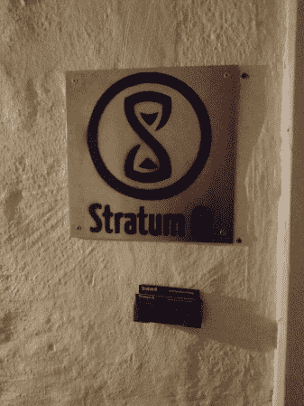

欢迎来到德国布伦瑞克的第 0 层。

我们找这个地方有点困难——它位于一座相当大的建筑的侧面，曾经是一家钢琴工厂。大门半开着，里面漆黑一片。我们进去吗？我们要打电话吗？我们走了一点，遇到了更多的黑暗。对我们的口味来说有点太诡异了。我们的智慧战胜了我们，我们决定打电话，以确保我们有正确的地方，而不是一些杀人狂的巢穴…事实证明，如果你只是按门铃，灯就亮了。哎呦。

我们去顶楼！

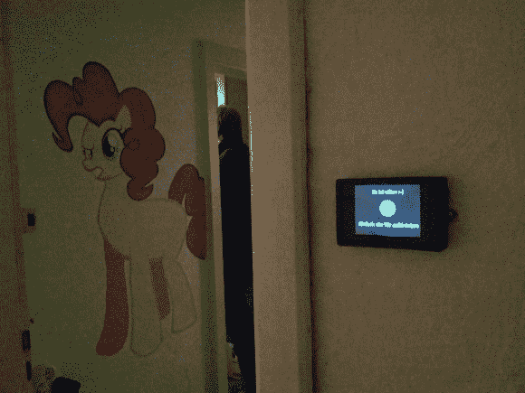

小显示屏显示空间的状态——尽管你可以直接敲门！我们不太确定《我的小马》是不是一个笑话…

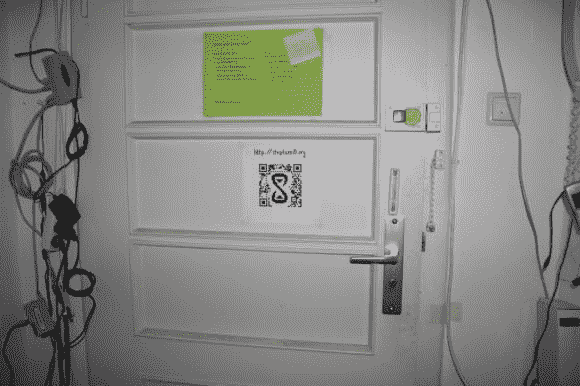

这里你可以看到一个可爱的电线阵列控制着各种东西。你可以在门的右侧看到一部老式诺基亚手机的边缘。它最初是用来通过振动和敲击按钮来解锁车门的！尽管他们已经升级了系统…

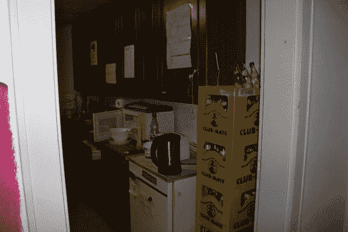

这个空间配备了一个完整的厨房，和俱乐部队友-显然！

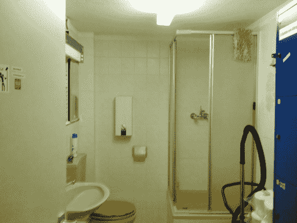

它还有一个带淋浴的设备齐全的浴室！

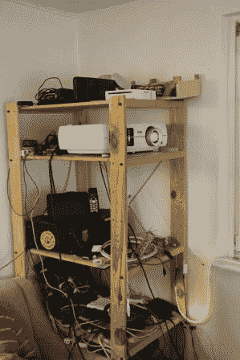

这个木制架子充当他们的临时设备存储库，我认为我们还不能称之为服务器机架。他们很快就要搬走了，所以请原谅这里的混乱！

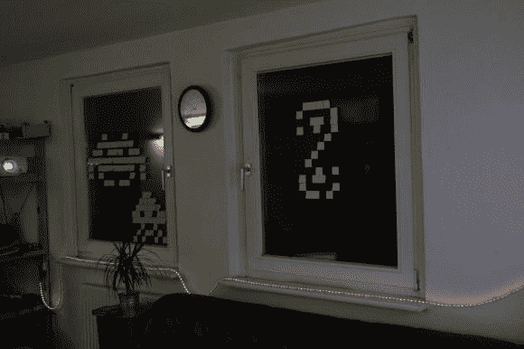

第一个房间是主休息室，有几个沙发，一个不错的投影仪，是一个普通的休闲区。

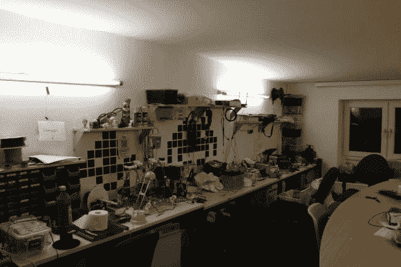

下一个房间是魔法发生的地方。3D 打印机、成箱的组件和烙铁琳琅满目！

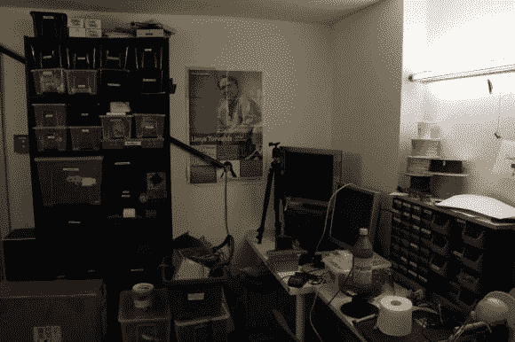

他们承认这个空间有点太基于计算机了，并计划在他们搬家时为硬件项目准备一个更大的“脏”车间。

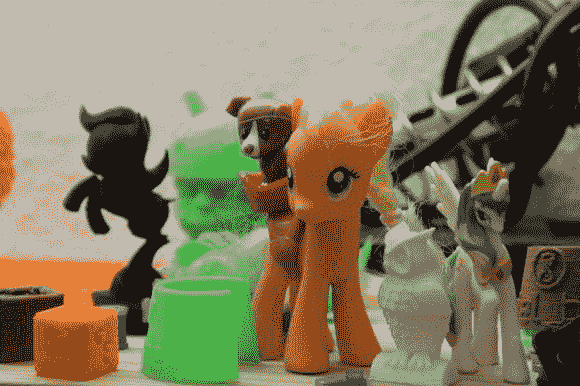

更多的小马！

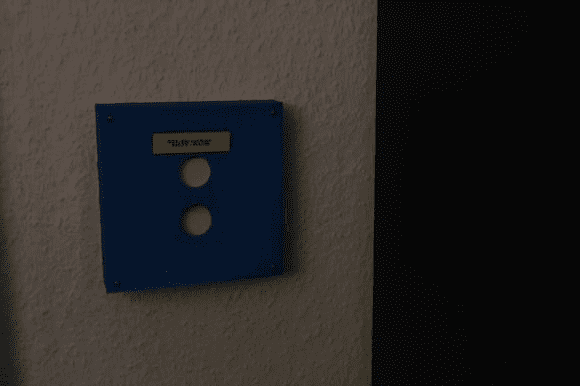

这个开关给整个房间供电。如果 3D 打印机正在打印，请不要关机！

否则你会落得如此下场。半个尤达脑袋。不过不用担心，他们很快就解决了另一半机器人头部的问题。

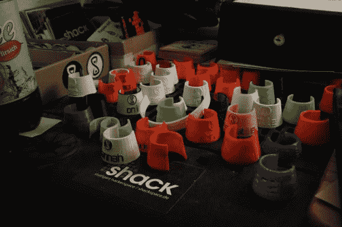

这些超级方便——[3D 打印的瓶子标签](http://www.thingiverse.com/thing:38861)。把它们扣在你选择的饮料的脖子上，永远知道它在哪里！

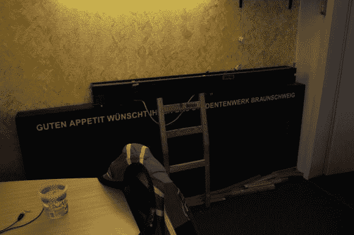

在这里看起来有点困难，但这是当地一所学校的 LED 计分板——他们还没有让它工作，但当它完成时会非常棒！

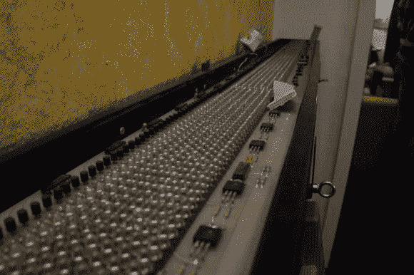

其中一个充满果汁的 LED 面板的细节图。

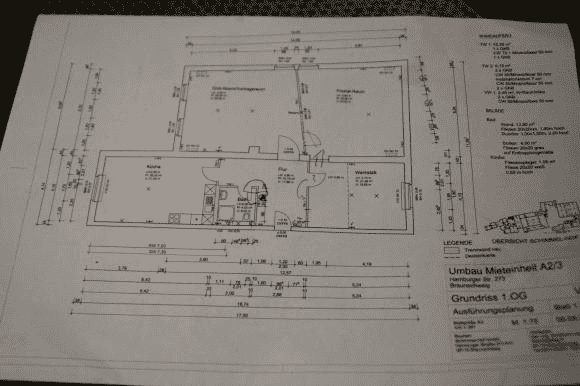

事实证明，楼下还有一个两倍大的空间可供出租。它还没完工，房东愿意以同样的租金把它给他们——太棒了！这些是他们正在制作的蓝图——完成后，空间将达到 160 平方米，包括一个很好的车间区域，用于放置激光切割机、电动工具和其他不适合当前空间的有趣东西。

我们真的很喜欢对 Stratum0 的访问——很棒的人和对未来的美好展望。我们迫不及待地想看看他们的新空间！谢谢你们的参观！