# 欧洲的黑客空间:Gent 中的空白

> 原文：<https://hackaday.com/2013/10/24/hackerspacing-in-europe-whitespace-in-gent/>

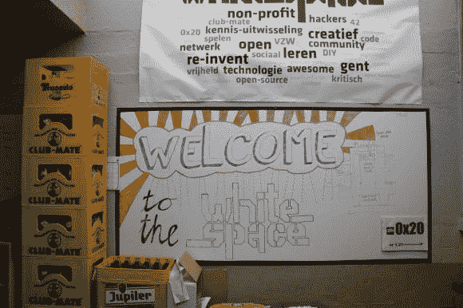

欢迎来到[白色空间](http://www.0x20.be/Main_Page)，或者更亲切的称呼，0x20。

我们很高兴我们能走到这一步——这甚至不是计划中的，但在参观完 HSBXL 后，一名成员与我们取得了联系，所以我们抓住机会，坐上了去比利时根特的火车——只是希望有人能带我们四处看看。我们很幸运，有两个会员来带我们参观。

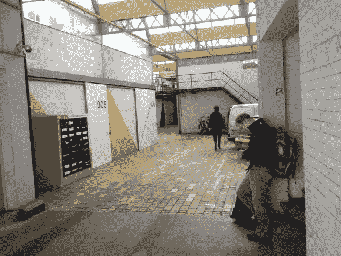

像一对迷路的游客一样在根特闲逛之后，我们设法找到了包含空白的复合体。类似于[车库实验室](http://hackaday.com/2013/10/20/hackerspacing-in-europe-the-garage-lab-in-dusseldorf/)但是建筑是封闭的，并且似乎在空间中容纳更多工作室。

邮箱有点混乱——#13 不代表他们在# 13 工作室。不，他们实际上在 1.21 的二楼。

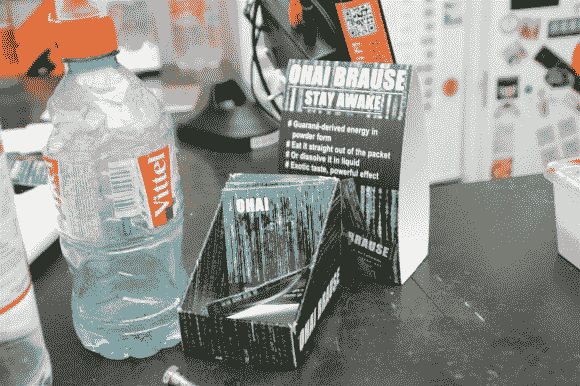

最受欢迎的俱乐部队友也在这里——到处都是！但是在这些包里有一种有趣的混合咖啡因，瓜拉那，谁知道还有什么。其中一名成员[巴特]警告我们，它们不太好吃…

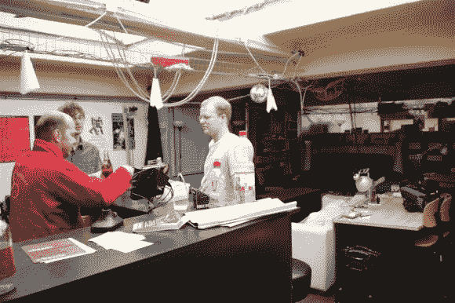

这是空间的主要区域，左边是酒吧(有自动现金/库存系统)、沙发、桌子和所有你可能需要的插座。

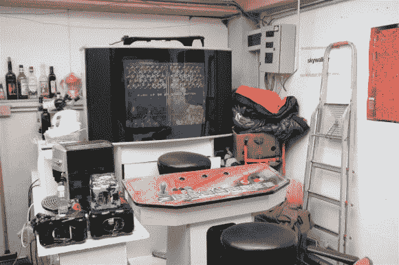

他们还有一台旧的街机，里面有大约 8 个游戏，都是用原版磁带运行的。非常好玩。

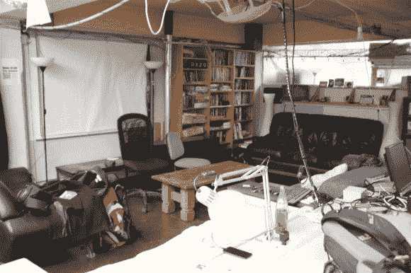

可以看到休息室，投影仪屏幕在后面。坐下来放松的好地方。

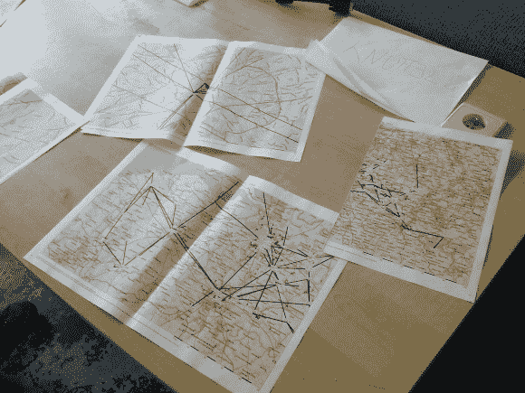

这很酷——如果你不知道的话，比利时到处都有免费 Wi-Fi([翻译](http://translate.google.ca/translate?hl=en&sl=nl&u=http://www.wirelessantwerpen.be/&prev=/search%3Fq%3Dantwerp%2Binternet%2Bnetwork%26espv%3D210%26es_sm%3D122%26biw%3D1024%26bih%3D587))。10 多年前，安特卫普的一些爱好者开始将它作为一种爱好，现在它是一个全国范围的无线网络，每个人都可以免费使用。本质上，每个人都分享他们的网络连接，这就创造了一个巨大的网状网络——这一切的美妙之处？比利时的每个人都有相同的 IP 地址——以国家安全局为例！有关更多信息，请查看上面的链接。

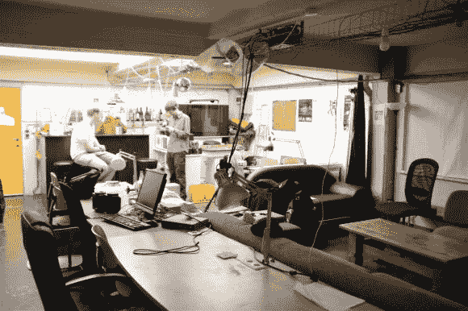

从另一侧看到的休息室。空间不大，但绝对舒适。

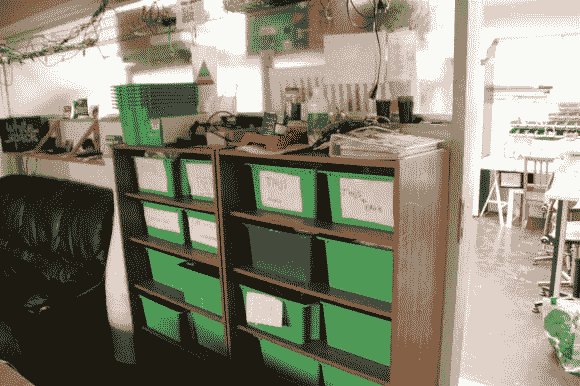

在工作室的入口旁边，我们有会员存放架，人们可以在那里存放他们所有未完成的项目。
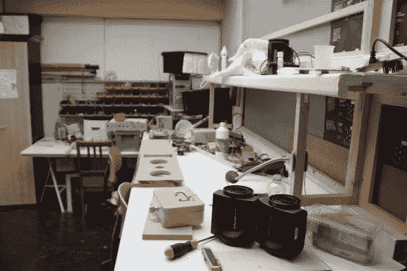

这是后面的工作间。

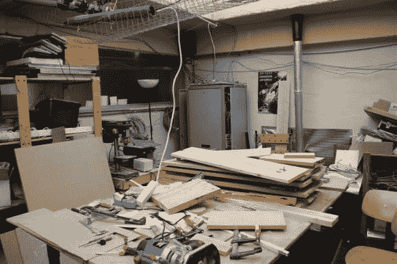

大量的空间用于凌乱的项目，甚至有适当的通风！

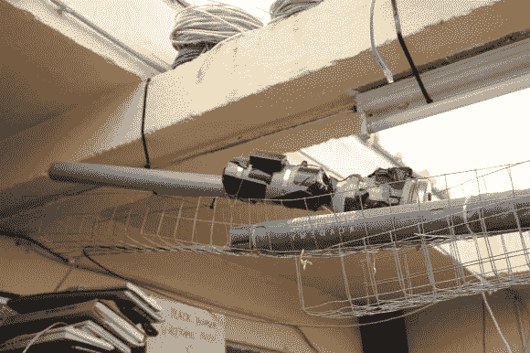

一个横梁架子上挂着一部旧的马铃薯佳能。

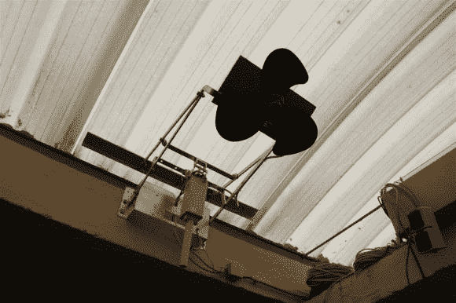

这很酷——屋顶打开了，空白侵入了这个机制，包括一个风扇来帮助通风。这都是由门边的三位开关控制的。

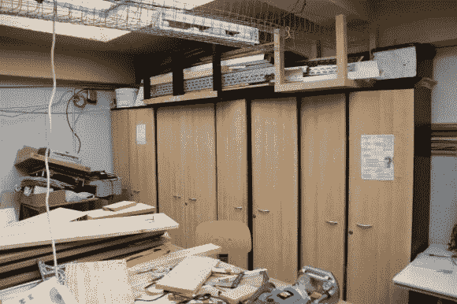

更多存储空间…

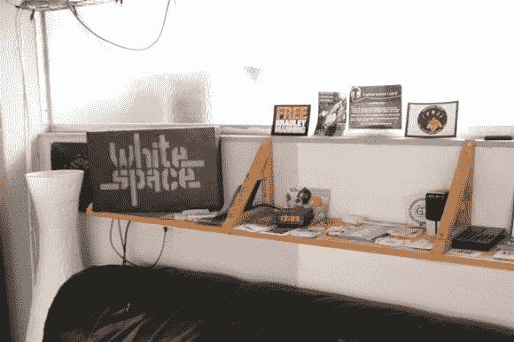

其中一个沙发和贴纸库。

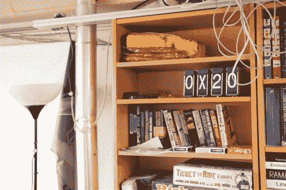

其中一名成员制作了一个巨大的对开显示阵列——准确地说是 140 个字符。你能猜出这是干什么用的吗？其中四个角色留在这里，它仍然是功能齐全的！

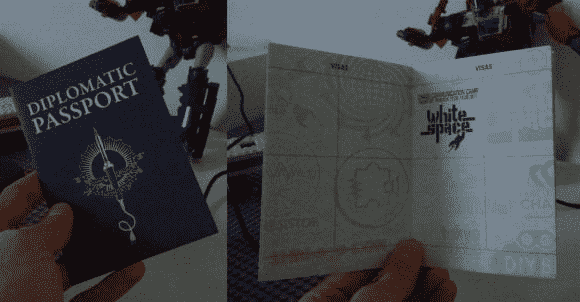

WhiteSpace 碰巧也有黑客空间护照供应！如果你没有意识到，这些是存在的！我们现在落后几张邮票，但并非所有空间都有邮票。你能认出 Hack A Day 的标志吗？

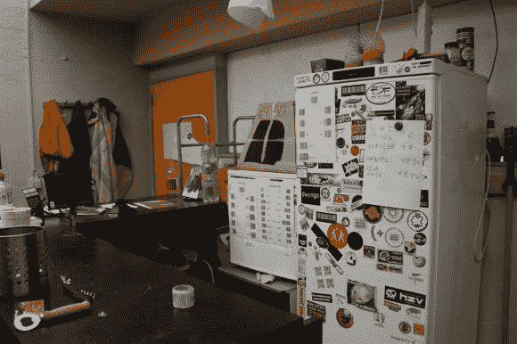

最后是厨房和酒吧区。左边的小监视器由控制食品和饮料会计系统的 Raspberry Pi 驱动。

总而言之，WhiteSpace 是一个非常酷的黑客空间，有很多特色和很棒的氛围。如果你碰巧在比利时根特或附近，去看看吧！