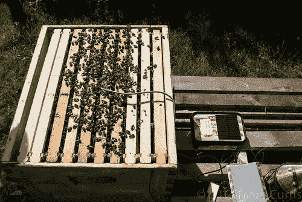

# 侵入蜂巢

> 原文：<https://hackaday.com/2014/08/16/hacking-a-bee-hive/>

[Marc]创建了一个独立的监控平台,使他能够记录蜂箱的温度和湿度。'

群体的健康状况可以基于几个因素来确定。一个是温度，这是蜜蜂是否要群集的早期指标。一旦注意到温度峰值，养蜂人可以采取必要的措施来减少邻居失去蜂巢的机会。蜜蜂健康的另一个指标是湿度。如果这个地区太潮湿，会损坏蜂巢。

考虑到这一点，[Marc]开发了一个系统，如果传感器读数超过一定范围，就会通过短信或电子邮件提醒他。此外，他还监测蜂巢的重量，看看里面有多少蜂蜜。嗡嗡声的频率也被记录下来，入口的活动也被记录下来。他使用了 Arduino Duo 和 DHT22 温度/湿度传感器。一个太阳能电池板为蜜蜂监测系统供电。

有一些挑战需要克服。最初，Arduino 没有发送数据，但通过简单的调试会话就解决了这个问题。从那里，他能够传播信息，用数据创建图表。电池电量、温度和湿度都被记录下来。随着蜂箱被入侵和监控，[Marc]能够利用 Arduino 在他的系统上取得进展。