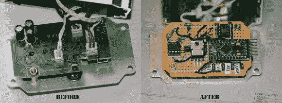

# 黑进迪斯科激光

> 原文：<https://hackaday.com/2013/09/18/hacking-a-disco-laser/>

[Mark]正在寻找一台用于聚会的廉价迪斯科激光投影仪，他找到了一台。对他来说不幸的是，宣传的功能有点欠缺。“声音激活模式”只是一个开关电路，而不是由音乐控制的*——[他着手解决这个](http://www.awe.com/mark/blog/20130915.html)。*

 *拆开这个单元，可以看到一个非常方便黑客入侵的设计。所有组件都通过连接器连接到主 PCB，这意味着激光驱动板是完全独立的！他使用原型板、Arduino pro mini、带简单前置放大器的麦克风、旋转编码器和 MSGEQ7 芯片来分析电平，完全取代了 PCB。哦，还有一个通过 PWM 输出控制电机的 MOSFET。它甚至最终和原来的一样大！

如果你碰巧有一个这样的投影仪，并且也想修理它，他已经在 github 上发布了[源代码和电路图。](https://github.com/iamamoose/arduino-laser)

休息之后，看看前后的视频。还是便宜的 disco 激光投影仪，但至少现在和宣传的一样好用！

[https://www.youtube.com/embed/zxoECKipwzo?version=3&rel=1&showsearch=0&showinfo=1&iv_load_policy=1&fs=1&hl=en-US&autohide=2&wmode=transparent](https://www.youtube.com/embed/zxoECKipwzo?version=3&rel=1&showsearch=0&showinfo=1&iv_load_policy=1&fs=1&hl=en-US&autohide=2&wmode=transparent)

【谢谢马克！]*