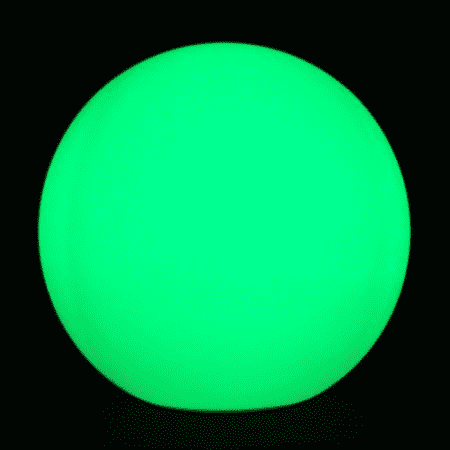
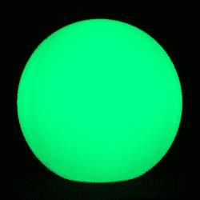
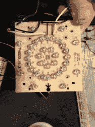
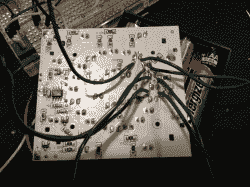
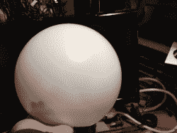

# 黑客攻击一个浮动的 RGB LED 装饰球

> 原文：<https://hackaday.com/2012/09/08/hacking-a-floating-rgb-led-decorative-ball/>

我的妻子知道我总是很高兴得到新的和闪亮的东西，她带了一个便宜的“[浮动泳池灯](http://www.amazon.com/Fortune-Products-R-ORB95-Multi-Color-Diameter/dp/B0060AOIPC/ref=sr_1_15?ie=UTF8&qid=1347113585&sr=8-15&keywords=floating+pool+light)”回家，她发现大约 10 美元。这是一个白色的大浮球，里面有发光二极管，通过不同的颜色循环。本打算放入水池中以获得整洁的效果，但我们发现在房子周围使用它会有趣得多。

然而，对我们的口味来说，它有点太亮了，而且颜色变化太快。当我们试图深夜在院子里坐下来喝几杯啤酒时，这实际上有点分散注意力。这给了我一个完美的借口来拆开它，并开始黑客攻击…好像我无论如何也不会那样做。

我在里面找到的东西极其简单。有一个单一的未标记的芯片拥有不同的显示模式(有 3 种显示模式:温暖，凉爽，白色)。led 排列成红色、蓝色、绿色和白色(一半标记为黄色)的阵列。

我的目标是让这种气氛变得更容易忍受，所以我需要起草一个计划。我有一个红牛比赛的 arduino 坐在这里，所以我想为什么不把它挂起来？它将允许通道的完全 PWM 控制，如果我愿意，我可以做一些预编程的序列。

这简单得可笑。我需要做的就是将引线焊接到每个 LED 通道上。关于如何从 arduino 运行 PWM 已经有了很好的教程，几个[的快速添加会让我通过电位计直接控制每个通道](http://arduino.cc/en/Tutorial/AnalogInput)。问题解决了，对吗？

嗯，算是吧。它真的困扰我，有一个完整的 arduino 只是为了一些 PWM。如果我只想要 PWM ，我可以去买元件来做 555 定时器 PWM 电路。话说回来，如果我比较一下价格，免费的 arduino 是一个比购买 2 个电容、1×555、1 个晶体管以及各种电阻和二极管便宜得多的解决方案，尤其是如果考虑到我必须一式三份地全部购买的话。

最终，如果我想在每个通道上只进行 PWM 控制，我会选择 555 电路。发光的球还能做什么？简单的通知系统？声音反应？给我一些建议。