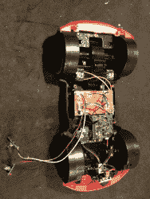

# 为过分依恋的女友黑进一个无线电控制的间谍设备。

> 原文：<https://hackaday.com/2013/02/27/hacking-a-radio-controlled-spy-device-for-overly-attached-girlfriend/>

[https://www.youtube.com/embed/YlXvH9MwXtk?version=3&rel=1&showsearch=0&showinfo=1&iv_load_policy=1&fs=1&hl=en-US&autohide=2&wmode=transparent](https://www.youtube.com/embed/YlXvH9MwXtk?version=3&rel=1&showsearch=0&showinfo=1&iv_load_policy=1&fs=1&hl=en-US&autohide=2&wmode=transparent)

这是我们系列视频中的第一个，旨在将黑客的好处在网络上广泛传播。正如你所看到的，这是一个相当愚蠢的视频，希望你喜欢这个幽默。不过，如果没有适当的记录，这就不会是黑客日了！

最初的想法是让它成为我老板可以从他的特斯拉 Model S 上部署的设备。最终，我们错过了 SkyFall 的发布，所以整个 007 主题似乎有点平淡。然而，我们办公室里碰巧有一个很棒的女人同意做一个“过分依恋的女朋友”。对于那些不熟悉的人，这里有一个关于迷因的链接。即使我们让她看起来像一个疯子，她也是一个伟大的运动员(谢谢[斯蒂芬妮]！).

目标是有一个无线电控制的设备，可以向某人发送实时视频和音频，并有能力在汽车底盘上安装一个小型 GPS 跟踪器。

[https://www.youtube.com/embed/RZFmUENF4zw?version=3&rel=1&showsearch=0&showinfo=1&iv_load_policy=1&fs=1&hl=en-US&autohide=2&wmode=transparent](https://www.youtube.com/embed/RZFmUENF4zw?version=3&rel=1&showsearch=0&showinfo=1&iv_load_policy=1&fs=1&hl=en-US&autohide=2&wmode=transparent)

我的第一个想法是简单地拿起一个 [spy Trakr](http://hackaday.com/2010/08/30/spy-video-trakr-the-teardown/) ,因为它已经处理音频/视频部分，并且有一个用于添加你自己的附件的接口。在我买这个之前，我做了我通常做的事情，当我需要便宜的无线电控制的东西时，我去玩具反斗城。当我在那里的时候，我看到了入侵者。

这似乎可以比价格相似的 Trakr 快得多，并吹捧一些相同的功能。它将连接到你的手机，让你驾驶它，在夜视和常规模式之间切换，打开和关闭前灯，并听到麦克风拾取的声音。我立刻喜欢上了打开/关闭前灯的功能，因为这将给我一个通道，我可以在不做任何修改的情况下将它用于外部设备。

当我把它从盒子里拿出来玩了一会儿，我对“汽车”这个部分非常失望。正如它承诺的那样，它发送了实时视频，但汽车本身行动迟缓，驾驶起来很糟糕。这主要是因为它的传动系统使用了一个愚蠢的系统。前轮是假的。它们非常光滑，在转弯时不起作用。所有的驾驶和转弯都是由后轮完成的，就像坦克上的履带一样。如果我不走另一条路，这将是有史以来最慢的间谍车。

这里有一些内脏的照片

camera board

camera board underside

camera

rear weight, stupid heavy.

battery

我最终决定，我会得到一个非常快速和小型的无线电控制汽车作为一个平台，我会使用入侵者的内脏作为间谍部分。这非常有效。然后，我去了镇上一家比较好的玩具商店，玩具城。我解释了我的项目，那里的家伙很兴奋地帮我找到一些可以工作的东西。我真的需要一些又快又强的东西，但又很短。在我买这个的时候，我仍然打算把它放在特斯拉跑车的下面，并且必须考虑离地间隙。我发现了 Losi 1/24 比例微型卡车，它很小，有 4 轮驱动，独立悬挂。对此没有必要进行修改。我只是使间谍部分能够在股票机构将连接的地方抢购。

为了创建间谍部分，我从一块有机玻璃开始，以整洁有序的方式展示了入侵者的内部结构。我现在需要添加我的 gps 传输臂。为了做到这一点，我使用了一个标准伺服系统。十几岁的孩子会注意车灯的关闭。当他们这样做时，它会将伺服旋转 90 度。当灯重新打开时，手臂会放下。尽可能简单。

我想花一点时间来谈谈青少年。太棒了。足够小，不会增加太多重量，仍然手标准引脚间距和板载 USB。事实上，它可以被计算机看作一个 HID 设备，这在将来会非常有用。不幸的是，我把我的留在加州的办公室了，所以我会为下一个项目订购另一个。19 美元很难被击败。

parts, not attached yet

front heavy

temporarily in place with twisty ties

这只手臂是用我四处乱扔的废料制成的。有一个便宜钢琴的轻质 PCB，有一个电脑机箱的槽盖，还有一个磁铁。假的 GPS(是的，在视频中 3 秒钟内没有必要买真的)，只是一个电池盒，上面有一些磁铁。当它被举起时，顶部的强磁铁会吸附在汽车的框架上。它们比固定在手臂上的磁铁更强，所以当手臂放下时，追踪器会停留在新的位置。

以下是我发给我的导演[Jay]的视频样本，这样他就可以在我们拍摄视频之前做好计划:

[https://www.youtube.com/embed/h1bwx2h3r_o?version=3&rel=1&showsearch=0&showinfo=1&iv_load_policy=1&fs=1&hl=en-US&autohide=2&wmode=transparent](https://www.youtube.com/embed/h1bwx2h3r_o?version=3&rel=1&showsearch=0&showinfo=1&iv_load_policy=1&fs=1&hl=en-US&autohide=2&wmode=transparent)

最终，它是成功的。我在拍摄过程中遇到了一些奇怪的问题，它会完全停止响应。我不知道这是距离问题，还是它和其他东西之间的串扰。不过，我们最终还是成功了。我们唯一的问题是，当我们告诉[斯蒂芬妮]把它直接开进摄像机里时，她就那样做了，把固定顶部和底部的小销钉打掉了。一条拉链带把它固定住，我们准备继续。

如果你想跟进，并可能对未来的视频项目有所帮助，你可以订阅右边栏中的电子邮件列表，或者观看我们的论坛。[我已经发了](http://forums.hackaday.com/viewtopic.php?f=3&t=3080)几条说[我现在正在](http://forums.hackaday.com/viewtopic.php?f=3&t=3052)[上](http://forums.hackaday.com/viewtopic.php?f=3&t=3053)！