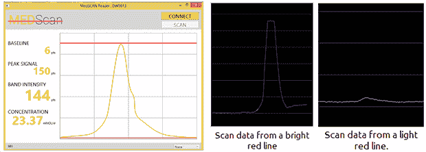

# 黑进医疗试纸的阅读器

> 原文：<https://hackaday.com/2013/12/13/hacking-a-reader-for-medical-test-strips/>

[Rahul]在一家生产尖端诊断测试卡的初创公司工作。这些简单的卡片可以快速简便地检测酶、抗体和疾病。对于一项测试来说，这极大地加快了测试和诊断的过程，但是由于这些测试现在可以一起进行，全世界的卫生服务现在都存在读取、分类和记录成千上万的这些诊断测试卡的问题。

这个问题的正常解决方案是一个专用的卡片扫描仪，但这些花费数万美元。在一次 24 小时的黑客马拉松中，[Rahul]决定通过组装自己的来降低读卡器的成本，这款读卡器是由一个光驱和一个 Arduino 组成的。

拉胡尔使用的卡是 A1c 卡，用于测试葡萄糖与血红蛋白的结合，卡上有几条线，根据测试结果发出不同强度的荧光。这可以通过连接到 Arduino 的光电二极管轻松读取。构建的机械部分由一个带有 3D 打印试纸适配器的旧 CD 驱动器组成。操作非常简单——只需将试纸放入试纸架，按下按钮，测试结果就会通过蓝牙传输。

[Rahul]的构建不仅非常简单，而且非常有用，足以让他在他的家乡新加坡的黑客马拉松中获得“最具创新性项目”奖。