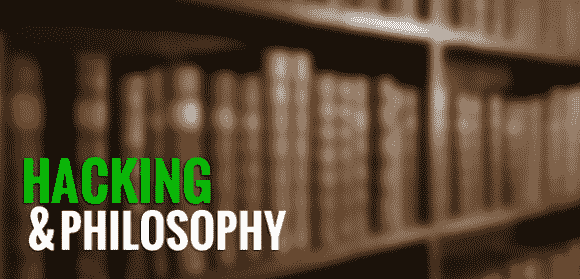

# 黑客与哲学:导论

> 原文：<https://hackaday.com/2013/10/28/hacking-and-philosophy-an-introduction/>

今年秋天标志着我作为博士生的第三年(也是最后一年),虽然我不再上课，但我经常想，如果其他黑客类型的人在课堂上参与讨论，我的研讨会可能会有所不同。

*黑客和哲学*是一个新的专栏，探索关于黑客的学术研究，并与一个生活在黑客体验中的社区合作。这是一个讨论研究人员和深度思考者如何处理我们的文化、形象、哲学等的机会。简单地说，就当是每周一次的读书俱乐部会议。我会选择文本，然后一章一章地进行，给你我对那周阅读的完整回应，同时在评论中加入你的回复，并在未来的帖子中加入你的重要或有见地的贡献。此外，我保证永远不会冒险进入[象牙塔的领地](https://en.wikipedia.org/wiki/Academic_elitism):我讨厌被人居高临下地说话。

黑客和哲学只有在对话的时候才起作用，所以我鼓励贡献、纠正、尊重不同意见，以及尽可能多的超文本(显然是字面上的，但哲学上的 [a la Landow](https://en.wikipedia.org/wiki/George_Landow_(professor)) )。不要把我当成一个教师，而是一个偶尔会指导我们理解晦涩概念和术语的参与者。

休息后继续阅读暂定书单和下周的阅读材料！

我提议下面的阅读清单(按作者的字母顺序排列)，因为我认为这些文本是典型的，它们为未来的讨论提供了重要的基础。这些是我读过的作品*；我会克制自己，不把那些我刚刚浏览过或者还没有打开的放在书架上。我也倾向于将文本限制在严格的学术范围内，排除面向大众读者的书籍，很少有例外。请记住，这里的目标是讨论哲学。*

 **   布兰科希普，劳埃德。“一个黑客的良心。”*《Phrack》杂志第 7 期，第 3 期，共 10 期(1986 年)，[http://www.phrack.org/issues.html?issue=7&id = 3](http://www.phrack.org/issues.html?issue=7&id=3)*
*   希马宁，佩卡。黑客伦理:商业哲学的激进方法。兰登书屋，2010 年。
*   行话文件(太多的作者和版本可以引用，不相信 Raymond 的印刷版是更好的选择，尽管我是*大教堂&集市*的粉丝)
*   利维，史蒂文。黑客:计算机革命的英雄。纽约:企鹅图书公司，2001 年。
*   斯特林布鲁斯。*黑客镇压:电子前沿的法律与混乱*。纽约:矮脚鸡图书公司，1992 年。
*   托马斯道格拉斯。*黑客文化。明尼阿波利斯:明尼苏达大学出版社，2002 年。*
*   沃克麦肯齐。*一份黑客宣言。剑桥:哈佛大学出版社，2004 年。*

我建议这些只是作为一个起点，每次一周完成每一章相当于每本书至少一个月。那会让我们很忙。从那里，我们可以探索一条德勒兹式的高论路线，或者迷失在关于监控状态的书籍海洋中，但让我们以后再担心这个问题。

下周的阅读材料:布兰肯希普(导师)的《黑客的良心》，也被称为《黑客宣言》。(不要和沃克的混淆)。Phrack 网站上的全文。

如果你喜欢的话，读一读并草草记下一些笔记，但是把你对这篇文章的评论留到下周的帖子上:这样它们就都被归在正确的标题下了。在本周的评论中，让我知道你接下来想要处理上面的哪本书(我现在要等待行话文件，但你可以帮助说服我使用哪个版本是最好的)。我也欢迎你对其他作品的建议，甚至反对我选择的任何作品，只要你提供一个令人信服的论点。

* * *

**黑客&哲学是一个正在进行的专栏，有几个部分:**

*   [10 月 28 日:黑客&哲学导论](http://hackaday.com/2013/10/28/hacking-and-philosophy-an-introduction/)
*   [11 月 4 日:导师宣言](http://hackaday.com/2013/11/04/hacking-and-philosophy-the-mentors-manifesto/)
*   [*11 月 11 日:斯特林黑客行动:简介&第一部*](http://hackaday.com/2013/11/11/hacking-and-philosophy-hacker-crackdown-part-i/)
*   *[11 月 18 日:斯特林黑客大行动:第二部](http://hackaday.com/2013/11/18/hacking-and-philosophy-crackdown-part-ii/)*
*   [*11 月 25 日:* **英国黑客严打:第三部**](http://hackaday.com/2013/11/25/hacking-and-philosophy-crackdown-part-iii/)
*   [*十二月二日:斯特林黑客大镇压:第四部*](http://hackaday.com/2013/12/02/hacking-and-philosophy-crackdown-part-iv/)*