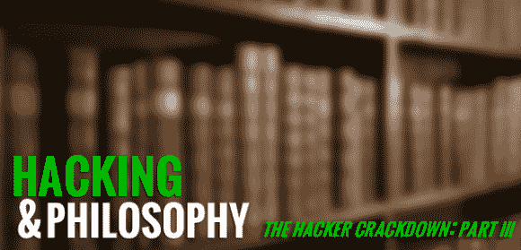

# 黑客和哲学:镇压第三部分

> 原文：<https://hackaday.com/2013/11/25/hacking-and-philosophy-crackdown-part-iii/>

《法律与秩序》可能是我最喜欢的一章*黑客严打:*它从执法的角度，涵盖了 90 年代初的查封和逮捕的视角。虽然这一章有它的缺陷，我强烈推荐它；[Sterling]以耐心和理解对待双方，揭示了每个人在网络空间的不确定性中是如何相似地漂泊(在某种程度上，仍然如此)。我还推荐 DEFCON 20 中的【盖尔·萨克雷】/【死去的瘾君子】[的联合谈话作为本章的配乐，因为它弥合了*镇压* *出版和今天*出版之间的 20 年差距——而【萨克雷】本人是本章的焦点。](http://www.youtube.com/watch?v=pKtLtKgKM7s)

一如既往，欢迎大家参加我们的每周讨论，即使你没有通过 [*黑客打击*](http://www.mit.edu/hacker/hacker.html) 跟上我们的进度。你也可以免费下载它作为有声读物！继续前进！

### 0.根据上周的讨论:

*回复:Q1(法律系统对数字盗窃的定义改变了吗？)*

[【dynamo Dan】](http://hackaday.com/2013/11/18/hacking-and-philosophy-crackdown-part-ii/#comment-1105749)指出 [Streamripper](http://en.wikipedia.org/wiki/Streamripper) 是受法律保护的东西的一个独特例子。[维基百科建议](http://en.wikipedia.org/wiki/Radio_music_ripping#US_context)网络电台的录音可能被[合理使用](http://en.wikipedia.org/wiki/Fair_use)和[1992 年家庭录音法案](http://en.wikipedia.org/wiki/Audio_Home_Recording_Act)所涵盖。他还指出，一些公司已经放弃了严格的版权执法，转而支持鼓励消费者购买而不是盗版的智能营销策略。

然而，这并不都是进步。[dan]提供了一个更具批判性的视角，强调那些在数字世界中违反规则的人通常会受到不相称的严厉惩罚。我认为这是技术和法律制定者(和执行者)之间脱节的结果，而且“数字盗窃”仍然是一个相对较新的概念。正如我们将在本周的章节中看到的，没有人完全知道如何处理法律*或*秩序。

关于:Q2(像 E911 这样的敏感文件应该公开吗？)

[深深笼罩&安静] [哀叹 80-90 年代的黑客时代](http://hackaday.com/2013/11/18/hacking-and-philosophy-crackdown-part-ii/#comment-1105022)的精神和心态，并重申大多数人的行为是出于好奇而非恶意。【迪纳丹】[质疑](http://hackaday.com/2013/11/18/hacking-and-philosophy-crackdown-part-ii/#comment-1105749)【斯特林】赋予像【乔布斯】和【沃兹】这样的黑客的清白，解释说作者模糊了恶意和好奇之间的界限。要免除他们对自己行为的责任需要大量的无知。

建议联邦政府的所有产品都应该对公众开放源代码，考虑到税收的支持。我怀疑会有更多关于这个话题的讨论。我鼓励人们继续响应！

*RE: Q3(这些年黑客和“吹牛”都怎么了？)*

[【dynamo Dan】认为](http://hackaday.com/2013/11/18/hacking-and-philosophy-crackdown-part-ii/#comment-1105749)吹牛可能是黑客无法意识到网络空间有多“真实”的结果；他们自吹自擂，因为他们没有看到这个新领域的后果。正如[【丹】所观察到的，这种吹嘘甚至持续到今天](http://hackaday.com/2013/11/18/hacking-and-philosophy-crackdown-part-ii/#comment-1107310)，也许这个问题与所涉及的黑客的年龄组更密切相关，尽管他可能也是对的，来自*严打*的黑客是通过老式的警察工作来追踪的，而不是遇到一些倒霉的吹牛者。

### 一、本周讨论的重点是什么？

本周，我将保持简短的回答。

如果你忘记了本章的其他内容，请记住这一段:

> …美国社会目前正处于一种接近永久性技术革命的状态。特别是在计算机领域，几乎不可能停止成为“先锋”，除非你死了或者故意跳下公共汽车。场景从来没有慢下来足够成为良好的制度化。二十年、三十年、四十年后，“计算机革命”继续蔓延，渗透到社会的新角落。任何真正有效的东西都已经过时了。[1]

在过去的半个世纪里，我们目睹了世界上令人震惊的变化，摩尔定律仍然适用——就目前而言。[Sterling]解释说，这种不断变化的景观只能由像 FCIC 这样的动态团体来解决，(它甚至还存在吗？)缺乏传统的等级制度，而倾向于“特设”我们当然也看到了其他向特设的转变，比如任何众包的例子。Kickstarter 基本上是特设的研发资金。

或许不那么重要(但同样有趣)的摘录是[斯特林]给年轻读者的建议:

> 在我看来，任何对计算机着迷、对计算机安全的来龙去脉着迷、被特殊形式的知识和权力的诱惑所吸引的青少年，最好都忘掉黑客，把自己的目标定为成为一名美联储成员。联邦调查局可以在黑客做的几乎每一件事情上击败黑客，包括收集情报、秘密伪装、捣毁、窃听电话、建立档案、联网和渗透计算机系统——犯罪计算机系统。特勤局特工对 phreakss、编码和梳理的了解比大多数 phreak 多年来所能发现的还要多，当涉及到病毒、闯入、软件炸弹和特洛伊木马时，联邦调查局可以直接获得炽热的机密信息，这些信息在地下只是模糊的谣言。[2]

在这里，我觉得[斯特林]对黑客的概念造成了极大的伤害:在本书的导言中，他似乎有意捍卫这个概念。接受黑客作为一个概念并不意味着必须进行非法活动，斯特林应该更清楚这一点。相反，我发现这一部分试图通过建议从事执法工作来迎合青少年对权力和禁忌知识的渴望。当我鼓励懂计算机的聪明人在执法部门找工作时，[斯特林]在这里想念他的观众，同时将自己从黑客社区中分离出来。尽管在这一章中他一直说自己不是黑客，但直到现在，他一直小心翼翼地尊敬地代表他们，以至于这些评论给人的感觉是一种“爸爸最清楚”的警告:正是黑客们想要反对的权威的断言。

### 二。本周的问题

1.查看第 160 页:“典型的黑客攻击是这样的…”我们的读者中有人被攻击过吗？没必要告诉我们细节，但我很好奇是否有人是“灰色地带”法律纠纷的受害者，在这种情况下，法律条文已经严重过时了，等等。这一章中美联储的观点是你所期望的吗？

2.你对[斯特林]给年轻读者的建议有什么看法？显然，他没有预料到 pentesting 的蓬勃发展的替代商业模式，但他的建议仍然合理吗？我的批评是否过于严厉？

3.在这一章的前面,[斯特林]引用了[萨克雷]的预测，黑客将很快对杀人负责。[3] [【巴纳拜·杰克】去年展示了心脏起搏器的可能性](http://blog.ioactive.com/2013/02/broken-hearts-how-plausible-was.html)，这让许多人猜测他在黑帽之前就已经去世了。[这个维基百科时间表](http://en.wikipedia.org/wiki/Timeline_of_computer_security_hacker_history)绝不是所有黑客攻击的详尽列表，但是*有任何直接导致死亡的*黑客攻击实例吗？

### 下周:

阅读*黑客镇压的最后一章，*“公民自由主义者”

* * *

### **备注:**

[1]布鲁斯·斯特林，《黑客镇压》，(纽约:矮脚鸡图书公司，1992)，193 页。

2 同上，第 217 页。

3 同上，第 185 页。

* * *

**黑客&哲学是一个正在进行的专栏，有几个部分:**

*   [10 月 28 日:黑客&哲学导论](http://hackaday.com/2013/10/28/hacking-and-philosophy-an-introduction/)
*   [11 月 4 日:导师宣言](http://hackaday.com/2013/11/04/hacking-and-philosophy-the-mentors-manifesto/)
*   [*11 月 11 日:斯特林黑客行动:简介&第一部*](http://hackaday.com/2013/11/11/hacking-and-philosophy-hacker-crackdown-part-i/)
*   *[11 月 18 日:斯特林黑客大行动:第二部](http://hackaday.com/2013/11/18/hacking-and-philosophy-crackdown-part-ii/)*
*   [*11 月 25 日:* **英国黑客严打:第三部**](http://hackaday.com/2013/11/25/hacking-and-philosophy-crackdown-part-iii/)
*   [*十二月二日:斯特林黑客大镇压:第四部*](http://hackaday.com/2013/12/02/hacking-and-philosophy-crackdown-part-iv/)