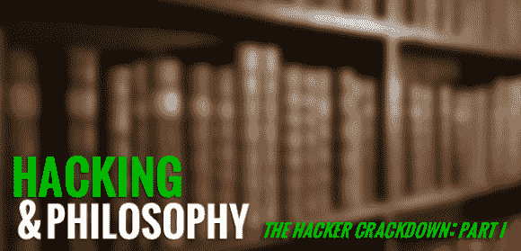

# 黑客和哲学:黑客镇压第一部分

> 原文：<https://hackaday.com/2013/11/11/hacking-and-philosophy-hacker-crackdown-part-i/>

本周的《黑客与哲学》系列报道了[布鲁斯·斯特林的] *黑客镇压*。如果你是第一次加入我们，你应该看看上周关于导师[的“黑客宣言”的对话不要停留在文章上，否则你会错过最精彩的部分！](http://hackaday.com/2013/11/04/hacking-and-philosophy-the-mentors-manifesto/)

来自我们社区的贡献是惊人的，值得我们花力气去研究这些评论。甚至还有几个【导师】本人的[回复。](http://hackaday.com/2013/11/04/hacking-and-philosophy-the-mentors-manifesto/#comment-1091774)

不幸的是，由于篇幅有限，我无法一一列举所有精彩的回答，但休息之后，我会推荐几个我认为非常重要的回答。继续前进！

但是首先，我们需要遵守一条规则:尊重他人。不仅要尊重彼此的观点，也要尊重作者，他的作品是每周讨论的主题。如果你从未遇到过“[故意谬误](http://en.wikipedia.org/wiki/Authorial_intent)的概念，这是快速阅读它的最佳时机。哲学是一场公开的讨论，但如果我们避免反动的话题，对话会更有价值和有趣。**也没有必要在本周的评论中进一步讨论这个问题，因为那样也会分散人们对手头内容的注意力。** [如果你想谈谈这个专栏的方向或形式，直接给我发邮件](mailto:josh@hackaday.com)。一如既往，我重视你的意见。谢谢！

### 0.我从上周的讨论中挑选出:

只有[【昆】](http://hackaday.com/2013/11/04/hacking-and-philosophy-the-mentors-manifesto/#comment-1092038)和[【丹】](http://hackaday.com/2013/11/04/hacking-and-philosophy-the-mentors-manifesto/#comment-1091760)两位评论者详细讨论了[的数字鸿沟](http://en.wikipedia.org/wiki/Digital_divide)，这是我在上周的回应接近尾声时提出的一个问题。在 20 世纪 80 年代和 90 年代，很少有人有机会逃避计算机带来的舒适和挑战，即使在今天，在整个社区中，计算机和互联网几乎不存在，或者根本不存在。

考虑到“宣言”的焦点，一场关于教育的辩论爆发就不足为奇了。[【Analog】哀叹](http://hackaday.com/2013/11/04/hacking-and-philosophy-the-mentors-manifesto/#comment-1091283)他感觉到的是黑客社区对学习的兴趣正在下降，但他指出，创客运动似乎重新点燃了这种热情，[【塔龙】提出了他作为教师的观点](http://hackaday.com/2013/11/04/hacking-and-philosophy-the-mentors-manifesto/#comment-1091268)。

有几项贡献和回应值得一提。我鼓励你仔细阅读其余的评论。

### 一、为什么选择本周阅读:*黑客严打*？

*黑客镇压*提供了 90 年代早期黑客文化的精彩快照，尤其是当它涉及早期网络犯罪时。在黑客&哲学的第一部分中，你们中的许多人回答说，你们更愿意从创造和创新的角度讨论黑客，而不是将黑客视为非法活动，但出于几个原因，我们应该在后一个领域博览群书。首先，我认为黑客制造者和黑客罪犯之间的联系是不可能切断的。重要的是要知道是哪些事件导致了新闻报道和流行文化贴上这些负面的内涵。第二，通过对比你对这个术语的理解和*黑客行动*中的事件，你会更好地定义“黑客”。此外，我相信这是其作者提供的第一批免费在线书籍之一。

### 二。作者是谁？

如果你拿起一本实体版的《黑客攻击》,你可能会注意到它缺少了一些东西:参考文献。没有参考书目，没有引用的作品，甚至没有脚注。这并不意味着它不值得一读。我怀疑大部分，如果不是全部，是相当准确的。它已经在网上免费提供了 19 年，我没有遇到任何批评。

你要知道[作者【Bruce Sterling】](http://en.wikipedia.org/wiki/Bruce_Sterling)是科幻作家，*黑客严打*很大程度上是针对普通观众的。学者不是唯一写重要书籍的人。[Sterling]主要是一个讲故事的人，所以你应该期待在*黑客镇压*中有大量的阐述，因为他讲述了 80 年代和 90 年代的重要黑客事件。这是他的风格，没关系。

### 三。什么重要？

请记住，这本书出版于 1992 年，当时万维网刚刚出现，互联网的商业化尚未发生。[Sterling]称[电子前沿基金会](http://www.eff.org/)“一个新的和非常奇怪的利益集团”，在介绍中没有进一步澄清，也许表明“数字权利”的想法对 90 年代初的观众来说是多么奇怪。**这些天来(也许特别是考虑到【斯诺登】泄密事件) [EFF 不仅经常出现在科技新闻头条，而且几乎在任何地方都会出现](http://www.eff.org/press/mentions)。**

 **第一章“系统崩溃”主要是一堂简短的历史课，让大家了解一些术语和电信系统的内部工作原理。在格雷厄姆·贝尔部分，[Sterling]提出了“技术生命周期”的四个阶段

1.  问号，或金色蒸汽器皿
2.  愚蠢的原型
3.  摇钱树
4.  “狗”或死亡

这些阶段似乎与维基百科条目中的[“技术生命周期”相似，该条目没有真正的参考文献来解释是谁开发了这一描述。[Sterling 的]似乎是他自己的发明，提供了一个非技术读者也能理解的基本框架。也许有人可以解释这些生命周期的起源或提供一些背景。](http://en.wikipedia.org/wiki/Technology_life_cycle#The_four_phases_of_the_technology_life-cycle)

然而，我确实质疑在[斯特林]生命周期最后阶段发生的“死亡”的程度。没有真正讨论其他的“死亡”或导致它们的原因，他对“技术”一词的使用相当广泛。在*黑客镇压*几年后，【斯特林】开始了“[死亡媒体项目](http://en.wikipedia.org/wiki/Dead_Media_Project)”来记录过时的技术，并撰写了一篇姊妹篇:“[死亡媒体宣言。](http://www.deadmedia.org/modest-proposal.html)”在这里，他呼吁记录过时的技术，甚至“可怕的媒体错误。”结果是令人印象深刻的大约 600 种不同的过时“技术”(可能值得窃笑的是，过时技术的清单是通过邮件列表建立和传播的:根据维基百科，它失去了动力，并于 2001 年死亡，从而结束了该项目)。

在*融合文化*中，【亨利·詹金斯】挑战【斯特林】关于技术死亡的概念，区分了“交付系统”和“媒体/媒介:”

> 八轨测试带。这些就是媒体学者所说的*传送技术。斯特林项目列出的大部分内容都属于这一类。交付技术变得过时并被取代；另一方面，媒体在发展。录音是媒介。CD、MP3 文件和 8 轨磁带都是交付技术。[2]*

关键的区别在于介质保持了弹性并防止过期:

> 媒介的内容可能会发生变化(正如电视取代广播成为讲故事的媒介，使广播成为摇滚的主要展示平台时发生的那样)，它的受众可能会发生变化(正如漫画从 20 世纪 50 年代的主流媒体转变为今天的小众媒体时发生的那样)，它的社会地位可能会上升或下降(正如戏剧从流行形式转变为精英形式时发生的那样)，但一旦媒介确立了自己满足某些核心人类需求，它就会继续在更大的传播选择系统中发挥作用。[3]

[Sterling]声称“电话迄今为止避免了这种(死亡的)命运”，但我不确定它是否曾经有过危险。电话是一种媒介还是一种技术？考虑到从简单的电话到[Sterling]记载的互联网的实现的发展和适应，他似乎在描述一种媒体形式。(更令人困惑的是，他将这些阶段设定为生命的*周期，*这意味着某种形式的重生。)

我最后的批评是，[斯特林]没有很好地解释公众舆论对马贝尔的转变。我们被告知“公共服务”形象恶化，但除了“维尔的工业社会主义在政治上已经无可救药地过时了”之外，没有任何真实的背景虽然[Sterling]之前提到过马贝尔公开示威焚烧反叛的非法电话公司的财产，但他并不清楚这一行为或其他行为是否有损这家公司巨头的形象。

### 四。本周的问题

1.  你在本周的阅读材料和上周的“宣言”之间发现了什么相似之处，如果有的话[导师]在[斯特林]描述的这个时代写作。《宣言》的内容是否符合[斯特林]对“聪明的十几岁男孩”的描述**【5】**
2.  [Sterling]指出,“社区”和“通信”与解释电信领域竞争的方式有着相同的拉丁词根。**【6】**通信网络导致社区的形成，移除这些网络会损害社区，引起反弹。有没有任何重要的当代受威胁网络的例子，他们是否以同样的方式回应？
3.  在引言的早期，[斯特林]试图描绘出“真实”、“网络空间”和“场所”之间的区别。他的陈述很充分，解释说网络空间是“电话之间的地方”，但在同一页的更下方，他声称“人们现在生活在其中。”**【7】**我们是如何在“之间”生活的？我不是在寻找一个随意的回答，而是认真考虑哪些空间被占用，以及我们如何参与其中。我们是不是“存在”在两个地方？仅仅是我们的大脑对刺激做出反应吗？即便如此，我们如何理解非现实的地方呢？
4.  我怀疑我们的一个读者在 80 年代[Sterling]讨论的事件中为美国电话电报公司工作。有人从内部人士的角度看这次停电吗？

作为问题 3 的补充说明:我们不应该指望[斯特林]在他关于网络空间的讨论中引用[德勒兹]，但我想这么做。几个小时以来，我苦于写一段话来简洁地解释[【德勒兹的虚拟概念】](http://en.wikipedia.org/wiki/Virtual_(philosophy)#Deleuze.27s_concept_of_virtuality)。相反，我决定给它打上一针:虚拟值得一整篇文章(可能至少有一篇关于内在的文章)。然而，如果你对[德勒兹]的“真实”、“实际”和“虚拟”的概念感到舒服，并且你渴望一场关于网络空间和德勒兹式虚拟的对话，请在评论中这样做。否则，我们很快就会腾出时间。

### 下周:

继续阅读[【斯特林】](http://en.wikipedia.org/wiki/The_Hacker_Crackdown) *[黑客严打](http://en.wikipedia.org/wiki/The_Hacker_Crackdown) :* 第二部:数字地下。

* * *

### **备注:**

[1]布鲁斯·斯特林，《黑客的镇压》，(纽约:矮脚鸡图书公司，1992 年)，第十四卷。

[2]亨利·詹金斯，*《趋同文化》，*(纽约:纽约大学出版社，2006)，13 页。

[3]同上，第 14 页。

[4]斯特林，19 岁。

[5]同上，第 19 页。

[6]同上，第 15-16 页。

[7]同上，第十二卷。

* * *

**黑客&哲学是一个正在进行的专栏，有几个部分:**

*   [10 月 28 日:黑客&哲学导论](http://hackaday.com/2013/10/28/hacking-and-philosophy-an-introduction/)
*   [11 月 4 日:导师宣言](http://hackaday.com/2013/11/04/hacking-and-philosophy-the-mentors-manifesto/)
*   [*11 月 11 日:斯特林黑客行动:简介&第一部*](http://hackaday.com/2013/11/11/hacking-and-philosophy-hacker-crackdown-part-i/)
*   *[11 月 18 日:斯特林黑客大行动:第二部](http://hackaday.com/2013/11/18/hacking-and-philosophy-crackdown-part-ii/)*
*   [*11 月 25 日:* **英国黑客严打:第三部**](http://hackaday.com/2013/11/25/hacking-and-philosophy-crackdown-part-iii/)
*   [*十二月二日:斯特林黑客大镇压:第四部*](http://hackaday.com/2013/12/02/hacking-and-philosophy-crackdown-part-iv/)**