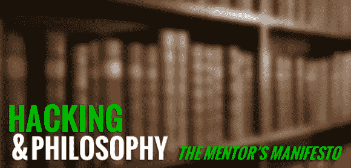

# 黑客和哲学:导师的宣言

> 原文：<https://hackaday.com/2013/11/04/hacking-and-philosophy-the-mentors-manifesto/>

欢迎回到黑客与哲学！我已经尽了最大努力来跟上上周文章的评论，你们的回应和建议是非常宝贵的。大多数读者表达了对这个专栏如何定义“黑客”或“黑客行为”的担忧，以及这些文章是更关注非法黑客行为还是黑客/制造者文化。请放心，所有的解释都是受欢迎的，但我也无意纠缠于耸人听闻的、犯罪的黑客刻板印象。其他人问我们是否会在一个更方便用户的地方进行对话:一个解决方案正在酝酿中。现在，我们将坚持评论。

上周，我让你们读了黑客史上的一份早期文件:[导师的《一个黑客宣言》，](http://www.phrack.org/issues.html?issue=7&id=3)也叫《一个黑客的良心》。以下是我对这篇文章的分析。我邀请你和我一起在评论中讨论:发表你对这篇文章的回应，你的问题，你的反对意见，任何东西！现在，让我们回到 80 年代…

### 一、我为什么选择这篇短文？

这是试图概括和解释黑客心态的最早文件之一。围绕其起源的细节有点模糊:道格拉斯·托马斯称其出版于 1985 年，但其他所有提及该作品的地方(包括导师本人)都称其为 1986 年。围绕其写作的情况涉及[该导师]的被捕，但关于指控是什么或这种情况的结果的信息有限。然而，这些不确定性在很大程度上并不重要，因为《宣言》获得了巨大的吸引力；它在网上被广泛传播，随后被认同其信息的读者所采纳。

### **二。作者是谁？**

[导师]是[[劳埃德·布兰肯希普](http://en.wikipedia.org/wiki/Loyd_Blankenship)]，他属于 LOD[末日军团]的“第二代”**【2】**他于 1986 年被捕，当时他“被困在一台他本不应该被困的电脑里”，出于沮丧写下了这篇文章；正如[布兰肯希普]解释的那样，他

> 没有伤害任何东西，我只是在一台我不应该在的电脑里。我对全国各地与我处境相同的朋友深表同情。这是后 *WarGames，*电影，所以当时几乎唯一的公众对黑客的看法是‘嘿，我们将开始一场核战争，或者玩井字游戏，两者之一’，所以我决定我将尝试写下我真正感觉到的我们正在做的事情的本质以及我们为什么要这样做。

 **有时间的话，听听他 2002 年从 h2k 2(直接 YouTube)的[演讲，这段语录出自哪里。](http://www.youtube.com/watch?v=0tEnnvZbYek)

### **三世。什么重要？**

[上周](http://hackaday.com/2013/10/28/hacking-and-philosophy-an-introduction/#comment-1085622)[的一些](http://hackaday.com/2013/10/28/hacking-and-philosophy-an-introduction/#comment-1085515)评论在这篇文章的第一行和/或一些建议文本的标题中看到了“被捕”一词，这似乎表明讨论的是“作为非法的黑客行为”，而不是“作为制造的黑客行为”或另一种不太刑事的解释。这并不是说这些评论者跳到这些想法是不正确的。正如[Blankenship]在这里概述的那样，问题在于权威人士对黑客意图的严重误解。甚至在这篇早期的文章中——其中*关注的是合法性问题——也有试图将“黑客行为”作为一种有价值的智力活动。“宣言”更感兴趣的是黑客与技术的关系，而不是技术本身，以及证明一种促进探索而不是谴责探索的心态。*

[Blankenship]在每一段中都阐述了他作为一名黑客的个人动机，并在后面重复了一些权威的负面回应，如“该死的后进生”，“可能抄袭了”，“他所做的一切就是玩游戏”，以及“再次占用电话线。”正如我上一次提到的那样，黑客文化的非法一面与更大范围的黑客讨论密不可分:不仅有人犯下了罪行(而且是恶意的，不仅仅是误解),而且权威机构——政府、新闻机构、电影&电视——都将黑客塑造成了技术地下世界的可疑居民。

我要借用我的朋友安迪·麦克纳马拉(Andy McNamara)的一句话:黑客和黑客已经成为一幅“反文化漫画”，精通技术的罪犯可以为所欲为，不管这可能会造成什么损害。然而，与此形成鲜明对比的是，[Blankenship]似乎特别关注对自己的行为负责，他对编程进行了讨论:

> 它[电脑]做了我想让它做的事情。如果它出错了，那是因为我把它搞砸了。不是因为它不喜欢我…或者觉得被我威胁…或者觉得我是个聪明的蠢驴…或者不喜欢教书不应该在这里…

虽然科技为[Blankenship]提供了一个平庸教育的替代选择，但它也是他在撰写宣言时所经历的法律麻烦的来源。技术是一个 pharmakon，这个术语被[Stiegler](我希望我们能读到他的作品)广泛讨论过。**【5】**药厂是[同时毒药和药方，问题和解决方法](https://en.wikipedia.org/wiki/Pharmakos#Pharmakos_and_pharmacology)。这是(对我来说)更有趣的话题之一，我想听听对这种技术即制药的情况的不同观点。[Blankenship]的情况说明了几个例子:

*   作为解放者的科技:“一扇向世界敞开的门……”**vs .**作为压迫者的科技:他因黑客行为被捕/科技当然被用来识别和抓捕他。
*   作为个人表达形式的技术:“这就是我们现在的世界……/波特之美。” **vs.** 技术被限制、制度化:权威人物决定了计算机能做什么，不能做什么
*   技术作为公正:“我们的存在没有肤色，没有国籍，没有宗教偏见……”**vs .**技术作为隐蔽的偏见

我想简单地讨论一下第三个例子，因为大多数文章都跳过了我所认为的一个明显的误解:互联网是伟大的均衡器，消除了种族、宗教、社会经济地位等的所有痕迹。带着匿名的面纱。它不是。互联网的最初几年充满了让文化竞技场变得公平的乐观情绪；大多数积极情绪是由感恩而死的约翰·巴洛推广的，作为消除特权和促进探索和教育的更大、更普遍目标的一种手段——(布兰肯希普)肯定会同意这些目标。然而，这种解释的问题是有限的接触和普遍的色盲。[布兰肯希普]对他童年的讨论揭示了他早年经历的特权。当被问及他第一次接触电脑时，他回答说:

> 1976 年初，在我五年级和六年级之间的那个夏天，我们从奥斯汀搬走了。当我到达圣马科斯时，我谁也不认识，开始在大学图书馆的西南德克萨斯州立大学计算机实验室里闲逛。这里挤满了 Pet-10、CompuColors 和一些早期的 Apple II 机器。我主要是在它们上面玩游戏(火炮等)。).我妈妈工作的地方有一个巨大的 PDP 主机，我见到了一些系统操作员。他们给我看了一个名为《星际迷航》的游戏，我很喜欢。我让他们打印出它的基本源代码，并通过移植到 Compucolors 上自学了 BASIC。我拥有的第一台苹果电脑是在 1979 年或 1980 年买的。

这种说法似乎将他置于中上阶层的人口统计中:他不仅可以使用大学的计算机设备，还可以使用他母亲工作中的机器。此外，他在 14-15 岁时就拥有了自己的电脑。**【7】**放眼全球。在 70 年代和 80 年代，有多少人能接触到电脑？这里有一个更好的问题:70 年代有多少人用上了*的电和自来水*？今天吗？当你考虑到这个时期的大多数电脑用户是生活在发达国家的白人男性时，对种族和文化平等的支持就被打破了。我们应该把[中村的] *数字化种族*加入我们的名单。以下是相关引文:

> 当我们着眼于 2000 年后的图形流行互联网时，这个关于互联网在流行文化中起源的乌托邦故事可以以不同的方式讲述，而是从访问、用户体验和内容方面跟踪其持续的色盲话语，这反映在学术以及 90 年代新自由主义对“适度再分配和文化普遍性”的强调中[8]

我不会在这里深入讨论白人和色盲，只是想说，否认种族或文化作用的平等主张(正如《宣言》在这里所做的那样)通常掩盖了一个更大的真相，使一个潜在的问题永久化。这是一个需要自己定位的主题。

### **四。问题**

这些是真正的问题，而不仅仅是“这些应该让他们忙起来！“谈话要点列表，所以我渴望听到你的回答:

1.  [Blankenship]的《宣言》今天是否能引起你的共鸣，还是看起来已经过时了？这和你对黑客文化的理解有关吗？
2.  计算机似乎突然出现，将[Blankenship]从他在整篇文章中表达的沮丧中解救出来:他对学校太厌倦了，因为它不存在挑战，但计算机存在挑战。这个时代是不是第一个*需要*超越公立教育的高级挑战？这似乎是一个愚蠢的问题，但谁是(布兰克希普)的先驱——受够了脱节的教育体系的个人？他们寻求什么样的挑战？
3.  学校在满足像[Blankenship]这样的学生的需求方面有什么进步吗？如果你听他在 H2K2 的演讲，他似乎特别关注公共教育的缺点。他一度解释说，解决问题的办法是加大对学校和教育工作者的财政投资，但任何要求更多资金的尝试通常都会扼杀与官员的对话。形势真的如此严峻吗？

### **下周:**

阅读[【Bruce Sterling 的】*黑客严打*](http://en.wikipedia.org/wiki/The_Hacker_Crackdown) :简介&第一部:系统崩溃

我认为最好的方法是按时间顺序向前推进(就出版日期而言)，[斯特林的]作品在几个地方可以在网上免费获得。参见维基百科上的[“外部链接”部分。到时候见！](http://en.wikipedia.org/wiki/The_Hacker_Crackdown#External_links)

* * *

### **备注:**

**【1】**Douglas Thomas，*黑客文化*(明尼阿波利斯:明尼苏达大学出版社，2002)，245 页。

**【2】**《精灵 Qrin 采访导师》，[http://www . elfqrin . com/docs/hakref/interversations/eq-I-Mentor . html](http://www.elfqrin.com/docs/hakref/interviews/eq-i-mentor.html)

Loyd Blankenship，“黑客的良心”，2002 年 7 月 13 日，纽约，H2K2(地球上的黑客)专题讨论会。http://www.youtube.com/watch?v=0tEnnvZbYek

安迪用反文化漫画这个词来描述媒体对游戏玩家和游戏暴力的歪曲，以及这些描述如何经常坚持游戏暴力和玩家在现实世界中的暴力之间存在因果联系，尽管许多研究证明了相反的情况。参见[安德森](http://www.apa.org/science/about/psa/2003/10/anderson.aspx)、[弗格森](http://www.tamiu.edu/~cferguson/Much%20Ado.pdf)(直接 PDF 链接)，和/或[考特纳和奥尔森](https://en.wikipedia.org/wiki/Grand_Theft_Childhood)。

**【5】**伯纳德·斯蒂格勒，*《对政治经济学的新批判》，*译。丹尼尔·罗斯(剑桥:政治出版社，2010)，29 岁。

**【6】**弗雷德·特纳，*从乡村文化到网络文化*，(芝加哥:芝加哥大学出版社，2006)，14

这句话是对所有权的直接声明:“我真正拥有的第一台电脑……”但我意识到这句话可能指的是一台不完全属于他的家庭电脑。不管怎样，在 70 年代末 80 年代初很少有家庭拥有电脑。

**【8】***丽莎·中村，《数字化竞赛【T3》，(明尼阿波利斯:明尼苏达大学出版社，2008)，第 4-5 页。*

* * *

**黑客&哲学是一个正在进行的专栏，有几个部分:**

*   [10 月 28 日:黑客&哲学导论](http://hackaday.com/2013/10/28/hacking-and-philosophy-an-introduction/)
*   [11 月 4 日:导师宣言](http://hackaday.com/2013/11/04/hacking-and-philosophy-the-mentors-manifesto/)
*   [*11 月 11 日:斯特林黑客行动:简介&第一部*](http://hackaday.com/2013/11/11/hacking-and-philosophy-hacker-crackdown-part-i/)
*   *[11 月 18 日:斯特林黑客大行动:第二部](http://hackaday.com/2013/11/18/hacking-and-philosophy-crackdown-part-ii/)*
*   [*11 月 25 日:* **英国黑客严打:第三部**](http://hackaday.com/2013/11/25/hacking-and-philosophy-crackdown-part-iii/)
*   [*十二月二日:斯特林黑客大镇压:第四部*](http://hackaday.com/2013/12/02/hacking-and-philosophy-crackdown-part-iv/)**