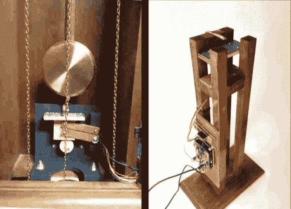

# 趁老爷钟还在走的时候黑掉它的精确度

> 原文：<https://hackaday.com/2013/01/15/hacking-grandfather-clock-accuracy-while-its-still-ticking/>

[Keith]得到了几个落地钟。显然，如果你能买到二手货，价格会大大降低。机械表需要每周上弦，这是一件好事，因为你也需要至少经常校正时间。但是这种漂移让[基思]开始考虑提高这些时钟的精确度。他想出了一种高科技的方法来调整正在滴答作响的时钟。

他首先需要的是超级精确的时间来源。他本可以使用温度补偿 RTC 芯片，但却走了更传统的路线，使用主电源频率作为参考。谜题的下一部分是弄清楚如何既监控落地钟，又对它的钟摆进行微调。

答案是磁铁。通过在钟摆的底部添加一块磁铁，并调整放置在它下面的金属板的接近度，他可以加快或减慢滴答声。添加霍尔效应传感器后，Arduino 可以测量每次摆动的速度，并计算出与高压频率参考相比的精度。