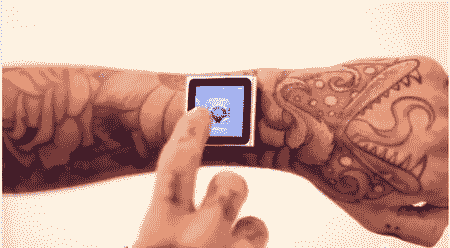

# 将磁铁植入你的皮肤

> 原文：<https://hackaday.com/2012/05/13/hacking-magnets-into-your-skin/>

[戴夫]如此热爱他的 iPod nano，以至于他在手臂上植入了 4 块磁铁来固定它。

好吧，继续对着你的屏幕喊“fanboy ”,对苹果的产品说些挖苦的话，或者哀叹富士康糟糕的工作条件。从你的身体里出来了吗？酷毙了。

事实上，如果我们不得不猜测，[戴夫]真的不是因为他对设备或公司的热爱才这么做的。更有可能的是，他只是真的对身体改造感兴趣，这是一个很方便的主题。我们觉得这个想法很有趣。我们已经在 T1 之前看到过植入，但是它们是 T2，通常是 RFID 类型的 T3。通常这些是用于某种安全或计算机控制。

然而，植入磁铁很有趣，因为它几乎可以给你一种“第六感”,你可以检测出什么是磁性的，以及磁性有多大。如果我们要做这样的事情，我们可能会完全皮下注射以避免感染。

用今天的技术，你还能现实地做什么其他种类的植入来给你自己其他的感觉？