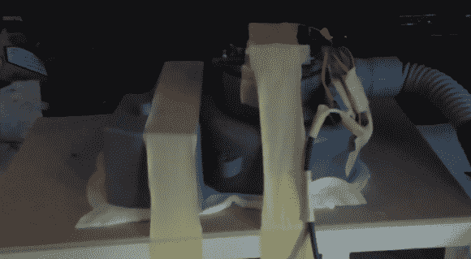

# 出于需要进行黑客攻击——修理你自己的 CPAP 机器

> 原文：<https://hackaday.com/2014/08/21/hacking-out-of-necessity-fixing-your-own-cpap-machine/>

我们的一位热心读者名叫[Felix]，患有睡眠呼吸暂停症，需要一台 CPAP 机器，以免在睡觉时窒息——在最近一次停电后，他的机器坏了，所以他决定试着修理它。

一台 CPAP ( [)持续气道正压通气](http://en.wikipedia.org/wiki/Continuous_positive_airway_pressure))机器通过防止喉咙关闭来确保患有睡眠呼吸暂停症的人整夜呼吸。作为一种医疗设备，它们往往非常昂贵，这就是为什么[费利克斯]想尝试修理他的(至少在他得到保险覆盖的新机器之前)。

打开机器后，很容易发现问题:电路板完全被烧焦了。幸运的是，这台机器非常简单。它有一个无刷 DC 电机(12V)，两个带有空气过滤器的房间，以及一个气压传感器。由于电机是无刷的，这不仅仅是把它挂在电源上那么简单。它有多达 8 个独立的线索。

为了找出哪个是哪个，他把不同的导线短接在一起。如果电机仍然手动旋转，这意味着他正在短路霍尔效应传感器电缆——如果他发现两条电线通向电机线圈(他确实这样做了),短路它们将导致电机抵抗旋转(称为“插头制动”电机)。

一旦他确定了各种电线，他就抓起一个 15A 的 turnigy 电机，一个 Arduino，并迅速在网上找到一个草图来编程。它没有压力控制或加速时间，但它做到了，让[费利克斯]再次入睡。

[https://www.youtube.com/embed/inwc0M2Milw?version=3&rel=1&showsearch=0&showinfo=1&iv_load_policy=1&fs=1&hl=en-US&autohide=2&wmode=transparent](https://www.youtube.com/embed/inwc0M2Milw?version=3&rel=1&showsearch=0&showinfo=1&iv_load_policy=1&fs=1&hl=en-US&autohide=2&wmode=transparent)