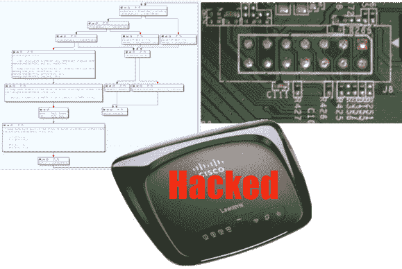

# 入侵 Linksys WRT120N 第 2 部分

> 原文：<https://hackaday.com/2014/02/21/hacking-the-linksys-wrt120n-part-2/>

[Craig Heffner]一直忙于他的 Linksys wrt 120n 路由器。当我们最后一次查看[克雷格]时，他已经让[对路由器固件中使用的模糊技术进行了逆向工程。从那以后，](http://hackaday.com/2014/02/07/linksys-wrt120n/)[他重新启用了 JTAG](http://www.devttys0.com/2014/02/re-enabling-jtag-and-debugging-the-wrt120n/) ，破解了用于保存配置备份的[“加密”，现在](http://www.devttys0.com/2014/02/cracking-linksys-crypto/)[他设计了一个简单的攻击来更改管理员密码](http://www.devttys0.com/2014/02/wrt120n-fprintf-stack-overflow/)。固件解锁后，[Craig]开始追逐硬件 JTAG。他的第一个障碍是缺少连接 TDI 引脚和处理器的跳线。用一个焊料滴进行连接，然后他发现路由器会连接到他的 JTAG 调试器，并立即重置。TDI 在软件中被重新用作 GPIO，并被分配给路由器背面的 reset 按钮。[克雷格的] JTAG 吊舱拉低引脚，导致复位。更糟糕的是，引导程序还重新定义并检查了复位按钮。如果按钮被按下，它将启动到恢复模式。[Craig]在 IDA pro 的帮助下修补了引导加载程序。然后，他拆下路由器的闪存，在系统外对其进行编程。固件需要类似的补丁。[Craig]创建了一个路由器可以接受的固件更新，并通过路由器的网络接口刷新了它，而不是将闪存芯片再次拆下。

因为他已经深入研究了 Linksys 的固件，[Craig]寻找任何明显的攻击媒介。他在/cgi/tmUnBlock.cgi 中发现了一个大的，在固件内部，发送给 cgi 的 URL 会通过 sprintf()发送。简单地说，这意味着没有进行输入长度检查——因此，比固件工程师预期的更长的 URL(在本例中为 256 字节)将溢出到不应该溢出的内存区域——在本例中为堆栈。对于一个精明的攻击者来说，这是一扇敞开的大门。[Craig]能够使用 find some[Return Oriented Programming(ROP)gadgets](http://en.wikipedia.org/wiki/Return-oriented_programming)并创建一个输入值，该值将导致路由器重置其自己的管理员密码。运行漏洞攻击后，快速浏览路由器的网页证明他的攻击是成功的。

如果这还不够的话，[Craig]还花了一些时间查看路由器固件的补丁。其中一个补丁的发行说明提到了加密配置文件。与许多路由器一样，WRT120N 允许用户下载配置并保存为文件。原来“加密”方案[只不过是与 0xFF](http://www.devttys0.com/2014/02/cracking-linksys-crypto/) 的异或运算。以任何标准来看都是相当弱的加密方案。我们向[克雷格]表示祝贺。对于 WRT120N 软件工程师，我们建议参加[【克雷格】的嵌入式设备开发课程](http://www.tacnetsol.com/embedded-device-exploitation/)。