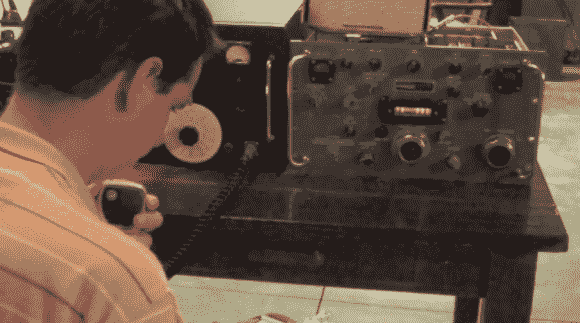

# 侵入 R-390A 军用短波无线电接收器进行传输

> 原文：<https://hackaday.com/2013/06/06/hacking-the-r-390a-military-shortwave-radio-receiver-to-transmit-as-well/>

在拿到这件遗物后，格雷戈里·查瓦特设法破解了它，将接收器转换成了收发器。

R-390A 可能很旧，但也没什么好嘲笑的。它的能力包括从 500 kHz 到 32 MHz 的 AM、code 和 FSK 操作。但是它是一个无法在相同频带上传输的接收器。这就是[格雷戈里的]黑客发挥作用的地方。为了使用他的 20 米单边带单元，他在 R-390A 内部重新布线了可变频率振荡器馈电。基本上，这使他能够控制 390 的一切，使用 SSB 的麦克风和一些开关硬件来传输他自己的信息。

他的演示视频从他使用被黑的设备进行一些联系开始。然后，他花一些时间在白板上解释这些变化。这一部分超出了我们的理解，但当他打开箱子并展示实际的修改时，就变得更加清楚了。

[https://www.youtube.com/embed/8kAfVfgEm74?version=3&rel=1&showsearch=0&showinfo=1&iv_load_policy=1&fs=1&hl=en-US&autohide=2&wmode=transparent](https://www.youtube.com/embed/8kAfVfgEm74?version=3&rel=1&showsearch=0&showinfo=1&iv_load_policy=1&fs=1&hl=en-US&autohide=2&wmode=transparent)