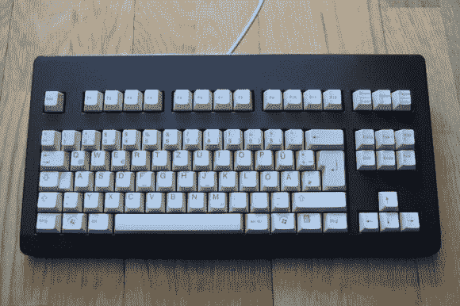

# 完全去掉键盘的右边

> 原文：<https://hackaday.com/2013/03/23/hacking-the-right-side-of-a-keyboard-completely-off/>

这个键盘的外形看起来不太合适。少了什么？哦，[数字小键盘已经被完全移除](http://imgur.com/a/78WwF)！我们几乎只使用我们的数字小键盘(尤其是在编码时)，所以很难理解为什么[Ludw]要这么做。他唯一提到的动机是，他希望鼠标更靠近键盘的主要部分，而且他没有使用数字小键盘。不管是什么原因，我们仍然认为他做了一件了不起的工作，给旧键盘以新的生命。

它最初是一个普通的老式米色樱桃 G80-3000 键盘。在打开外壳后，Ludw 小心地找出了按键矩阵和提供 USB 连接的 PCB 之间的连接。这是因为控制器安装在他要拆除的 PCB 部分上。在进行切割之前，他拆下了所有 17 个开关(这些可以重新用于[制造一个新的键盘](http://hackaday.com/2011/05/21/bamf2011-keyboards-built-from-scratch/)，或者[给各种项目添加开关](http://hackaday.com/2013/01/14/kitchen-scale-key-transplant/))。然后，他剪掉了减少的基板，并使用点对点焊接重新连接控制器。一点点的情况变化消除了额外的空间，同时也重新利用了良好的成型边缘。干净整洁的油漆工作完成了这项工作。

[via [Reddit](http://www.reddit.com/r/DIY/comments/1ar35m/i_modded_my_keyboard_removed_numpad_paintjob/)