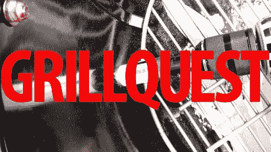

# 黑客入侵你的烤架来获得性能和特性

> 原文：<https://hackaday.com/2012/09/03/hacking-your-grill-for-performance-and-features/>

夏季即将结束，这意味着各地商店的烧烤架将开始销售。对于那些喜欢户外烹饪的人来说，一个漂亮的新烤架总是很诱人。如果你和我一样，那就很难证明这笔开销是值得的。你需要的只是一些火，对吗？如果你想熏制食物，或者做长时间控制的工作，基本上除了快速烤焦什么都可以。

Gizmodo 的[Joe Brown] [发现自己想从简单的煤炭/木材升级到更高级的东西](http://gizmodo.com/5923283/how-i-got-at-least-2000-worth-of-grill-for-540)，但他真的不想支付 2000 美元，他发现这是获得他想要的麦克风功能所必需的。于是，他着手寻找一个好的平台进行 mod，并单独添加他想要的功能。最终的结果是一个性能良好的户外烹饪用具，只花了他 540 美元。

这个技巧比较简单，但是他的修改确实增加了一些很棒的特性。你们中的许多人可以从头开始构建插件，这让我想知道，亲爱的 Hackaday 读者，你会如何改进一个 grill？