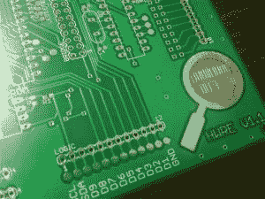
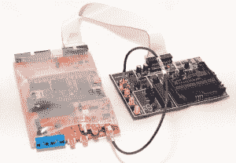
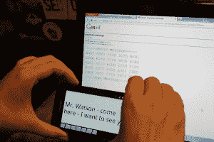
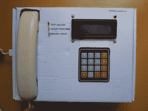

# Hacklet #10 密码学和逆向工程

> 原文：<https://hackaday.com/2014/08/08/hacklet-10-cryptography-and-reverse-engineering/>

为了向 DEFCON 致敬，本周我们将在 Hackaday.io  上了解一些密码学和逆向工程项目。每个黑客都喜欢硬件拼图，而[Tom]创造了一个制作这些拼图的工具。他的[硬件逆向工程学习平台](http://hackaday.io/project/1543-Hardware-Reverse-Engineering-Learning-Platform)由两个 ATmega328 芯片和一个 I2C EEPROM 组成。两个 Atmel 芯片共享一条数据总线和 I2C 线。在这一切的正中间是一个 ST Morpho 连接器，它允许 ST Nucleo 板充当嗅探器。该平台允许任何人创建逆向工程挑战！要成功反转  工程师电路板，拥有好的工具当然有帮助。[coflynn]在与[芯片密语者 T10 的空间中给了我们这些。ChipWhisperer 是一个开源的安全研究平台。系统的核心是 Xilinx Spartan 6 FPGA。FPGA 允许非常高速的操作，如 VCC 和时钟毛刺。ChipWhisperer 是一个完整的电路板生态系统——从 LNA 积木到现场探头。整个系统由易于使用的图形用户界面控制。最终结果是硬件攻击的强大工具。](http://hackaday.io/project/956)  在房子的加密方面，我们先把联邦调查局拒之门外。[Sector67]黑客空间集体创建了[NSA AWAY](http://hackaday.io/project/1569-NSA-Away)。NSA AWAY 是一种通过不安全的媒介(如电子邮件)发送安全信息的简单方法。一次性使用的 pad 存储在两个 SD 卡上，由两个 Android 设备使用。消息发送者使用 Android 设备对消息进行加密。在接收端，只需将 android 设备的摄像头对准加密数据，就可以解码信息。太简单了，连爷爷奶奶都能做！  接下来是【乔希的】[把它埋在噪音地板下面。](http://hackaday.io/project/2006-Bury-it-under-the-noise-floor)“埋葬它”是一个关于一般密码学，特别是隐写软件的教育。[Josh]解释如何使用 AES-256 加密、密码哈希和其他常用技术。然后，他通过展示如何在图像中隐藏加密信息，介绍了[隐写术](http://en.wikipedia.org/wiki/Steganography)。任何参与 [Hackaday 的 ARG](http://hackaday.io/hacker/3935-major-tom) 积累到[hack aday Prize](http://hackaday.io/prize)的人都会认识到这个技巧。【yago】用他的 [ZRTP 硬电话给我们加密的语音通讯。](http://hackaday.io/project/1400-ZRTP-Hardphone)硬电话实现了 [ZRTP](https://en.wikipedia.org/wiki/ZRTP) ，这是一种用于加密 IP 语音通信的协议。该协议由 Raspberry Pi 使用几个 USB 声卡实现。用户界面是一个 16×2 行字符的 LCD，一个薄膜键盘，当然还有一个电话听筒。不要忘记你需要建造两个单位，否则无论你要打电话给谁，他都会很困惑！

最后我们有了[mool multi pass](http://hackaday.io/project/86-Mooltipass)。由[Mathieu Stephan]和整个社区在 Hackaday 上开发的 Mooltipass 是一个安全的密码存储系统。您所有的密码可以存储完全 AES-256 加密，与智能卡密钥。在引擎盖下，Mooltipass 使用 Arduino 兼容的 ATmega32U4 微控制器。用户界面是通过有机发光二极管屏幕和触摸控制。这星期到此为止！请务必查看下周的 Hacklet，届时我们将为您带来更多来自 [Hackaday.io](Hackaday.io) 的精彩内容！