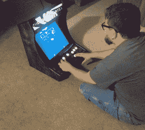
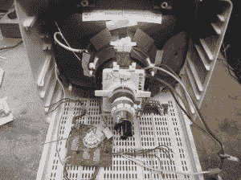
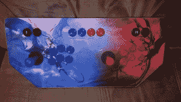
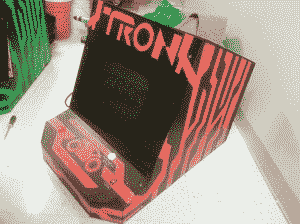
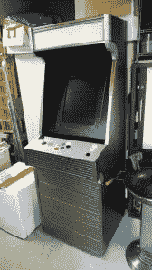

# 黑客 15-拱廊之火

> 原文：<https://hackaday.com/2014/09/12/hacklet-15-arcade-fire/>

本周的 Hacklet 致力于街机游戏。80 年代和 90 年代初的街机厅可能已经让位于今天的游戏机和 PC 游戏，但经典的立式街机柜仍然存在！许多黑客修复了旧的街机橱柜，甚至自己动手做了。我们将在 Hackaday.io 上看看一些最好的街机游戏相关的黑客攻击！

 【布雷登】从他的[树莓派老式街机](http://hackaday.io/project/2090)开始。黑色漩涡是一个桌面拱廊柜使用树莓皮，一个旧显示器，和一些不错的木工技能。黑涡用了一个树莓 Pi B+额外的 GPIO 引脚使接口按钮和操纵杆开关变得简单。在软件方面，[Brayden]正在使用流行的 PiMame(现在是[PiPlay](http://pimame.org/))风格的 Linux，为游戏和仿真而构建。黑涡的外壳是胶合板。[布雷登]使用袖珍孔夹具建立一个坚固的，没有额外的支撑块内阁。染色处理真的很管用！

 接下来，【弗雷德里克诺】从头开始用[街机 XY 显示器震撼我们的心灵](http://hackaday.io/project/2871)。修复经典雅达利矢量游戏印刷电路板。他的实验室需要一个测试监视器。在《暴风雨》和《星球大战》等游戏中使用的原始 Amplifone 和 WG6100 彩色 XY 显示器变得相当罕见。没问题，因为[弗雷德里克诺]正在建造他自己的。与 WG6100 非常相似，[fredkono]从标准的彩色电视 CRT 开始。他取下并重新绕上了矢量运算的轭。电视的电子设备被替换成了自己的偏转放大器印刷电路板。[fredkono]肯定包括非常重要的光点杀手电路，它在光点烧坏 CRT 之前关闭电子枪。

 【里斯】用两个专用于街机控制的项目来维持运转。他的[TI launch pad Arcade Control to USB 接口](http://hackaday.io/project/510)包含使用德州仪器 Tiva C launchpad 作为 Arcade Control 的 USB 接口的指令和代码。[里斯]在他的[街机控制面板](http://hackaday.io/project/507)中很好地利用了这一切。控制面板具有 MAME 按钮，以及标准的双人格斗游戏按钮布局。他用一些红色和蓝色的龙的光滑图形结束了他的面板。

 【莎拉和雷蒙德】在 2010 年举办了一场《创:遗产》的发布会。史诗街机电影需要史诗街机游戏，或者在这种情况下，游戏。准确地说是 16 个桌面拱廊。所有 16 台机器仅用了 6 天就造好了。其中 8 台机器运行的是经典 Tron lightcycle 游戏的网络版 [Armegatron Advanced](http://armagetronad.org/) 。其他人玩的是像吃豆人这样的经典游戏，或者像 T7 头后 T8 这样的现代子弹射击游戏。橱柜由膨胀 PVC 制成，木块作为支撑结构。[Sarah 和 Raymond]用 UV 黑光漆定制油漆每个橱柜。我们喜欢他们个人签名机上的定制艺术品！

 【迈克】带我们回到 80 年代，与[只是另一个街机](http://hackaday.io/project/1234)。在引擎盖下，这台机器使用了标准的 Raspberry Pi 和 PiMame(现在的 [PiPlay](http://pimame.org/) )套件。[迈克]甚至加了一个轨迹球，这样他就可以玩蜈蚣了。这个拱廊的特别之处在于它的橱柜。[Mike]找到一个旧衣柜，上面有完美 80 年代风格的金属条包层。[Mike]拆下包层，切割硬纸板框架。他把东西重新组装成一个直立的拱廊橱柜，看起来就像是 1985 年从西尔斯的电子部门出来的一样。

好了，伙计们，这是另一集的黑客攻击。一如既往，下周见。同样的黑客时间，同样的黑客频道，带给你最好的 Hackaday.io！