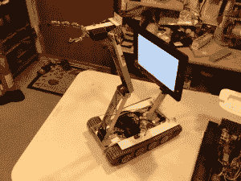

# hack let 16–出色的网真技术

> 原文：<https://hackaday.com/2014/09/19/hacklet-16-telepresence/>

本周的 Hacklet 是关于当你不能通过网真的魔力时，你就在那里。不仅仅是电话会议，网真更进了一步，将用户置于一个遥远的空间。这可能是一个机器人平台，虚拟现实护目镜，或与远程环境交互的致动器。这也是一个充满创造性黑客机会的领域！

 我们先从【PJK】[地下调查装置](http://hackaday.io/project/1198)说起。[PJK]正在探索一个隐藏的地下室城堡。为了到达那里，他必须穿过一条铺着碎石地板的狭小通道。昵称为“杂草希德”，[PJK 的]机器人是无线电控制的，使用网络摄像头将图像发送回[PJK]。就像过去用于探索金字塔的机器人一样，[PJK]也配备了轨道驱动系统。不像金字塔机器人，[PJK]是在预算之内，所以他的轨道系统是一个带有块状胎面的改良链条。[PJK]不想太依赖他的机器人——在它的处女航中，它很可能会失去希德。

 接下来是【JackRC】和他的 [Skype 机器人](http://hackaday.io/project/957)。[Jack]正在使用 Skype API 制造一个成本相对较低(约 200 美元)的机器人。他的马克 I 和马克 2 号模型都是基于遥控坦克。当你移除炮塔和大炮时，坦克可以承载惊人的重量。[Jack]增加了平板电脑的安装臂和解除炸弹和/或愤怒儿童的机械臂。他的工艺技能在完成的机器人中真正体现出来了。没有尺寸参考，它可以通过一个警察发行的拆弹机器人！

 【加里·费尔斯通】用他的[最小延迟 Oculus Rift FPV](http://hackaday.io/project/1513) 带我们飞向天空。[Gary]使用 Oculus Rift 头戴式显示器(HMD)进行第一人称视角(FPV)驾驶。他的飞机是四轴飞行器。[Gary 的]视频源是 GoPro 摄像机。他的四轴飞行器使用标准模拟视频系统以 5.8GHz 传输视频。在接收端，笔记本电脑捕捉视频，消除 GoPro 镜头的鱼眼扭曲，为 Oculus 重新扭曲图像。他的延迟下降了大约 50-100 毫秒，这对于捕捉模拟视频的系统来说是相当不错的。

 下一个【Brad】带着[芯片机器人(chip bot):4G 网真漫游车穿越美洲](http://hackaday.io/project/1926)。[Brad]和他 5 岁的继子正在将一辆遥控卡车改装成远程呈现漫游车。Chipbot 的电子产品得到了重大升级。[Brad]添加了一个 Raspberry Pi 和一个 Arduino，带有用于电机控制的 SN75441 芯片。连接是通过使用 TP-LINK 路由器的 WiFi，或使用 4G 调制解调器的蜂窝。[Brad]没有选择 Raspberry Pi 摄像头，而是选择了 Ubiquiti IP 摄像头。Ubiquiti 使用以太网供电，所以他增加了一个 POE 注射器。Chipbot 仍在开发中，但正如(Brad 的)最近更新显示的，Chipbot 已经对来自互联网的命令做出了反应。自从上次 Chipbot 更新以来已经过去了大约一个月，所以如果你看到[Brad]请告诉他顺便来看看我们的进展情况！

 最后，我们有【乔·费尔纳】和他统称为[的网真机器人](http://hackaday.io/project/2338)。[乔]正在用谷歌的安卓操作系统控制他的安卓网真化身。他的车载电脑是一台 Nexus 7 平板电脑。带有 STM32 ARM 微控制器的定制板允许 Nexus 与机器人的电机和传感器接口。[乔]正在使用网络界面来控制他的机器人。早期的演示很有希望，因为远程呈现机器人已经被威斯康星州密尔沃基的一名用户带到弗吉尼亚州雷斯顿的一次驾驶中。

这一集的黑客攻击到此结束。一如既往，下周见。同样的黑时间，同样的黑渠道，带给你最好的 [Hackaday.io！](hackaday.io)

*更新——点击这里查看我们的[网真列表](http://hackaday.io/list/3096-Telepresence-Technology)！*