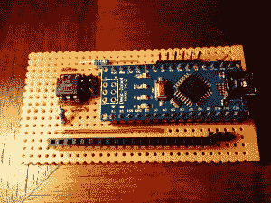
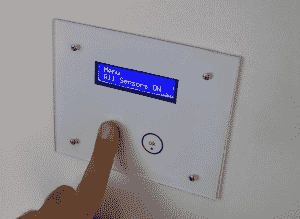

# hack let 26–Arduino 项目

> 原文：<https://hackaday.com/2014/12/12/hacklet-26-arduino-projects/>

Arduino 是那些已经成为黑客和制作同义词的板子之一。自从 2005 年推出以来，已经售出了超过 700，000 块 Arduino 官方主板，以及数以百万计的兼容和克隆主板。世界各地的黑客和制造商已经发现 Arduino 平台是让他们的项目起步的一种廉价而简单的方式。本周 Hacket 聚焦于我们在 [Hackday.io 上发现的一些最好的基于 Arduino 的项目！](http://hackaday.io/)

 【尼赞格尔斯】用[机器人艺术家](http://hackaday.io/project/895)(一个绘制线条画的机器人)滚动球或圆珠笔。不过，Roboartist 不仅仅是一个绘图员。[Niazangels]创建了一个定制的 PC 程序，它可以从网络摄像头捕获的图像中创建线条画。线条画被转换成坐标，并被发送到 Arduino，Arduino 控制所有移动笔的马达。[Niazangels]采用了 Dynamixel 闭环伺服电机，而不是我们在 3D 打印机中常见的步进电机。

 【彼得·爱德华兹】用 [Tapuino，20 美元 C64 磁带模拟器](http://hackaday.io/project/1985)保存着过去。Commodore 64、128 和兼容机的许多程序只在磁带上发行。这些磁带正在慢慢退化，尽管经典的 Commodore [herdware](http://hackaday.com/author/williamherd/) 依然强劲。Tapuino 通过使用 Arduino nano 将文件从 SD 卡播放到原始的[dataset](http://en.wikipedia.org/wiki/Commodore_Datasette)界面来保存这些磁带。[Peter]还计划在 Tapuino 中添加录音功能，这将使它成为保存数据的完整包。唯一缺少的是按下机械播放按钮时令人满意的沉闷金属声！

[Dushyant Ahuja]知道现在是什么时间，这要感谢他的无限镜像时钟。这个时钟在一些 WS2812B RGB LED 的帮助下显示时间。[Dushyant]用常规的 Arduino 调试时钟，但当需要完成项目时，他使用 ATmega328 从头开始创建 Arduino 兼容板。借助板载蓝牙模块，编程非常简单。[Dushyant]计划添加一个 TFT lcd，当那些耗电的 led 关闭时，它将显示天气和其他信息。

 【英加罗】用他的项目 [Arduino 防盗报警盾](http://hackaday.io/project/2519)搭建了一个完整的家庭报警系统。[英加罗]需要为他的家安装一个报警系统。对于标准的 ATmega328p 驱动的 Arduino Uno 来说，这是一个很高的要求。然而，Arduino Mega2560 上可用的额外 I/O 线正是医生订购的。[IngGaro]执行了一些令人惊叹的点对点 perfboard 布线，以生产外观和工作效果都很棒的定制屏蔽！该报警器可以与任何传感器连接，并可以通过互联网进行控制。你甚至可以通过 RFID 钥匙卡解除系统。

想要生活中有更多的 Arduino？查看我们策划的 Arduino 列表！

这就是我们这个星期的全部收入。一如既往，下周见。同样的黑时间，同样的黑渠道，带给你最好的 [Hackaday.io！](http://hackaday.io/)