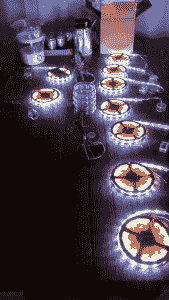
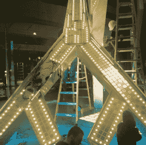

# Hacklet 27 假日黑客

> 原文：<https://hackaday.com/2014/12/19/hacklet-27-holiday-hacks/>

这看起来越来越像这里的节日了。这意味着是时候在 Hacklet 上进行假日出租了！本周我们来看看你在 [Hackaday.io 上创造的最酷的节日黑客！](http://hackaday.io/)

 我们先从【查理克斯】和[赛普拉斯 PSOC 4 + ESP8266 WS2812 RGB 圣诞灯光](http://hackaday.io/project/3250)说起。这个名字可能有点拗口，但是这个项目的目标很简单:超棒的圣诞灯！[Charliex]创造了 WiFi 可控圣诞灯。为此，他利用了 Cypress 基于 ARM 内核的 PSOC4 芯片。WiFi 任务由流行的 ESP8266 模块处理，灯本身是 WS2812 可寻址灯条。

[charliex]这次真的超越了自己，从头开始创建了一个完整的解决方案。他从 Cypress dev 板开始，但很快转向自己设计的板。多氯联苯首先在家里被碾磨，然后被送去生产。
通过 WiFi 网络的 UDP 协议控制条带。[Charliex]发现这些条带有足够的无线覆盖范围，可以放在他家外面。谜题的最后一部分是控制——通过创建自己的 GUI 来处理中央计算机上播放的音乐同步几个片段,[charliex]很有风格地处理了这个问题。

 接下来是【nsted】与另一个 LED hack，[发光的圣诞雪花雕塑](http://hackaday.io/project/3431)。[Nsted]被承包给一个雕塑添加一些额外的 LED 灯。问题是，这些发光二极管将填补整个雕塑的主要互动照明系统的空白。任何时候你不得不融合两个系统，事情会变得疯狂。[Nsted]发现了这一点，他将 WS2812B Adafruit NeoPixel 条添加到已经设计到雕塑中的 Sensacell 模块中。通信通过 RS485 进行，Arduino Due 和 Megas 负责处理。功率是这个雕塑的一个问题，因为它在低电压下超过 100 安培。像许多艺术装置一样，这是一次“工作到最后一刻”的活动。尽管一切都在最后一分钟走到了一起，这个项目还是成功了！

 接下来是【杰里米·韦瑟福德】和[圣诞乐队](http://hackaday.io/project/3533)。[Jeremy]承担了组建史上最伟大的复古电子乐队的任务。他在冬天用四张软盘、三台扫描仪和一台老式喷墨打印机演奏西伯利亚交响乐团的《巫师》。移动元件上的 LED 灯条为声音增添了灯光。一台带坡道板的 Arduino Mega 控制着这场表演。[Jeremy]让他的乐队在音频和视频上进行专业录制。我们正在焦急地等待最后的视频上传，这样我们就可以摇滚到一些旧的硬件！

 最后，我们得到了【crenn6977】和他的[太阳能圣诞灯控制器。](http://hackaday.io/project/1917)这是【crenn6977】在 Hackaday 奖的参赛作品。虽然它没有把他带到太空，但我们确信它会把圣诞老人带到他的门前。[crenn6977]不是为他的太阳能圣诞灯运行许多微小的太阳能电池，而是寻求一个单一的大型面板和无线控制。nRF24L01+处理无线连接，而 STM32F042 ARM cortex M0 处理器则是操作的大脑。太阳能需要高效的设计，因此[crenn6977]正在深入研究运算放大器电路，以保持这些 led 在夜间运行，电池在白天充电。

是时候让我们的大脑安定下来，睡上一个漫长的冬季午觉了，所以我们将在这里结束这个版本的 Hacklet。一如既往，下周见。同样的黑时间，同样的黑渠道，带给你最好的 [Hackaday.io！](http://hackaday.io/)