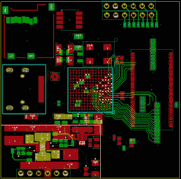
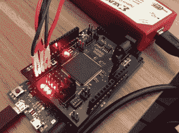
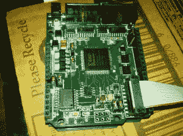

# 黑客 28–可编程逻辑黑客

> 原文：<https://hackaday.com/2015/01/02/hacklet-28-programmable-logic-hacks/>

FPGAs、CPLDs、PALs 和 GALs，天啊！本周的 Hacklet 聚焦于 [Hackaday.io 上一些最好的可编程逻辑项目！](http://hackaday.io?utm_source=hackaday&utm_medium=hacklet&utm_campaign=28)可编程逻辑器件往往有一个陡峭的学习曲线。新黑客不仅要学习复杂的部分，还要学习全新的语言，比如 VHDL 或 Verilog。尽管如此，冒险进入可编程逻辑还是很值得的。用微控制器不可能实现的高速项目突然变得触手可及！

 一个很好的例子就是【汤姆·麦克劳德的】[基于 FPGA 的廉价 HDMI 实验板](http://hackaday.io/project/2777?utm_source=hackaday&utm_medium=hacklet&utm_campaign=28)。[Tom]的目标是开发一款能够通过 HDMI 以合理的帧速率输出 720p 视频的主板。他使用 Xilinx Spartan 6 芯片来实现这一点，同时还有一些支持组件。这些图像将存储在 SD 卡上。[Tom]也希望用这种装置做一些视频，但他还没有看到芯片是否足够快，能够在生成 HDMI 数据流的同时处理视频解码。[Tom]已经在这个项目上沉默了几个月，所以我们希望要么他会看到这个帖子并发送更新，要么有人会拿起他的源文件并继续这个项目！

 接下来是我们自己的【技术狂】带着他的 [Arduino 兼容 FPGA 盾](http://hackaday.io/project/38?utm_source=hackaday&utm_medium=hacklet&utm_campaign=28)。从 FPGAs 开始可能很困难。[技术狂]用这个盾牌让事情变得简单了一点。最初作为一个项目开始于。io，现在[在 Hackaday 商店](http://store.hackaday.com/products/arduino-compatible-fpga-shield)有售，shield 采用 Xilinx Spartan 6 FPGA。[技术狂]通过包括调节器和电平转换器来使敏感的 FPGA 高兴，从而使电源和接口变得容易。不确定从哪里开始？查看【Mike Szczys’】[Spartan-6 FPGA Hello World](http://hackaday.io/project/2930?utm_source=hackaday&utm_medium=hacklet&utm_campaign=28)！[Mike]带我们从安装 Xilinx 的免费工具链到运行“hello world”led 信号灯！

 仍对学习可编程逻辑感兴趣，但不确定该何去何从？查看【Bruce Land’s】[教授 FPGA 并行计算](http://hackaday.io/project/841?utm_source=hackaday&utm_medium=hacklet&utm_campaign=28)。实际上，看看[【Bruce】在 Hackaday.io](http://hackaday.io/hacker/739?utm_source=hackaday&utm_medium=hacklet&utm_campaign=28) 上做的每一件事——这个人是一个活着的传奇，拥有丰富的电子和嵌入式系统信息。成为纽约康奈尔大学的工程学教授也没有坏处！在[教授 FPGA 并行计算](http://hackaday.io/project/841?utm_source=hackaday&utm_medium=hacklet&utm_campaign=28)的课程中，【Bruce】链接到康奈尔大学的 ECE 5760 课程，他在该课程中授课。本课程使用 Altera/Terasic DE2 FPGA 板来演示使用可编程逻辑器件的并行计算。注意[Bruce]用 Verilog 教授这门课，所以你们这些经验丰富的 VHDL 人仍然可以学到一些新东西！

 最后，我们有【迈克尔·a·莫里斯】与[变色龙](http://hackaday.io/project/656?utm_source=hackaday&utm_medium=hacklet&utm_campaign=28)。Chameleon 是一款 Arduino 兼容 FPGA 板，板上集成 Xilinx Spartan 3A FPGA。[Michael]设计变色龙有两个主要目的:软核处理器和智能串行通信接口。在处理器方面，变色龙确实大放异彩。[Michael]在他的设计中实现了 6502 内核。这意味着它可以作为逆向计算项目的核心。[迈克尔]仍在努力研究变色龙，他最近得到 fig-FORTH 1.0 运行！干得好[迈克尔]！

想要更多的可编程逻辑好吗？查看我们的[可编程逻辑列表！](http://hackaday.io/list/3746?utm_source=hackaday&utm_medium=hacklet&utm_campaign=28)

这一集的黑客攻击到此结束了！一如既往，下周见。同样的黑时间，同样的黑渠道，带给你最好的 [Hackaday.io！](http://hackaday.io?utm_source=hackaday&utm_medium=hacklet&utm_campaign=28)