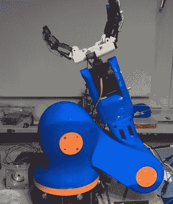
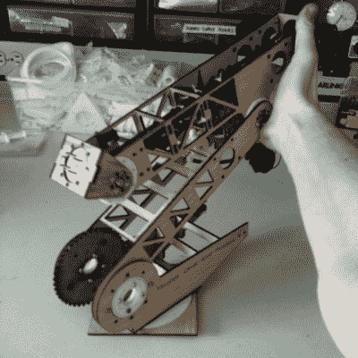
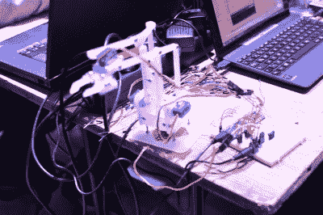
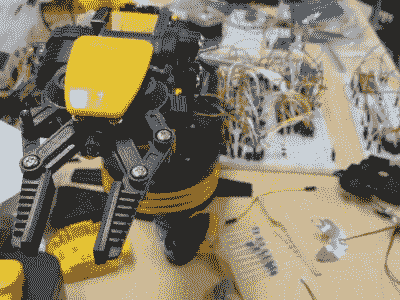

# hack let 30–机械臂项目

> 原文：<https://hackaday.com/2015/01/16/hacklet-30-robot-arm-projects/>

机械臂——从移动硅片到焊接汽车，它们无所不能。许多黑客都梦想拥有自己的机器人手臂，为他们提供啤酒，帮助他们构建项目。本周的 Hacklet 在 [Hackaday.io 上展示了一些最好的机器人手臂项目！](http://hackaday.io/?utm_source=hackaday&utm_medium=30&utm_campaign=hacklet)

 我们从【4ndreas】开始，他正在建造这个不可思议的 [3D 可打印机械臂。](http://hackaday.io/project/3800?utm_source=hackaday&utm_medium=30&utm_campaign=hacklet)受大型工业机器人的启发，[4ndreas]给了我们一个完全 3D 可打印的设计。【4 ndreas’】3D 设计体验真正展现在这里。这只手臂看起来像是刚在当地装配线上完成工作！手臂也很大——打印零件花费了他大约一周的时间，并且使用了大约 1.2 千克的 ABS 细丝！[4]最近，他将这个项目分成了两半:他的蓝色手臂由步进电机驱动，而橙色手臂则由 DC 电机驱动。双臂都可以使用他的可怕的手爪设计。查看项目页面，观看手臂运动的视频！

 接下来是【丹·罗耶】和他的[六自由度机械臂](http://hackaday.io/project/945?utm_source=hackaday&utm_medium=30&utm_campaign=hacklet)。[丹的]不想花费超过 10，000 美元在工业手臂上，所以他用木头、塑料和容易获得的零件建造了自己的手臂。顾名思义，手臂有 6 个自由度。电子设备包括结实的 NEMA 17 步进电机和伦巴控制器，最初是为 3D 打印机设计的。丹甚至创造了一些新颖的编码器安装。每个关节都有一个编码器，这将使机器人作为一个闭环系统运行。[Dan]最初是在 2014 年 Hackaday 奖中加入这条手臂的。虽然它没有带他去太空，但我们打赌它能给他买瓶汽水！

没有[Ben . phenom ptix]和令人敬畏的[MeArm](http://hackaday.io/project/181?utm_source=hackaday&utm_medium=30&utm_campaign=hacklet)的机器人手臂 Hacklet 是不完整的。MeArm 是一个口袋大小的机器人手臂，它使用微小的 9 克伺服系统来移动。它是由激光切割丙烯酸和标准硬件制成的。我们非常喜欢 MeArm，因此我们将其作为我们在慕尼黑的[嵌入式硬件研讨会的挑战之一。最近，【本】和米尔姆在](http://hackadaymunich.com/) [Kickstarter](https://www.kickstarter.com/projects/phenoptix/mearm-pocket-sized-industrial-robotics-for-everybo) 上运行得很好。让我们希望这些手臂擅长填充、写地址和邮寄包裹吧！

 终于我们有了【健二·拉森】与 [Reactron 材料运输机](http://hackaday.io/project/1452?utm_source=hackaday&utm_medium=30&utm_campaign=hacklet)。材料运输器只是[Kenji]更大的[反应堆项目](http://hackaday.com/2014/07/24/thp-hacker-bio-kenji-larsen/)的一小部分。它始于一个 OWI-535 机械臂。OWI 实际上是一个玩具——一个塑料套件，它构建了一个开环 DC 电机驱动的手臂。[Kenji]花了很多时间来改造他的手臂。在确定基于印刷电路板的设计之前，他尝试为每个接头模制自己的电位计。一旦新系统就位，他发现他的电阻器可以工作大约 10，000 个周期。对于一个改装玩具来说还不错！

有相当多的机械臂项目我们未能在这一期的 Hacklet 中涵盖——你可以在我们全新的[机械臂项目列表中查看它们！](http://hackaday.io/list/3868?utm_source=hackaday&utm_medium=30&utm_campaign=hacklet)

一如既往，这篇文章就到这里，下周见。同样的黑时间，同样的黑渠道，带给你最好的 [Hackaday.io！](http://hackaday.io/?utm_source=hackaday&utm_medium=30&utm_campaign=hacklet)