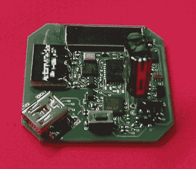
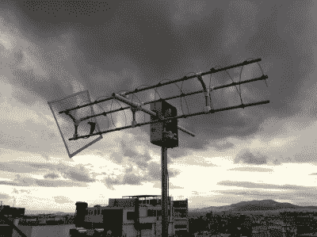
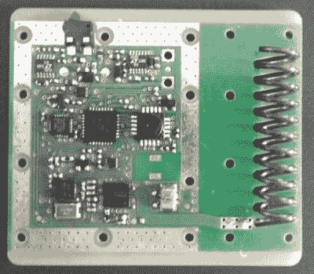
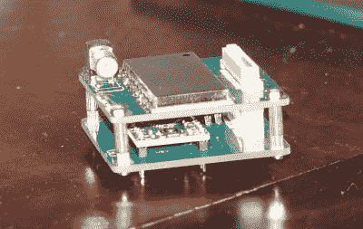

# hacklet 34–卫星项目

> 原文：<https://hackaday.com/2015/02/13/hacklet-34-satellite-projects/>

空间。最后的边疆。每个修补匠、黑客和制造者都梦想飞出地球大气层，进入天堂。去年，一个努力工作的团队通过赢得 Hackaday 奖获得了将一名成员送上太空的机会。对于我们其余的人来说，我们仍然可以通过联系轨道上的卫星，甚至将我们自己的一些硬件送入太空来体验这种兴奋。本周 Hacklet 聚焦 Hackaday.io 上最好的卫星项目！

 我们从【movax】[你的卫星开发包开始，发射](http://hackaday.io/project/3612)。Chipsat 是一颗运行基本代码的微型卫星。是的，基本在太空！芯片卫星将被堆叠在一个发射架上，成群结队地被送入太空。这个想法是最终让他们从国际空间站发射。电力由一个小型太阳能电池提供，它给一对超级电容器充电。电容器充电后，卫星将运行几秒钟。与地面的连接是通过 433 兆赫的链路。Chipsat 不仅仅漂浮在太空中，三个线圈赋予了它控制姿态和旋转的能力。Chipsat 将通过一个磁力计和一个光传感器来感知周围的空间。

如果没有【Pierros Papadeas】和他的团队在[SatNOGS——全球地面站网络](http://hackaday.io/project/1340)上的工作，任何以卫星为主题的黑客攻击都是不完整的。SatNOGS 的目标是建立一个连接卫星地面站的全球网络。可以把它想象成美国宇航局地球轨道卫星深空网络的草根版本。这不仅仅是一个伟大的想法，因为 [SatNOGS 赢得了 2014 年黑客日奖](http://hackaday.com/2014/11/13/satnogs-wins-the-2014-hackaday-prize/)。你可以在 2014 年 11 月查看[我们对该项目的报道](http://hackaday.com/2014/11/07/hackaday-prize-finalist-a-network-of-satellite-ground-stations/)。从那以后，SatNOGS 团队就开始忙碌了！他们刚刚在希腊雅典的黑客空间部署了首个卫星 V2 系统。

 接下来是 [TRSI PocketQub 卫星](http://hackaday.io/project/2915)，由【movax】的另一个项目。TRSI 是一颗通过图像发送数据的卫星，可以使用简单的 RTL-SDR 棒使用 [Hellschreiber 模式](http://en.wikipedia.org/wiki/Hellschreiber)查看图像。地狱模式意味着无论哪个 SDR 应用程序运行接收器，都可以在瀑布显示中直接查看图像。用 TRSI 的手机式相机模块拍摄的数字或整个图像可以被编码和显示。电力当然由太阳能电池提供，通信链路将在协调的 433 MHz 频带上。最初的 TRSI 硬件实际上已经变成了 chips at(mor VAX 的另一个卫星项目)的部署机器。他已经暂停了主要的 TRSI 项目，直到 ChipSat 项目完成。

 完成我们的卫星特别节目的是【OzQube】和他的项目 [QubeCast Max](http://hackaday.io/project/1726) 。QubeCast 是 PocketQube PQ60 卫星外形的第一个澳大利亚版本。在目睹了 [$50Sat](http://www.50dollarsat.info/) 项目的成功后，【OzQube】想设计一颗自己的卫星。由于他想增加传感器，并向地球发送比以前更多的数据，他需要比目前的卫星更高的数据速率。这意味着要使用大功率无线电。为此，他使用了 NiceRF RF4463F30 无线电模块。该模块基于硅实验室 Si4463 RF ISM 频段芯片，配有功率放大器。该模块输出 1 瓦，这对于一颗微小的卫星来说是相当大的功率！

想要更多卫星的好处？看看 Hackaday.io 最新公布的卫星名单。

倒计时快到了，所以这一集的时间就这么多了。下周见。同样的黑时间，同样的黑渠道，带给你最好的 [Hackaday.io！](http://hackaday.io/)