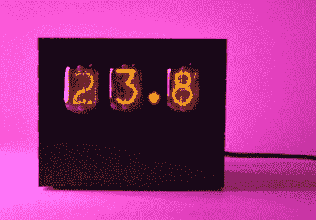
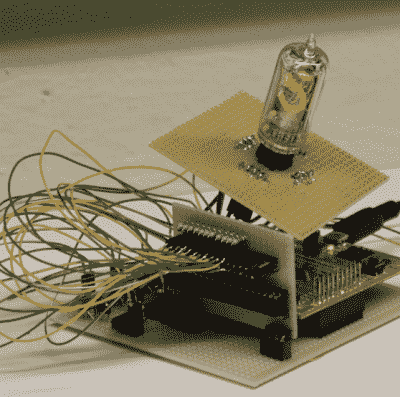
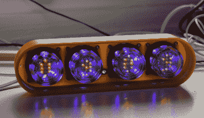
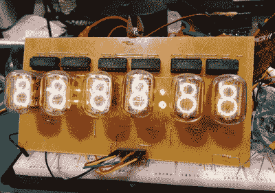

# hacklet 37–谢妮项目

> 原文：<https://hackaday.com/2015/03/06/hacklet-37-nixie-projects/>

没有什么能比得上电子管的温暖光芒。有什么比用它来阅读数字更好的方式来享受这种光芒呢？谢妮管是由海都兄弟实验室创造的，并在 1955 年由巴勒斯公司推广。该名称来自 NIX I–或“数字指示器 1 号实验”。到 20 世纪 70 年代中期，七段 LED 成为 Nixies 的流行和低成本替代品，但它们没有同样的吸引力。谢妮电子管的生产一直持续到 20 世纪 90 年代。这种电子管的光芒总的来说受到黑客、制造商和人类的喜爱。本周的 Hacklet 在 Hackaday.io 上重点介绍了谢妮(以及谢妮启发)的最佳项目！

 我们先从【萨沙格兰特】[谢妮温度显示](http://hackaday.io/project/3885)说起。[Sascha]将一个 Arduino、一个 Dallas DS18B20 温度传感器和三个 IN-12A 谢妮管混合在一起，创建了一个简单的三位数温度显示器。我们非常喜欢低调的激光切割黑色亚克力表壳。Arduino Pro Micro 读取 Dallas 1 线传感器，并将温度转换为 BCD。高压任务由模块化高压电源处理，该电源可将 9V 提升至所需的 170V。控制谢妮电子管本身的是经典的 K155ID1 BCD 到十进制转换芯片——时钟制造者的最爱。

 接下来是【克里斯托夫】[阅读数据表，驾驶谢妮电子管](http://hackaday.io/project/3989)。像 K155ID1 和 74141 这样的芯片使驱动谢妮管变得容易。它们将二进制编码十进制(BCD)转换为离散输出，以驱动谢妮的阴极。更重要的是，这种芯片的输出驱动器设计用于处理驱动谢妮电子管所涉及的高电压。这些芯片已经不再生产，而且越来越少。[Christoph]使用了更多的通用部件。他的最终驱动晶体管是一个 MPSA42 高压 NPN 单元。驱动 MPSA42 的是 74HC595 型移位寄存器。[Christoph]使用了带有 FET 输出的有点奇特的德州仪器 TPIC6B595，但任何移位寄存器在这里都应该工作。该项目在 Stellaris Launchpad 上运行，因此它应该是 Arduino 兼容代码。

 【达维达科】有[固定电子钟](http://hackaday.io/project/1886)。Fixietube 不完全是谢妮。这是一个受谢妮电子管启发的 LED 显示屏。现代琥珀色 led 与经典 Nixies 不太一样，但它们非常接近。[Dave]设计了一个带有 3×5 led 矩阵的 PCB 来显示数字。几个蓝色发光二极管增加了一点环境光。led 由 74HC595 移位寄存器驱动。整个组件安装在一个小玻璃果酱罐内，给它一个真空管的效果。结果不言自明——修复管当然不是 Nixies，但它们看起来相当不错。添加一个漂亮的 3D 打印案例，你就有了一个伟大的项目，任何人都可以安全地构建它。

 最后，我们有【Johnny.drazzi】带着他的[打开谢妮时钟显示](http://hackaday.io/project/1940)。[Johnny]已经在开放谢妮工作了几年。目标是创建一个基于谢妮的时钟显示器，可以通过 SPI 总线驱动。到目前为止，在无处不在的 K155ID1 BCD 到十进制转换器的帮助下，[Johnny]有 6 个俄罗斯 IN-12 管发光。时钟的冒号由两个 INS-1 霓虹灯指示器创建。[Johnny]花了很多时间分析数码管的特性，包括冲击电压和稳态电流。如果你有兴趣自己建造一条谢妮赛道，他的研究非常值得一读！

不满意？想要更多的谢妮善良？查看我们的[数码管项目列表！](http://hackaday.io/list/4532)

这就是我们本周的全部时间。一如既往，下周见。同样的黑时间，同样的黑渠道，带给你最好的 [Hackaday.io！](http://hackaday.io/)