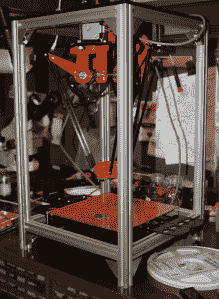
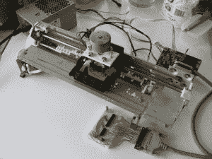
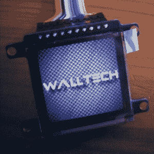
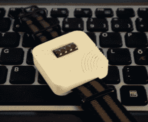
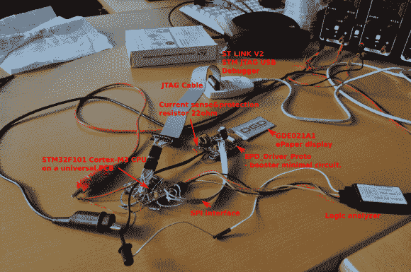

# 小技巧 4——PCB 工具和手表

> 原文：<https://hackaday.com/2014/06/20/hacklet-4/>

黑客日大奖正在升温！当我们设立奖项时，我们期望看到一些令人难以置信的参赛作品，你们没有让我们失望。像旨在创建一个全球卫星地面站网络的 [SatNOGS](http://hackaday.io/project/1340-SatNOGS) 或低成本 Python 驱动的视觉模块 [OpenMV](http://hackaday.io/project/1313-OpenMV) 这样的项目正在严重打击我们。

我们开始[通过社区投票](http://hackaday.io/prize/vote)发放一些奖品，还有足够的时间让你参加。查看[黑客日大奖](http://hackaday.io/prize)页面了解全部详情。

#### **低成本印刷电路板工具**

我们已经看到了铣床、车床、数控机床和 3D 打印机，但如果有什么设备引起了硬件黑客的注意，那就是取放机。在 PCB 行业，这些机器每小时拾取数千个零件，完美地将它们放置在印刷电路板上。缺点是它们非常昂贵。最便宜的不带视觉的中国机器起价 4000 美元。

[Neil]的目标是用一台价值 300 美元的拾取和放置机器打破这些价格壁垒，该机器还可以兼作 3D 打印机。他正在使用 delta 3D 打印机硬件来做这件事，而且他正在投入一切！基于 OpenCV 的视觉、多个工具头、卷轴和托盘拾取，[Neil]已经涵盖了所有要点。但是他一个人做不到，所以他在寻求帮助。检查一下，给他一只手(或者一个脑壳)！
T3

一台低成本的拾放机需要印刷电路板来工作。不要担心，[shlonkin]以不到 10 美元的价格为你购买了他的[PCB 工厂。由回收的打印机、一台 Arduino 和在处理过程中编写的主机软件构建而成，[shlonkin]已经发布了令人印象深刻的](http://hackaday.io/project/283-PCB-mill-for-under-%2410)[他的机器铣出的电路板的照片](http://hackaday.io/project/283/log/694-successful-copper-cuts)。[shlonkin]遇到的主要问题是塑料部件的寿命。[在他最近的更新](http://hackaday.io/project/283/log/2345-some-problems-and-limitations)中，他在寻找想法。你能帮助他吗？

#### **数字手表**

任何人都会告诉你，电子表是一个非常好的主意。随着智能手表时代的到来，不止一名黑客开始研究如何打造自己的手表。我们很高兴地报告说，他们中的大多数人甚至告诉时间。

【Walltech】全力以赴打造极致腕表。他的[有机发光二极管智能手表 6.0](http://hackaday.io/project/1348-The-Walltech-OLED-Smart-Watch-v6.0) 是多年工作的顶峰。这款手表配有 1.5 英寸有机发光二极管显示屏、SD 卡插槽和振动电机。它有蓝牙 4.0 连接世界，一个 Atmel ATmega32u4 作为它的大脑。500 毫安时电池每次充电可为手表供电 18-24 小时。

[Walltech]计划让它做从短信和电子邮件通知到音乐流媒体的所有事情。看不到您想要的功能？补充一下！智能手表 6.0 是完全开源的，因此您可以直接进入代码并进行破解！

 在光谱的另一端是【askoog89】[倾斜触摸时间](http://hackaday.io/project/1306-Tilt-Touch-Time)，它利用了那些令人敬畏的气泡 LED 显示屏，我们有些人还记得 70 年代。复古的外观只是 3D 打印的皮肤，因为【askoog 89】使用的是 ATtiny2313 处理器。Atmel 的 Qtouch 提供电容触摸感应，而倾斜传感器有助于倾斜触摸时间名副其实。[Askoog89]已经将他的手表提交给了 Hackaday 奖，所以他正在试图找到一种使用触摸传感器与 PC 同步时间的方法。如果这不可行，我们打赌这些气泡发光二极管将成为一些监视器闪烁同步动作的伟大光传感器。

辐射迷们在 Hackaday 上已经看到了很多 PIP boys，但是你见过[[jara]PIP Watch 吗？](http://hackaday.io/project/1181-PIP-Watch)这款个人信息面板尺寸很大，但功耗较低，采用 3 英寸电子墨水显示屏。[捷瑞]使用的是 STM32F101 ARM Cortex-M3 CPU，因此他拥有充足的处理能力。他正通过蓝牙串行链路与世界连接。他只需要一个盖革计数器，他就可以走了！

这就是本周的 Hacklet，敬请期待下周我们为您带来更多在 [Hackaday.io](http://hackaday.io/) 发生的事情！